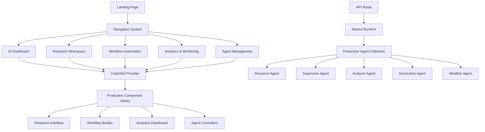

# Design Document

## Overview

The CopilotKit Integration System transforms the current single-page demo into a comprehensive, production-ready multi-page application that provides real functionality using your Mastra agents. The system creates a professional AI-powered workspace with dedicated areas for research, workflow automation, analytics, and general AI assistance, all seamlessly integrated with your existing Mastra backend infrastructure.

## Architecture

### High-Level Architecture



### Application Structure

```
src/app/
├── page.tsx (Landing Page)
├── layout.tsx (Root Layout with CopilotKit Provider)
├── dashboard/
│   └── page.tsx (AI Assistant Dashboard - moved from root)
├── research/
│   └── page.tsx (Research Workspace with document analysis)
├── workflows/
│   └── page.tsx (Multi-agent workflow automation)
├── analytics/
│   └── page.tsx (Agent performance and usage analytics)
├── dev/
│   └── page.tsx (AI-powered development workspace)
├── agents/
│   └── page.tsx (Agent management and configuration)
├── components/
│   ├── layout/
│   │   ├── navigation.tsx
│   │   ├── header.tsx
│   │   └── footer.tsx
│   ├── landing/
│   │   ├── hero.tsx
│   │   ├── features.tsx
│   │   ├── capabilities.tsx
│   │   └── cta.tsx
│   ├── research/
│   │   ├── document-uploader.tsx
│   │   ├── research-interface.tsx
│   │   ├── analysis-results.tsx
│   │   └── report-generator.tsx
│   ├── workflows/
│   │   ├── workflow-builder.tsx
│   │   ├── agent-orchestrator.tsx
│   │   ├── execution-monitor.tsx
│   │   └── results-manager.tsx
│   ├── analytics/
│   │   ├── performance-dashboard.tsx
│   │   ├── usage-metrics.tsx
│   │   ├── agent-health.tsx
│   │   └── system-monitoring.tsx
│   ├── dev/
│   │   ├── code-editor.tsx
│   │   ├── component-generator.tsx
│   │   ├── file-manager.tsx
│   │   ├── live-preview.tsx
│   │   └── ai-assistant.tsx
│   └── copilotkit/
│       ├── providers/
│       │   └── copilotkit-provider.tsx
│       ├── interfaces/
│       │   ├── research-chat.tsx
│       │   ├── workflow-chat.tsx
│       │   ├── analytics-chat.tsx
│       │   └── dev-chat.tsx
│       └── actions/
│           ├── research-actions.tsx
│           ├── workflow-actions.tsx
│           ├── analytics-actions.tsx
│           ├── dev-actions.tsx
│           └── system-actions.tsx
```

## Components and Interfaces

### Core Provider System

```typescript
interface CopilotKitProviderProps {
  children: React.ReactNode;
  runtimeUrl?: string;
  publicApiKey?: string;
  instructions?: string;
}

interface PageConfig {
  title: string;
  description: string;
  copilotConfig: {
    component: 'chat' | 'sidebar' | 'popup';
    defaultOpen?: boolean;
    instructions?: string;
    labels?: CopilotLabels;
    features?: string[];
  };
}
```

### Component Wrapper System

```typescript
interface CopilotWrapperProps {
  config: PageConfig['copilotConfig'];
  themeColor?: string;
  className?: string;
  children?: React.ReactNode;
}

interface CustomActionConfig {
  name: string;
  description: string;
  parameters: ActionParameter[];
  handler: (args: any) => void | Promise<void>;
  render?: (props: any) => React.ReactNode;
}
```

### Navigation and Routing

```typescript
interface NavigationItem {
  label: string;
  href: string;
  description: string;
  icon?: React.ComponentType;
  badge?: string;
}

interface PageMetadata {
  title: string;
  description: string;
  features: string[];
  codeExample?: string;
  documentationLink?: string;
}
```

## Page Designs

### Landing Page Design

#### Hero Section

- Professional headline about AI-powered workspace capabilities
- Clear value proposition of the integrated Mastra + CopilotKit platform
- Call-to-action buttons to access dashboard and key functional areas
- Live preview of actual AI assistant capabilities

#### Capabilities Section

- Grid layout showcasing real functionality:
  - **Research & Analysis**: Document processing and knowledge extraction
  - **Workflow Automation**: Multi-agent task orchestration
  - **Performance Analytics**: Real-time monitoring and optimization
  - **Intelligent Assistance**: Context-aware AI support across all functions

#### Quick Access Section

- Direct links to main functional areas
- Recent activity and quick stats
- System status and health indicators

#### Getting Started Section

- Clear navigation to primary workflows
- User onboarding and feature highlights
- Support and documentation access

### AI Dashboard Page Design

#### Layout

- Moves current `page.tsx` content to `/dashboard`
- Maintains all existing functionality:
  - CopilotSidebar with full agent access
  - Theme management and UI customization
  - Real-time agent interaction and tool execution
  - Context preservation and conversation history

#### Production Enhancements

- Navigation header for accessing all functional areas
- Agent status indicators and health monitoring
- Recent conversations and quick access to saved sessions
- Integration points to research, workflows, and analytics

### Research Workspace Page (`/research`)

#### Document Management Interface

- Document upload and processing capabilities
- Integration with research agent for content analysis
- Real-time document summarization and key insight extraction
- Citation tracking and reference management

#### Research Chat Interface

- CopilotChat optimized for research tasks
- Integration with analyzer and research agents
- Context-aware document querying and analysis
- Export capabilities for research reports and findings

#### Analysis Results Dashboard

- Visual presentation of research findings
- Structured output with proper formatting and references
- Collaborative features for team research projects
- Integration with external research databases and APIs

### Workflow Automation Page (`/workflows`)

#### Workflow Builder Interface

- Visual interface for creating multi-agent workflows
- Integration with supervisor agent for orchestration
- Real-time workflow execution monitoring
- Template library for common automation patterns

#### Agent Orchestration Panel

- Coordination between multiple Mastra agents
- Parallel and sequential task execution
- Error handling and retry mechanisms
- Performance optimization and load balancing

#### Execution Monitoring Dashboard

- Real-time workflow status and progress tracking
- Detailed execution logs and performance metrics
- Alert system for workflow failures or bottlenecks
- Historical execution data and trend analysis

### Analytics & Monitoring Page (`/analytics`)

#### Performance Dashboard

- Real-time metrics for all active agents
- Response time analysis and success rate tracking
- Resource utilization and system health indicators
- Comparative performance analysis across agents

#### Usage Analytics Interface

- Conversation history and interaction patterns
- User engagement metrics and feature adoption
- Agent effectiveness and optimization recommendations
- Custom reporting and data export capabilities

#### System Monitoring Panel

- Infrastructure health and connectivity status
- Error tracking and diagnostic information
- Performance alerts and notification management
- Integration with external monitoring systems

### AI-Powered Development Workspace (`/dev`)

#### Code Generation Interface

- CopilotChat optimized for code generation and component creation
- Integration with generation agent for React component creation
- Natural language to code conversion with TypeScript support
- Real-time code validation and syntax highlighting

#### Component Builder Panel

- Visual component generator with live preview
- Integration with existing design system and Radix UI components
- Automatic prop interface generation and TypeScript definitions
- Component library integration and reusable pattern creation

#### File Management System

- Project file browser with AI-assisted navigation
- File creation, modification, and deletion through chat interface
- Code refactoring and optimization suggestions
- Integration with existing project structure and conventions

#### Live Preview Environment

- Real-time component rendering and testing
- Hot reload functionality for immediate feedback
- Interactive component playground with prop manipulation
- Export and integration capabilities for generated components

#### AI Development Assistant

- Context-aware code suggestions and improvements
- Bug detection and resolution assistance
- Performance optimization recommendations
- Documentation generation and code commenting

## Integration Architecture

### CopilotKit Provider Setup

```typescript
// app/layout.tsx
export default function RootLayout({
  children,
}: {
  children: React.ReactNode;
}) {
  return (
    <html lang="en">
      <body>
        <CopilotKitProvider runtimeUrl="/api/copilotkit">
          <Navigation />
          {children}
          <Footer />
        </CopilotKitProvider>
      </body>
    </html>
  );
}
```

### API Route Integration

The existing `src/app/api/copilotkit/route.ts` remains unchanged, providing:

- Connection to Mastra server at `http://localhost:4111`
- Agent discovery and runtime setup
- Request handling for all CopilotKit components

### Shared Component Library

#### CopilotKit Wrappers

- Standardized wrapper components for each CopilotKit variant
- Consistent theming and configuration management
- Reusable across all pages with customizable props

#### Action Library

- Modular frontend actions that can be imported as needed
- Theme management, UI manipulation, data visualization
- Custom actions specific to different demo scenarios

#### Example Components

- Pre-built examples showcasing different interaction patterns
- Weather demonstrations, research workflows, data analysis
- State machine examples with guided user flows

## Styling and Theming

### Design System Integration

- Maintains existing Tailwind CSS and Radix UI components
- Consistent color scheme and typography across all pages
- Responsive design for mobile and desktop experiences

### CopilotKit Styling

- Custom CSS variables for consistent theming
- Integration with existing design tokens
- Dark/light mode support where applicable

### Component Variants

- Multiple visual styles for different use cases
- Glassmorphic design (current default)
- Professional, minimal, and colorful variants

## State Management

### Theme Management

- Global theme state shared across pages
- Persistent theme preferences in localStorage
- Dynamic theme switching via frontend actions

### Navigation State

- Active page tracking and highlighting
- Breadcrumb navigation for complex flows
- Back/forward navigation support

### Chat State

- Conversation persistence across page navigation
- Context preservation for multi-page workflows
- Session management and cleanup

## Error Handling and Fallbacks

### Connection Management

- Graceful handling of Mastra server connectivity issues
- Fallback UI when agents are unavailable
- Clear error messages and recovery suggestions

### Component Error Boundaries

- Isolated error handling for each CopilotKit component
- Fallback interfaces when components fail to load
- Debug information in development mode

### Progressive Enhancement

- Basic functionality without JavaScript
- Graceful degradation for older browsers
- Accessibility compliance throughout

## Performance Considerations

### Code Splitting

- Page-level code splitting for optimal loading
- Lazy loading of CopilotKit components
- Dynamic imports for specialized functionality

### Caching Strategy

- Static page generation where possible
- API response caching for agent metadata
- Asset optimization and compression

### Bundle Optimization

- Tree shaking for unused CopilotKit features
- Optimized imports and component loading
- Minimal runtime overhead

## Security and Privacy

### API Security

- Secure communication with Mastra backend
- Input validation and sanitization
- Rate limiting and abuse prevention

### Data Handling

- Secure handling of conversation data
- Privacy-compliant data storage
- User consent and data management

## Accessibility

### WCAG Compliance

- Full keyboard navigation support
- Screen reader compatibility
- High contrast mode support
- Focus management and indication

### Inclusive Design

- Clear visual hierarchy and navigation
- Alternative text for all visual elements
- Consistent interaction patterns
- Error messaging and guidance

## Documentation Integration

### Inline Documentation

- Code examples embedded in demo pages
- Links to relevant CopilotKit documentation
- Implementation guides and best practices

### Developer Resources

- Component API documentation
- Integration examples and tutorials
- Troubleshooting guides and FAQs
