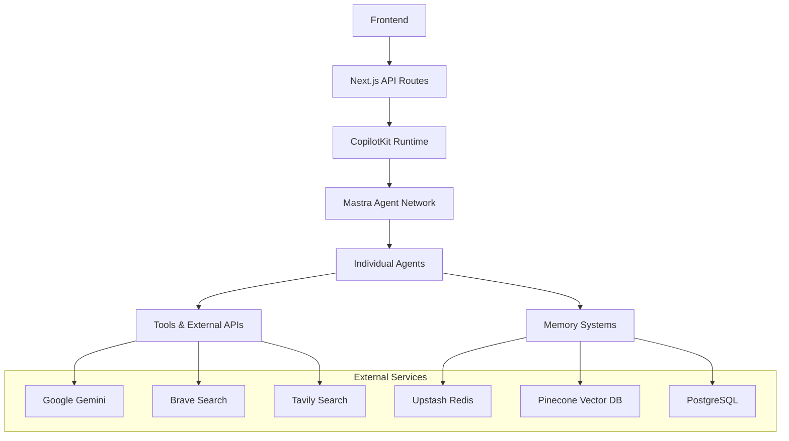

# API Architecture & Guidelines

This document outlines the API architecture, patterns, and best practices for the CopilotKit + Mastra AI application's backend services.

## API Architecture Overview

The application uses a hybrid architecture combining Next.js API routes with Mastra's agent framework:



## Core API Components

### 1. CopilotKit API Route (`/api/copilotkit`)

The main API endpoint that bridges the frontend with Mastra agents:

```typescript
// src/app/api/copilotkit/route.ts
export async function POST(req: NextRequest) {
  const url = new URL(req.url);

  // Special telemetry endpoint
  if (url.searchParams.get('telemetry') === 'true') {
    return handleTelemetryRequest();
  }

  // Standard CopilotKit request handling
  const { handleRequest } = await initRuntime();
  return handleRequest(req);
}
```

**Key Features:**
- Initializes CopilotRuntime with Mastra agents
- Handles both standard chat requests and telemetry queries
- Manages agent discovery and routing
- Provides real-time telemetry and logging data

### 2. Mastra Agent Network

The core agent orchestration system:

```typescript
// src/mastra/index.ts
export const mastra = new Mastra({
  agents: {
    weatherAgent,
    researchAgent,
    supervisorAgent,
    analyzerAgent,
    masterAgent,
    generationAgent,
    chanceAgent,
    langGraphAgent,
  },
  workflows: {
    weatherWorkflow,
    researchAnalysisWorkflow,
    documentAnalysisWorkflow,
    researchReportWorkflow,
    agentPerformanceWorkflow,
  },
  vnext_networks: { 'dean-machines-vnext': vNextNetwork },
  networks: { baseNetwork },
  logger: createLogger({ level: LOG_LEVEL }),
  telemetry: {
    serviceName: "ai",
    enabled: true,
    sampling: { type: "always_on" },
    export: {
      type: "custom",
      tracerName: "mastra",
      exporter: new LangfuseExporter({
        publicKey: process.env.LANGFUSE_PUBLIC_KEY,
        secretKey: process.env.LANGFUSE_SECRET_KEY,
        baseUrl: process.env.LANGFUSE_HOST,
      })
    },
  },
});
```

## Agent Architecture

### 1. Agent Structure

Each agent follows a consistent structure:

```typescript
export const masterAgent = new Agent({
  name: "masterAgent",
  instructions: `You are the primary debugging and problem-solving assistant...`,
  model: createGemini25Provider('gemini-2.5-flash-lite-preview-06-17', {
    safetyLevel: 'OFF',
    structuredOutputs: true,
  }),
  memory: mastraMemory,
  tools: [
    // Agent-specific tools
    graphRAGUpsertTool,
    enhancedVectorQueryTool,
    readDataFileTool,
    // ... more tools
  ],
});
```

**Agent Configuration:**
- **Name**: Unique identifier for the agent
- **Instructions**: System prompt defining agent behavior
- **Model**: LLM provider configuration (Google Gemini)
- **Memory**: Shared memory system (Upstash-based)
- **Tools**: Array of available tools and functions

### 2. Available Agents

| Agent | Purpose | Key Tools |
|-------|---------|-----------|
| `masterAgent` | Primary debugging and problem-solving | Vector search, file operations, Git tools |
| `researchAgent` | Information gathering and fact-checking | Web search, academic research, data analysis |
| `analyzerAgent` | Data analysis and insights generation | Statistical analysis, visualization, cognitive frameworks |
| `supervisorAgent` | Agent coordination and performance monitoring | Quality assurance, task delegation, oversight |
| `weatherAgent` | Weather information and forecasting | Weather APIs, location services |
| `generationAgent` | Content creation and generation | Text generation, code generation, structured data |
| `chanceAgent` | Decision-making under uncertainty | Stochastic algorithms, risk assessment |
| `langGraphAgent` | LangGraph workflow execution | Graph-based workflows, state management |

### 3. Runtime Context

Agents support runtime context for dynamic configuration:

```typescript
interface MasterAgentRuntimeContext {
  productionMode?: boolean;
  debugLevel?: 'minimal' | 'standard' | 'verbose';
  maxToolCalls?: number;
  preferredSearchEngine?: 'brave' | 'tavily';
  memoryRetentionDays?: number;
}
```

## Tool System

### 1. Tool Categories

**Data Management:**
- `readDataFileTool`: File system operations
- `gitOperationsTool`: Git repository management
- `chunkerTool`: Document chunking and processing

**Web Search & Research:**
- `createBraveSearchTool`: Brave Search API integration
- `createTavilySearchTool`: Tavily Search API integration
- `createArxivClient`: Academic paper search
- `createRedditClient`: Reddit content analysis
- `createHackerNewsClient`: Hacker News integration

**Vector & RAG:**
- `vectorQueryTool`: Basic vector search
- `enhancedVectorQueryTool`: Advanced context-aware search
- `hybridVectorSearchTool`: Semantic + metadata search
- `graphRAGUpsertTool`: Graph-based RAG operations

**Cognitive Frameworks:**
- `sequentialThinkingTool`: Step-by-step reasoning
- `decisionFrameworkTool`: Structured decision making
- `mentalModelTool`: Mental model application
- `debuggingApproachTool`: Systematic debugging

**Financial & Real-time Data:**
- `cryptoPriceTool`: Cryptocurrency prices
- `stockPriceTool`: Stock market data
- `sportsOddsTool`: Sports betting odds
- `weatherTool`: Weather information

### 2. Tool Implementation Pattern

```typescript
export const exampleTool = createTool({
  id: "example_tool",
  name: "Example Tool",
  description: "Description of what the tool does",
  inputSchema: z.object({
    query: z.string().describe("The query parameter"),
    options: z.object({
      limit: z.number().optional().describe("Result limit"),
    }).optional(),
  }),
  outputSchema: z.object({
    results: z.array(z.string()),
    metadata: z.object({
      count: z.number(),
      processingTime: z.number(),
    }),
  }),
  execute: async ({ query, options }) => {
    // Tool implementation
    const results = await performOperation(query, options);
    return {
      results,
      metadata: {
        count: results.length,
        processingTime: Date.now() - startTime,
      },
    };
  },
});
```

## Memory System

### 1. Memory Architecture

The application uses a sophisticated memory system built on Upstash:

```typescript
// src/mastra/memory/upstashMemory.ts
export const mastraMemory = new Memory({
  store: new UpstashStore({
    redis: Redis.fromEnv(),
  }),
  vectorStore: new UpstashVector({
    index: upstashVectorIndex,
    embedder: createGeminiEmbeddingModel(),
  }),
  processors: [
    new AttentionGuidedMemoryProcessor(),
    new ContextualRelevanceProcessor(),
    new TokenLimiter({ maxTokens: 1000000 }),
    new ToolCallFilter({ includeAll: true }),
    new WorkflowAwareMemoryProcessor({
      stages: ['data_collection', 'analysis', 'reporting'],
    }),
    new BiasMitigationProcessor(),
    new MentalModelProcessor(),
    new ToolUsageTrackerProcessor({ logInterval: 100 }),
    new AgentInteractionPatternProcessor({ sequenceLength: 10 }),
  ],
});
```

### 2. Memory Operations

**Thread Management:**
```typescript
// Create memory thread
const thread = await createMemoryThread({
  userId: "user123",
  resourceId: "resource456",
  metadata: { topic: "research", priority: "high" },
});

// Search memory
const results = await searchMemoryMessages({
  threadId: thread.id,
  query: "search query",
  limit: 10,
  filters: { topic: "research" },
});
```

**Vector Operations:**
```typescript
// Upsert vectors
await upsertVectors({
  vectors: [
    {
      id: "doc1",
      values: embedding,
      metadata: { title: "Document 1", type: "research" },
    },
  ],
  namespace: "documents",
});

// Query vectors
const vectorResults = await queryVectors({
  vector: queryEmbedding,
  topK: 5,
  filter: { type: "research" },
  includeMetadata: true,
});
```

### 3. Memory Processors

**Attention-Guided Memory:**
- Manages message importance and context preservation
- Implements dynamic context pruning
- Provides semantic importance weighting

**Bias Mitigation:**
- Detects cognitive biases (confirmation, recency, anchoring)
- Applies mitigation strategies
- Maintains balanced perspectives

**Workflow Awareness:**
- Adjusts context based on workflow stage
- Maintains stage-specific memory
- Optimizes for workflow continuity

## Workflow System

### 1. Workflow Definition

```typescript
export const researchAnalysisWorkflow = new Workflow({
  name: "researchAnalysisWorkflow",
  triggerSchema: z.object({
    topic: z.string(),
    depth: z.enum(['shallow', 'medium', 'deep']),
    sources: z.array(z.string()).optional(),
  }),
})
  .step("gather_information")
  .step("analyze_data")
  .step("generate_insights")
  .step("create_report");
```

### 2. Available Workflows

| Workflow | Purpose | Agents Used |
|----------|---------|-------------|
| `weatherWorkflow` | Weather data processing | weatherAgent |
| `researchAnalysisWorkflow` | Research and analysis | researchAgent, analyzerAgent |
| `documentAnalysisWorkflow` | Document processing | masterAgent, analyzerAgent |
| `researchReportWorkflow` | Report generation | researchAgent, generationAgent |
| `agentPerformanceWorkflow` | Performance monitoring | supervisorAgent |

## External API Integrations

### 1. Google Gemini Configuration

```typescript
// src/mastra/config/googleProvider.ts
export function createGemini25Provider(
  modelId: string,
  options?: {
    safetyLevel?: 'STRICT' | 'MODERATE' | 'PERMISSIVE' | 'OFF';
    structuredOutputs?: boolean;
    useSearchGrounding?: boolean;
    dynamicRetrieval?: boolean;
  }
) {
  return baseGoogleModel(modelId, {
    safetySettings: SAFETY_PRESETS[options?.safetyLevel || 'MODERATE'],
    structuredOutputs: options?.structuredOutputs || false,
    useSearchGrounding: options?.useSearchGrounding || false,
    dynamicRetrieval: options?.dynamicRetrieval || false,
  });
}
```

### 2. Search API Integration

**Brave Search:**
```typescript
const braveSearchTool = createBraveSearchTool({
  apiKey: process.env.BRAVE_API_KEY!,
  maxResults: 10,
  safeSearch: 'moderate',
});
```

**Tavily Search:**
```typescript
const tavilySearchTool = createTavilySearchTool({
  apiKey: process.env.TAVILY_API_KEY!,
  maxResults: 5,
  searchDepth: 'advanced',
});
```

### 3. Database Connections

**Upstash Redis:**
```typescript
const redis = Redis.fromEnv();
const upstashStore = new UpstashStore({ redis });
```

**Upstash Vector:**
```typescript
const upstashVectorIndex = new Index({
  url: process.env.UPSTASH_VECTOR_REST_URL!,
  token: process.env.UPSTASH_VECTOR_REST_TOKEN!,
});
```

## Error Handling & Logging

### 1. Error Handling Patterns

```typescript
export async function handleAgentRequest(request: AgentRequest) {
  try {
    const result = await processRequest(request);
    return { success: true, data: result };
  } catch (error) {
    logger.error('Agent request failed', {
      requestId: request.id,
      error: error.message,
      stack: error.stack,
    });
    
    return {
      success: false,
      error: error.message,
      code: getErrorCode(error),
    };
  }
}
```

### 2. Logging Configuration

```typescript
const logger = createLogger({
  level: process.env.LOG_LEVEL as LogLevel || "info",
  format: 'json',
  transports: [
    new ConsoleTransport(),
    new FileTransport({ filename: 'app.log' }),
  ],
});
```

### 3. Telemetry & Monitoring

```typescript
// Langfuse integration for observability
const telemetry = {
  serviceName: "ai",
  enabled: true,
  sampling: { type: "always_on" },
  export: {
    type: "custom",
    tracerName: "mastra",
    exporter: new LangfuseExporter({
      publicKey: process.env.LANGFUSE_PUBLIC_KEY,
      secretKey: process.env.LANGFUSE_SECRET_KEY,
      baseUrl: process.env.LANGFUSE_HOST,
    }),
  },
};
```

## Security & Authentication

### 1. API Security

- **Environment Variables**: Secure storage of API keys and secrets
- **CORS Configuration**: Proper CORS setup for development and production
- **Rate Limiting**: Implement rate limiting for API endpoints
- **Input Validation**: Zod schema validation for all inputs

### 2. Agent Security

- **Tool Permissions**: Restrict tool access based on agent roles
- **Memory Isolation**: Ensure proper memory access controls
- **Content Filtering**: Apply safety filters to generated content

## Performance Optimization

### 1. Caching Strategies

```typescript
// Memory caching for frequently accessed data
const cache = new Map<string, CacheEntry>();

export async function getCachedResult(key: string, fetcher: () => Promise<any>) {
  const cached = cache.get(key);
  if (cached && !isExpired(cached)) {
    return cached.data;
  }
  
  const data = await fetcher();
  cache.set(key, { data, timestamp: Date.now() });
  return data;
}
```

### 2. Connection Pooling

- **Database Connections**: Use connection pooling for database operations
- **HTTP Clients**: Reuse HTTP connections for external API calls
- **Memory Management**: Implement proper memory cleanup and garbage collection

### 3. Monitoring & Metrics

- **Response Times**: Track API response times
- **Error Rates**: Monitor error rates and patterns
- **Resource Usage**: Monitor memory and CPU usage
- **Agent Performance**: Track agent execution times and success rates

## Development & Testing

### 1. API Testing

```typescript
// Example API test
describe('CopilotKit API', () => {
  test('should handle agent requests', async () => {
    const response = await fetch('/api/copilotkit', {
      method: 'POST',
      headers: { 'Content-Type': 'application/json' },
      body: JSON.stringify({
        messages: [{ role: 'user', content: 'Hello' }],
      }),
    });
    
    expect(response.ok).toBe(true);
    const data = await response.json();
    expect(data).toHaveProperty('messages');
  });
});
```

### 2. Agent Testing

```typescript
// Example agent test
describe('Master Agent', () => {
  test('should process research queries', async () => {
    const result = await masterAgent.run({
      messages: [{ role: 'user', content: 'Research AI trends' }],
    });
    
    expect(result).toHaveProperty('response');
    expect(result.response).toContain('AI trends');
  });
});
```

## Deployment Considerations

### 1. Environment Configuration

```bash
# Required environment variables
GOOGLE_GENERATIVE_AI_API_KEY=your-key
UPSTASH_REDIS_REST_URL=your-url
UPSTASH_REDIS_REST_TOKEN=your-token
UPSTASH_VECTOR_REST_URL=your-url
UPSTASH_VECTOR_REST_TOKEN=your-token
BRAVE_API_KEY=your-key
TAVILY_API_KEY=your-key
LANGFUSE_PUBLIC_KEY=your-key
LANGFUSE_SECRET_KEY=your-key
LANGFUSE_HOST=your-host
```

### 2. Production Optimizations

- **Edge Runtime**: Use Next.js Edge Runtime for better performance
- **Connection Limits**: Configure appropriate connection limits
- **Timeout Settings**: Set reasonable timeout values
- **Health Checks**: Implement health check endpoints

### 3. Monitoring & Alerting

- **Error Tracking**: Implement error tracking and alerting
- **Performance Monitoring**: Monitor API performance metrics
- **Resource Monitoring**: Track resource usage and scaling needs
- **Agent Health**: Monitor agent performance and availability