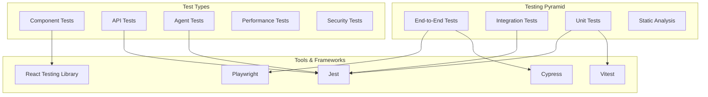

# Testing Strategy & Guidelines

This document outlines comprehensive testing strategies, patterns, and best practices for the CopilotKit + Mastra AI application.

## Testing Architecture



## Testing Stack

### Core Testing Tools

- **Unit Testing**: Jest / Vitest
- **Component Testing**: React Testing Library
- **Integration Testing**: Jest with test containers
- **End-to-End Testing**: Playwright / Cypress
- **API Testing**: Supertest with Jest
- **Performance Testing**: Lighthouse CI, k6
- **Security Testing**: OWASP ZAP, Snyk

### Test Configuration

**Jest Configuration:**
```javascript
// jest.config.js
const nextJest = require('next/jest');

const createJestConfig = nextJest({
  dir: './',
});

const customJestConfig = {
  setupFilesAfterEnv: ['<rootDir>/jest.setup.js'],
  testEnvironment: 'jest-environment-jsdom',
  moduleNameMapping: {
    '^@/(.*)$': '<rootDir>/src/$1',
  },
  testMatch: [
    '**/__tests__/**/*.(test|spec).(js|jsx|ts|tsx)',
    '**/*.(test|spec).(js|jsx|ts|tsx)',
  ],
  collectCoverageFrom: [
    'src/**/*.{js,jsx,ts,tsx}',
    '!src/**/*.d.ts',
    '!src/**/*.stories.{js,jsx,ts,tsx}',
  ],
  coverageThreshold: {
    global: {
      branches: 80,
      functions: 80,
      lines: 80,
      statements: 80,
    },
  },
};

module.exports = createJestConfig(customJestConfig);
```

**Test Setup:**
```javascript
// jest.setup.js
import '@testing-library/jest-dom';
import { TextEncoder, TextDecoder } from 'util';

// Polyfills for Node.js environment
global.TextEncoder = TextEncoder;
global.TextDecoder = TextDecoder;

// Mock Next.js router
jest.mock('next/router', () => ({
  useRouter: () => ({
    push: jest.fn(),
    pathname: '/',
    query: {},
  }),
}));

// Mock CopilotKit
jest.mock('@copilotkit/react-core', () => ({
  useCopilotAction: jest.fn(),
  useCopilotReadable: jest.fn(),
  useCopilotChat: jest.fn(() => ({
    visibleMessages: [],
    appendMessage: jest.fn(),
    setMessages: jest.fn(),
    isLoading: false,
  })),
}));
```

## Unit Testing

### 1. Component Testing

**Basic Component Test:**
```typescript
// src/app/components/agents/__tests__/agent-card.test.tsx
import { render, screen, fireEvent } from '@testing-library/react';
import { AgentCard } from '../agent-card';
import type { Agent } from '@/lib/types';

const mockAgent: Agent = {
  id: 'test-agent',
  name: 'Test Agent',
  description: 'A test agent for testing',
  status: 'active',
  lastActive: new Date().toISOString(),
};

describe('AgentCard', () => {
  it('renders agent information correctly', () => {
    render(<AgentCard agent={mockAgent} onSelect={jest.fn()} />);
    
    expect(screen.getByText('Test Agent')).toBeInTheDocument();
    expect(screen.getByText('A test agent for testing')).toBeInTheDocument();
    expect(screen.getByText('active')).toBeInTheDocument();
  });

  it('calls onSelect when clicked', () => {
    const mockOnSelect = jest.fn();
    render(<AgentCard agent={mockAgent} onSelect={mockOnSelect} />);
    
    fireEvent.click(screen.getByRole('button'));
    expect(mockOnSelect).toHaveBeenCalledWith(mockAgent);
  });

  it('applies selected styling when isSelected is true', () => {
    render(
      <AgentCard 
        agent={mockAgent} 
        onSelect={jest.fn()} 
        isSelected={true} 
      />
    );
    
    const card = screen.getByRole('button');
    expect(card).toHaveClass('ring-2', 'ring-primary');
  });

  it('handles loading state correctly', () => {
    const loadingAgent = { ...mockAgent, status: 'loading' as const };
    render(<AgentCard agent={loadingAgent} onSelect={jest.fn()} />);
    
    expect(screen.getByTestId('loading-spinner')).toBeInTheDocument();
  });
});
```

**Hook Testing:**
```typescript
// src/hooks/__tests__/use-agents.test.ts
import { renderHook, waitFor } from '@testing-library/react';
import { useAgents } from '../use-agents';

// Mock the API
jest.mock('@/lib/api', () => ({
  fetchAgents: jest.fn(),
}));

import { fetchAgents } from '@/lib/api';
const mockFetchAgents = fetchAgents as jest.MockedFunction<typeof fetchAgents>;

describe('useAgents', () => {
  beforeEach(() => {
    mockFetchAgents.mockClear();
  });

  it('fetches agents on mount', async () => {
    const mockAgents = [
      { id: '1', name: 'Agent 1', status: 'active' },
      { id: '2', name: 'Agent 2', status: 'inactive' },
    ];
    
    mockFetchAgents.mockResolvedValue(mockAgents);
    
    const { result } = renderHook(() => useAgents());
    
    expect(result.current.loading).toBe(true);
    
    await waitFor(() => {
      expect(result.current.loading).toBe(false);
    });
    
    expect(result.current.agents).toEqual(mockAgents);
    expect(result.current.error).toBeNull();
  });

  it('handles fetch errors', async () => {
    const errorMessage = 'Failed to fetch agents';
    mockFetchAgents.mockRejectedValue(new Error(errorMessage));
    
    const { result } = renderHook(() => useAgents());
    
    await waitFor(() => {
      expect(result.current.loading).toBe(false);
    });
    
    expect(result.current.error).toBe(errorMessage);
    expect(result.current.agents).toEqual([]);
  });
});
```

### 2. Utility Function Testing

**Pure Function Tests:**
```typescript
// src/lib/__tests__/utils.test.ts
import { cn, formatDate, validateEmail } from '../utils';

describe('utils', () => {
  describe('cn', () => {
    it('combines class names correctly', () => {
      expect(cn('base', 'additional')).toBe('base additional');
    });

    it('handles conditional classes', () => {
      expect(cn('base', true && 'conditional')).toBe('base conditional');
      expect(cn('base', false && 'conditional')).toBe('base');
    });

    it('removes duplicates and handles conflicts', () => {
      expect(cn('p-4', 'p-2')).toBe('p-2');
    });
  });

  describe('formatDate', () => {
    it('formats dates correctly', () => {
      const date = new Date('2024-01-15T10:30:00Z');
      expect(formatDate(date)).toBe('Jan 15, 2024');
    });

    it('handles invalid dates', () => {
      expect(formatDate(new Date('invalid'))).toBe('Invalid Date');
    });
  });

  describe('validateEmail', () => {
    it('validates correct email addresses', () => {
      expect(validateEmail('test@example.com')).toBe(true);
      expect(validateEmail('user.name+tag@domain.co.uk')).toBe(true);
    });

    it('rejects invalid email addresses', () => {
      expect(validateEmail('invalid-email')).toBe(false);
      expect(validateEmail('test@')).toBe(false);
      expect(validateEmail('@domain.com')).toBe(false);
    });
  });
});
```

## Integration Testing

### 1. API Integration Tests

**CopilotKit API Tests:**
```typescript
// src/app/api/__tests__/copilotkit.test.ts
import { NextRequest } from 'next/server';
import { POST, GET } from '../copilotkit/route';

// Mock Mastra client
jest.mock('@mastra/client-js', () => ({
  MastraClient: jest.fn().mockImplementation(() => ({
    getTelemetry: jest.fn().mockResolvedValue({ traces: [] }),
    getLogs: jest.fn().mockResolvedValue([]),
  })),
}));

// Mock CopilotKit
jest.mock('@copilotkit/runtime', () => ({
  CopilotRuntime: jest.fn(),
  copilotRuntimeNextJSAppRouterEndpoint: jest.fn(() => ({
    handleRequest: jest.fn().mockResolvedValue(
      new Response(JSON.stringify({ success: true }))
    ),
  })),
  ExperimentalEmptyAdapter: jest.fn(),
}));

describe('/api/copilotkit', () => {
  describe('POST', () => {
    it('handles standard requests', async () => {
      const request = new NextRequest('http://localhost:3000/api/copilotkit', {
        method: 'POST',
        body: JSON.stringify({
          messages: [{ role: 'user', content: 'Hello' }],
        }),
      });

      const response = await POST(request);
      expect(response.status).toBe(200);
      
      const data = await response.json();
      expect(data.success).toBe(true);
    });

    it('handles telemetry requests', async () => {
      const request = new NextRequest(
        'http://localhost:3000/api/copilotkit?telemetry=true',
        { method: 'POST' }
      );

      const response = await POST(request);
      expect(response.status).toBe(200);
      
      const data = await response.json();
      expect(data).toHaveProperty('data');
      expect(data.data).toHaveProperty('telemetry');
      expect(data.data).toHaveProperty('logs');
    });
  });

  describe('GET', () => {
    it('handles telemetry GET requests', async () => {
      const request = new NextRequest(
        'http://localhost:3000/api/copilotkit?telemetry=true',
        { method: 'GET' }
      );

      const response = await GET(request);
      expect(response.status).toBe(200);
    });
  });
});
```

### 2. Database Integration Tests

**Memory System Tests:**
```typescript
// src/mastra/memory/__tests__/upstash-memory.integration.test.ts
import { Redis } from '@upstash/redis';
import { 
  createMemoryThread, 
  searchMemoryMessages,
  upsertVectors 
} from '../upstashMemory';

// Use test database
const testRedis = new Redis({
  url: process.env.TEST_UPSTASH_REDIS_REST_URL!,
  token: process.env.TEST_UPSTASH_REDIS_REST_TOKEN!,
});

describe('Upstash Memory Integration', () => {
  beforeEach(async () => {
    // Clean test database
    await testRedis.flushall();
  });

  afterAll(async () => {
    // Cleanup
    await testRedis.flushall();
  });

  describe('createMemoryThread', () => {
    it('creates a new memory thread', async () => {
      const thread = await createMemoryThread({
        userId: 'test-user',
        resourceId: 'test-resource',
        metadata: { topic: 'testing' },
      });

      expect(thread).toHaveProperty('id');
      expect(thread.userId).toBe('test-user');
      expect(thread.resourceId).toBe('test-resource');
      expect(thread.metadata.topic).toBe('testing');
    });
  });

  describe('searchMemoryMessages', () => {
    it('searches messages in a thread', async () => {
      // Create thread and add messages
      const thread = await createMemoryThread({
        userId: 'test-user',
        resourceId: 'test-resource',
      });

      // Add test messages
      await addTestMessages(thread.id);

      const results = await searchMemoryMessages({
        threadId: thread.id,
        query: 'test query',
        limit: 5,
      });

      expect(results).toHaveProperty('messages');
      expect(Array.isArray(results.messages)).toBe(true);
    });
  });

  describe('upsertVectors', () => {
    it('upserts vectors successfully', async () => {
      const vectors = [
        {
          id: 'test-vector-1',
          values: new Array(768).fill(0.1),
          metadata: { content: 'test content' },
        },
      ];

      const result = await upsertVectors({
        vectors,
        namespace: 'test',
      });

      expect(result.upsertedCount).toBe(1);
    });
  });
});
```

### 3. Agent Integration Tests

**Agent Workflow Tests:**
```typescript
// src/mastra/agents/__tests__/master-agent.integration.test.ts
import { masterAgent } from '../master-agent';
import { mastraMemory } from '../../memory/upstashMemory';

describe('Master Agent Integration', () => {
  beforeEach(async () => {
    // Setup test memory thread
    await setupTestMemory();
  });

  afterEach(async () => {
    // Cleanup test data
    await cleanupTestMemory();
  });

  it('processes research queries end-to-end', async () => {
    const result = await masterAgent.run({
      messages: [
        {
          role: 'user',
          content: 'Research the latest trends in AI development',
        },
      ],
      threadId: 'test-thread',
    });

    expect(result).toHaveProperty('response');
    expect(result.response).toContain('AI trends');
    expect(result.toolCalls).toBeDefined();
    expect(result.toolCalls.length).toBeGreaterThan(0);
  });

  it('uses memory context correctly', async () => {
    // Add context to memory
    await mastraMemory.addMessage({
      threadId: 'test-thread',
      content: 'Previous context about AI research',
      role: 'assistant',
    });

    const result = await masterAgent.run({
      messages: [
        {
          role: 'user',
          content: 'Continue the previous discussion',
        },
      ],
      threadId: 'test-thread',
    });

    expect(result.response).toContain('AI research');
  });

  it('handles tool failures gracefully', async () => {
    // Mock tool failure
    jest.spyOn(console, 'error').mockImplementation(() => {});

    const result = await masterAgent.run({
      messages: [
        {
          role: 'user',
          content: 'Search for information that will fail',
        },
      ],
      threadId: 'test-thread',
    });

    expect(result).toHaveProperty('response');
    expect(result.response).toContain('unable to complete');
  });
});
```

## End-to-End Testing

### 1. Playwright Configuration

**Playwright Config:**
```typescript
// playwright.config.ts
import { defineConfig, devices } from '@playwright/test';

export default defineConfig({
  testDir: './e2e',
  fullyParallel: true,
  forbidOnly: !!process.env.CI,
  retries: process.env.CI ? 2 : 0,
  workers: process.env.CI ? 1 : undefined,
  reporter: 'html',
  use: {
    baseURL: 'http://localhost:3000',
    trace: 'on-first-retry',
    screenshot: 'only-on-failure',
  },
  projects: [
    {
      name: 'chromium',
      use: { ...devices['Desktop Chrome'] },
    },
    {
      name: 'firefox',
      use: { ...devices['Desktop Firefox'] },
    },
    {
      name: 'webkit',
      use: { ...devices['Desktop Safari'] },
    },
    {
      name: 'Mobile Chrome',
      use: { ...devices['Pixel 5'] },
    },
  ],
  webServer: {
    command: 'npm run dev',
    url: 'http://localhost:3000',
    reuseExistingServer: !process.env.CI,
  },
});
```

### 2. E2E Test Examples

**User Journey Tests:**
```typescript
// e2e/agent-interaction.spec.ts
import { test, expect } from '@playwright/test';

test.describe('Agent Interaction Flow', () => {
  test('user can interact with agents through chat', async ({ page }) => {
    await page.goto('/');
    
    // Wait for the page to load
    await expect(page.getByText('AI-Powered Workspace')).toBeVisible();
    
    // Navigate to agents page
    await page.click('[data-testid="agents-nav"]');
    await expect(page).toHaveURL('/agents');
    
    // Select an agent
    await page.click('[data-testid="master-agent-card"]');
    await expect(page.getByText('Master Agent')).toBeVisible();
    
    // Start a conversation
    const chatInput = page.getByPlaceholder('Type your message...');
    await chatInput.fill('Hello, can you help me with research?');
    await chatInput.press('Enter');
    
    // Wait for response
    await expect(page.getByText('I can help you with research')).toBeVisible({
      timeout: 10000,
    });
    
    // Verify agent tools are available
    await expect(page.getByText('Available tools:')).toBeVisible();
  });

  test('user can switch between different agents', async ({ page }) => {
    await page.goto('/agents');
    
    // Select first agent
    await page.click('[data-testid="master-agent-card"]');
    await expect(page.getByText('Master Agent')).toBeVisible();
    
    // Switch to research agent
    await page.click('[data-testid="research-agent-card"]');
    await expect(page.getByText('Research Agent')).toBeVisible();
    
    // Verify different capabilities are shown
    await expect(page.getByText('Academic research')).toBeVisible();
  });
});
```

**Performance Tests:**
```typescript
// e2e/performance.spec.ts
import { test, expect } from '@playwright/test';

test.describe('Performance Tests', () => {
  test('page loads within acceptable time', async ({ page }) => {
    const startTime = Date.now();
    
    await page.goto('/');
    await expect(page.getByText('AI-Powered Workspace')).toBeVisible();
    
    const loadTime = Date.now() - startTime;
    expect(loadTime).toBeLessThan(3000); // 3 seconds
  });

  test('agent response time is acceptable', async ({ page }) => {
    await page.goto('/agents');
    await page.click('[data-testid="master-agent-card"]');
    
    const chatInput = page.getByPlaceholder('Type your message...');
    await chatInput.fill('Quick test message');
    
    const startTime = Date.now();
    await chatInput.press('Enter');
    
    await expect(page.locator('.agent-response').first()).toBeVisible({
      timeout: 15000,
    });
    
    const responseTime = Date.now() - startTime;
    expect(responseTime).toBeLessThan(15000); // 15 seconds
  });
});
```

## Performance Testing

### 1. Load Testing with k6

**Load Test Script:**
```javascript
// k6/load-test.js
import http from 'k6/http';
import { check, sleep } from 'k6';

export const options = {
  stages: [
    { duration: '2m', target: 10 }, // Ramp up
    { duration: '5m', target: 10 }, // Stay at 10 users
    { duration: '2m', target: 20 }, // Ramp up to 20 users
    { duration: '5m', target: 20 }, // Stay at 20 users
    { duration: '2m', target: 0 },  // Ramp down
  ],
  thresholds: {
    http_req_duration: ['p(95)<2000'], // 95% of requests under 2s
    http_req_failed: ['rate<0.1'],     // Error rate under 10%
  },
};

export default function () {
  // Test homepage
  const homeResponse = http.get('http://localhost:3000');
  check(homeResponse, {
    'homepage status is 200': (r) => r.status === 200,
    'homepage loads in <1s': (r) => r.timings.duration < 1000,
  });

  sleep(1);

  // Test API endpoint
  const apiResponse = http.post(
    'http://localhost:3000/api/copilotkit',
    JSON.stringify({
      messages: [{ role: 'user', content: 'Test message' }],
    }),
    {
      headers: { 'Content-Type': 'application/json' },
    }
  );

  check(apiResponse, {
    'API status is 200': (r) => r.status === 200,
    'API responds in <5s': (r) => r.timings.duration < 5000,
  });

  sleep(2);
}
```

### 2. Lighthouse CI Configuration

**Lighthouse CI Config:**
```json
// lighthouserc.json
{
  "ci": {
    "collect": {
      "url": [
        "http://localhost:3000",
        "http://localhost:3000/agents",
        "http://localhost:3000/dashboard"
      ],
      "numberOfRuns": 3
    },
    "assert": {
      "assertions": {
        "categories:performance": ["error", {"minScore": 0.8}],
        "categories:accessibility": ["error", {"minScore": 0.9}],
        "categories:best-practices": ["error", {"minScore": 0.9}],
        "categories:seo": ["error", {"minScore": 0.8}]
      }
    },
    "upload": {
      "target": "temporary-public-storage"
    }
  }
}
```

## Security Testing

### 1. OWASP ZAP Integration

**Security Test Script:**
```bash
#!/bin/bash
# security-test.sh

# Start the application
npm run dev &
APP_PID=$!

# Wait for app to start
sleep 30

# Run OWASP ZAP baseline scan
docker run -t owasp/zap2docker-stable zap-baseline.py \
  -t http://host.docker.internal:3000 \
  -J zap-report.json \
  -r zap-report.html

# Run API security scan
docker run -t owasp/zap2docker-stable zap-api-scan.py \
  -t http://host.docker.internal:3000/api/copilotkit \
  -f openapi \
  -J api-zap-report.json

# Stop the application
kill $APP_PID

echo "Security scan complete. Check zap-report.html for results."
```

### 2. Dependency Security Testing

**Snyk Integration:**
```yaml
# .github/workflows/security.yml
name: Security Scan

on:
  push:
    branches: [main, develop]
  pull_request:
    branches: [main]

jobs:
  security:
    runs-on: ubuntu-latest
    steps:
      - uses: actions/checkout@v3
      
      - name: Run Snyk to check for vulnerabilities
        uses: snyk/actions/node@master
        env:
          SNYK_TOKEN: ${{ secrets.SNYK_TOKEN }}
        with:
          args: --severity-threshold=high
          
      - name: Upload result to GitHub Code Scanning
        uses: github/codeql-action/upload-sarif@v2
        with:
          sarif_file: snyk.sarif
```

## Test Data Management

### 1. Test Fixtures

**Agent Test Data:**
```typescript
// __tests__/fixtures/agents.ts
export const mockAgents = [
  {
    id: 'master-agent',
    name: 'Master Agent',
    description: 'Primary debugging and problem-solving assistant',
    status: 'active',
    capabilities: ['research', 'analysis', 'debugging'],
    lastActive: '2024-01-15T10:30:00Z',
  },
  {
    id: 'research-agent',
    name: 'Research Agent',
    description: 'Specialized research and information gathering',
    status: 'active',
    capabilities: ['web-search', 'academic-research', 'fact-checking'],
    lastActive: '2024-01-15T09:45:00Z',
  },
];

export const mockMemoryThread = {
  id: 'test-thread-123',
  userId: 'test-user',
  resourceId: 'test-resource',
  createdAt: '2024-01-15T08:00:00Z',
  updatedAt: '2024-01-15T10:30:00Z',
  metadata: {
    topic: 'AI research',
    priority: 'high',
  },
};

export const mockMessages = [
  {
    id: 'msg-1',
    threadId: 'test-thread-123',
    role: 'user',
    content: 'What are the latest trends in AI?',
    timestamp: '2024-01-15T10:00:00Z',
  },
  {
    id: 'msg-2',
    threadId: 'test-thread-123',
    role: 'assistant',
    content: 'Based on recent research, the main AI trends include...',
    timestamp: '2024-01-15T10:01:00Z',
  },
];
```

### 2. Database Seeding

**Test Database Setup:**
```typescript
// __tests__/setup/database.ts
import { Redis } from '@upstash/redis';
import { mockAgents, mockMemoryThread, mockMessages } from '../fixtures';

const testRedis = new Redis({
  url: process.env.TEST_UPSTASH_REDIS_REST_URL!,
  token: process.env.TEST_UPSTASH_REDIS_REST_TOKEN!,
});

export async function seedTestDatabase() {
  // Clear existing data
  await testRedis.flushall();
  
  // Seed agents
  for (const agent of mockAgents) {
    await testRedis.hset(`agent:${agent.id}`, agent);
  }
  
  // Seed memory thread
  await testRedis.hset(`thread:${mockMemoryThread.id}`, mockMemoryThread);
  
  // Seed messages
  for (const message of mockMessages) {
    await testRedis.hset(`message:${message.id}`, message);
    await testRedis.lpush(`thread:${message.threadId}:messages`, message.id);
  }
}

export async function cleanupTestDatabase() {
  await testRedis.flushall();
}
```

## Continuous Integration

### 1. GitHub Actions Workflow

**CI Pipeline:**
```yaml
# .github/workflows/test.yml
name: Test Suite

on:
  push:
    branches: [main, develop]
  pull_request:
    branches: [main]

jobs:
  test:
    runs-on: ubuntu-latest
    
    services:
      redis:
        image: redis:7-alpine
        ports:
          - 6379:6379
        options: >-
          --health-cmd "redis-cli ping"
          --health-interval 10s
          --health-timeout 5s
          --health-retries 5

    steps:
      - uses: actions/checkout@v3
      
      - name: Setup Node.js
        uses: actions/setup-node@v3
        with:
          node-version: '18'
          cache: 'npm'
          
      - name: Install dependencies
        run: npm ci
        
      - name: Run linting
        run: npm run lint
        
      - name: Run type checking
        run: npx tsc --noEmit
        
      - name: Run unit tests
        run: npm test -- --coverage
        env:
          TEST_UPSTASH_REDIS_REST_URL: redis://localhost:6379
          
      - name: Run integration tests
        run: npm run test:integration
        env:
          TEST_UPSTASH_REDIS_REST_URL: redis://localhost:6379
          
      - name: Upload coverage to Codecov
        uses: codecov/codecov-action@v3
        
  e2e:
    runs-on: ubuntu-latest
    steps:
      - uses: actions/checkout@v3
      
      - name: Setup Node.js
        uses: actions/setup-node@v3
        with:
          node-version: '18'
          cache: 'npm'
          
      - name: Install dependencies
        run: npm ci
        
      - name: Install Playwright
        run: npx playwright install --with-deps
        
      - name: Run E2E tests
        run: npm run test:e2e
        env:
          GOOGLE_GENERATIVE_AI_API_KEY: ${{ secrets.GOOGLE_AI_KEY }}
          
      - name: Upload Playwright report
        uses: actions/upload-artifact@v3
        if: always()
        with:
          name: playwright-report
          path: playwright-report/
```

### 2. Test Scripts

**Package.json Scripts:**
```json
{
  "scripts": {
    "test": "jest",
    "test:watch": "jest --watch",
    "test:coverage": "jest --coverage",
    "test:integration": "jest --config jest.integration.config.js",
    "test:e2e": "playwright test",
    "test:e2e:ui": "playwright test --ui",
    "test:security": "./scripts/security-test.sh",
    "test:performance": "k6 run k6/load-test.js",
    "test:all": "npm run test && npm run test:integration && npm run test:e2e"
  }
}
```

## Test Reporting & Analytics

### 1. Coverage Reporting

**Coverage Configuration:**
```javascript
// jest.config.js (coverage section)
module.exports = {
  // ... other config
  collectCoverageFrom: [
    'src/**/*.{js,jsx,ts,tsx}',
    '!src/**/*.d.ts',
    '!src/**/*.stories.{js,jsx,ts,tsx}',
    '!src/**/__tests__/**',
    '!src/**/node_modules/**',
  ],
  coverageReporters: ['text', 'lcov', 'html', 'json-summary'],
  coverageDirectory: 'coverage',
  coverageThreshold: {
    global: {
      branches: 80,
      functions: 80,
      lines: 80,
      statements: 80,
    },
    './src/components/': {
      branches: 85,
      functions: 85,
      lines: 85,
      statements: 85,
    },
  },
};
```

### 2. Test Results Dashboard

**Custom Test Reporter:**
```typescript
// scripts/test-reporter.ts
import fs from 'fs';
import path from 'path';

interface TestResults {
  testSuites: number;
  tests: number;
  passed: number;
  failed: number;
  coverage: {
    lines: number;
    functions: number;
    branches: number;
    statements: number;
  };
}

export function generateTestReport(results: TestResults) {
  const report = {
    timestamp: new Date().toISOString(),
    summary: {
      totalSuites: results.testSuites,
      totalTests: results.tests,
      passed: results.passed,
      failed: results.failed,
      passRate: (results.passed / results.tests) * 100,
    },
    coverage: results.coverage,
  };

  fs.writeFileSync(
    path.join(process.cwd(), 'test-report.json'),
    JSON.stringify(report, null, 2)
  );

  console.log('Test Report Generated:');
  console.log(`✅ Passed: ${results.passed}`);
  console.log(`❌ Failed: ${results.failed}`);
  console.log(`📊 Pass Rate: ${report.summary.passRate.toFixed(2)}%`);
  console.log(`📈 Coverage: ${results.coverage.lines}% lines`);
}
```

## Best Practices Summary

### 1. Test Organization
- Follow the testing pyramid (more unit tests, fewer E2E tests)
- Group related tests in describe blocks
- Use descriptive test names that explain the expected behavior
- Keep tests focused and atomic

### 2. Test Quality
- Write tests before or alongside code (TDD/BDD)
- Maintain high test coverage (80%+ for critical paths)
- Test both happy paths and error conditions
- Use realistic test data and scenarios

### 3. Performance
- Run tests in parallel when possible
- Use test doubles (mocks, stubs) to isolate units
- Clean up resources after tests
- Optimize test database operations

### 4. Maintenance
- Keep tests simple and readable
- Update tests when requirements change
- Remove obsolete tests
- Regular test suite performance reviews

### 5. CI/CD Integration
- Run tests on every commit
- Block deployments on test failures
- Generate and track test reports
- Monitor test suite performance over time