# Tools & Integrations Overview

This document provides a comprehensive overview of all tools, integrations, and external services used in the CopilotKit + Mastra AI application.

## Tool Architecture

```mermaid
graph TB
    subgraph "Agent Layer"
        MA[Master Agent]
        RA[Research Agent]
        AA[Analyzer Agent]
        SA[Supervisor Agent]
        WA[Weather Agent]
        GA[Generation Agent]
        CA[Chance Agent]
        LA[LangGraph Agent]
    end
    
    subgraph "Tool Categories"
        DM[Data Management]
        WS[Web Search]
        SM[Social Media & News]
        AR[Academic & Research]
        CS[Code Analysis]
        FD[Financial Data]
        VR[Vector & RAG]
        CF[Cognitive Frameworks]
        RT[Real-time Data]
    end
    
    subgraph "External Services"
        GOOGLE[Google Gemini]
        BRAVE[Brave Search]
        TAVILY[Tavily Search]
        UPSTASH[Upstash Redis/Vector]
        PINECONE[Pinecone]
        POSTGRES[PostgreSQL]
        ARXIV[ArXiv API]
        REDDIT[Reddit API]
        HN[Hacker News API]
        WEATHER[Weather APIs]
        CRYPTO[Crypto APIs]
        STOCK[Stock APIs]
    end
    
    MA --> DM
    MA --> WS
    MA --> VR
    RA --> WS
    RA --> AR
    RA --> SM
    AA --> FD
    AA --> CF
    AA --> CS
    
    DM --> UPSTASH
    DM --> POSTGRES
    WS --> BRAVE
    WS --> TAVILY
    VR --> UPSTASH
    VR --> PINECONE
    AR --> ARXIV
    SM --> REDDIT
    SM --> HN
    RT --> WEATHER
    RT --> CRYPTO
    RT --> STOCK
```



## Core Tool Registry

The application maintains a centralized tool registry for dynamic discovery and execution:

```typescript
// src/mastra/tools/index.ts
export const toolsRegistry = {
  // Data File Management
  readDataFileTool,
  
  // Web Search
  createBraveSearchTool,
  createTavilySearchTool,
  
  // Social Media & News
  createRedditClient,
  createHackerNewsClient,
  
  // Academic & Research
  createArxivClient,
  wikidataTools,
  
  // Code Analysis & Scraping
  codeSearchTool,
  webScraperTool,
  gitOperationsTool,
  
  // Financial Data
  cryptoPriceTool,
  stockPriceTool,
  sportsOddsTool,
  
  // Vector & RAG
  vectorQueryTool,
  enhancedVectorQueryTool,
  hybridVectorSearchTool,
  chunkerTool,
  graphRAGUpsertTool,
  
  // Weather
  weatherTool,
  
  // Cognitive Frameworks
  sequentialThinkingTool,
  decisionFrameworkTool,
  mentalModelTool,
  debuggingApproachTool,
  collaborativeReasoningTool,
  metacognitiveMonitoringTool,
  scientificMethodTool,
  structuredArgumentationTool,
  visualReasoningTool,
  stochasticAlgorithmTool,
  
  // Miscellaneous
  getNango,
  mem0RememberTool,
  rerankTool,
  createFreestyleTool,
};
```

## Data Management Tools

### 1. File System Operations

**Read Data File Tool:**
```typescript
// Reads and processes various file formats
const readDataFileTool = createTool({
  id: "read_data_file",
  name: "Read Data File",
  description: "Read and parse data files (JSON, CSV, TXT, MD)",
  inputSchema: z.object({
    filePath: z.string().describe("Path to the file to read"),
    format: z.enum(["json", "csv", "txt", "md"]).optional(),
    encoding: z.string().default("utf-8"),
  }),
  execute: async ({ filePath, format, encoding }) => {
    // File reading and parsing logic
    return { content, metadata, format: detectedFormat };
  },
});
```

**Git Operations Tool:**
```typescript
// Git repository management
const gitOperationsTool = createTool({
  id: "git_operations",
  name: "Git Operations",
  description: "Perform Git operations (status, log, diff, etc.)",
  inputSchema: z.object({
    operation: z.enum(["status", "log", "diff", "branch", "commit"]),
    repository: z.string().optional(),
    options: z.record(z.any()).optional(),
  }),
  execute: async ({ operation, repository, options }) => {
    // Git operations using simple-git
    return { result, output, success: true };
  },
});
```

### 2. Document Processing

**Chunker Tool:**
```typescript
// Advanced document chunking with multiple strategies
const chunkerTool = createTool({
  id: "chunker_tool",
  name: "Document Chunker",
  description: "Chunk documents using various strategies",
  inputSchema: z.object({
    content: z.string(),
    strategy: z.enum(["recursive", "sentence", "paragraph", "fixed", "semantic"]),
    chunkSize: z.number().default(1000),
    overlap: z.number().default(200),
    extractMetadata: z.boolean().default(true),
    vectorize: z.boolean().default(false),
  }),
  execute: async ({ content, strategy, chunkSize, overlap, extractMetadata, vectorize }) => {
    // Document chunking logic with metadata extraction
    return { chunks, statistics, vectors: vectorize ? embeddings : undefined };
  },
});
```

## Web Search & Research Tools

### 1. Search Engines

**Brave Search Integration:**
```typescript
const createBraveSearchTool = (config: BraveSearchConfig) => createTool({
  id: "brave_search",
  name: "Brave Search",
  description: "Search the web using Brave Search API",
  inputSchema: z.object({
    query: z.string().describe("Search query"),
    count: z.number().default(10).describe("Number of results"),
    offset: z.number().default(0).describe("Result offset"),
    country: z.string().optional().describe("Country code for localized results"),
    safesearch: z.enum(["strict", "moderate", "off"]).default("moderate"),
    freshness: z.enum(["pd", "pw", "pm", "py"]).optional(),
  }),
  execute: async ({ query, count, offset, country, safesearch, freshness }) => {
    const client = new BraveSearch({ apiKey: config.apiKey });
    const results = await client.webSearch({
      q: query,
      count,
      offset,
      country,
      safesearch,
      freshness,
    });
    
    return {
      results: results.web?.results || [],
      totalCount: results.web?.totalCount || 0,
      query: results.query,
    };
  },
});
```

**Tavily Search Integration:**
```typescript
const createTavilySearchTool = (config: TavilySearchConfig) => createTool({
  id: "tavily_search",
  name: "Tavily Search",
  description: "Advanced web search with AI-powered result processing",
  inputSchema: z.object({
    query: z.string().describe("Search query"),
    searchDepth: z.enum(["basic", "advanced"]).default("basic"),
    maxResults: z.number().default(5),
    includeDomains: z.array(z.string()).optional(),
    excludeDomains: z.array(z.string()).optional(),
    includeAnswer: z.boolean().default(true),
    includeImages: z.boolean().default(false),
  }),
  execute: async ({ query, searchDepth, maxResults, includeDomains, excludeDomains, includeAnswer, includeImages }) => {
    const client = new TavilySearchAPI({ apiKey: config.apiKey });
    const results = await client.search({
      query,
      search_depth: searchDepth,
      max_results: maxResults,
      include_domains: includeDomains,
      exclude_domains: excludeDomains,
      include_answer: includeAnswer,
      include_images: includeImages,
    });
    
    return {
      answer: results.answer,
      results: results.results,
      images: results.images,
      query: results.query,
    };
  },
});
```

### 2. Academic Research

**ArXiv Client:**
```typescript
const createArxivClient = () => createTool({
  id: "arxiv_search",
  name: "ArXiv Search",
  description: "Search academic papers on ArXiv",
  inputSchema: z.object({
    query: z.string().describe("Search query"),
    maxResults: z.number().default(10),
    sortBy: z.enum(["relevance", "lastUpdatedDate", "submittedDate"]).default("relevance"),
    sortOrder: z.enum(["ascending", "descending"]).default("descending"),
    category: z.string().optional().describe("ArXiv category (e.g., cs.AI, math.CO)"),
  }),
  execute: async ({ query, maxResults, sortBy, sortOrder, category }) => {
    // ArXiv API integration
    const searchQuery = category ? `cat:${category} AND ${query}` : query;
    const results = await arxivSearch({
      query: searchQuery,
      max_results: maxResults,
      sort_by: sortBy,
      sort_order: sortOrder,
    });
    
    return {
      papers: results.entries.map(entry => ({
        id: entry.id,
        title: entry.title,
        authors: entry.authors,
        abstract: entry.summary,
        publishedDate: entry.published,
        categories: entry.categories,
        pdfUrl: entry.links.find(link => link.type === 'application/pdf')?.href,
      })),
      totalResults: results.totalResults,
    };
  },
});
```

**Wikidata Tools:**
```typescript
const wikidataTools = {
  search: createTool({
    id: "wikidata_search",
    name: "Wikidata Search",
    description: "Search Wikidata entities",
    inputSchema: z.object({
      query: z.string(),
      language: z.string().default("en"),
      limit: z.number().default(10),
      type: z.enum(["item", "property"]).default("item"),
    }),
    execute: async ({ query, language, limit, type }) => {
      const wdk = WBK({
        instance: 'https://www.wikidata.org',
        sparqlEndpoint: 'https://query.wikidata.org/sparql',
      });
      
      const results = await wdk.searchEntities({
        search: query,
        language,
        limit,
        type,
      });
      
      return { entities: results.search };
    },
  }),
  
  getEntity: createTool({
    id: "wikidata_get_entity",
    name: "Get Wikidata Entity",
    description: "Get detailed information about a Wikidata entity",
    inputSchema: z.object({
      entityId: z.string().describe("Wikidata entity ID (e.g., Q42)"),
      language: z.string().default("en"),
    }),
    execute: async ({ entityId, language }) => {
      // Fetch entity details from Wikidata
      const entity = await fetchWikidataEntity(entityId, language);
      return { entity };
    },
  }),
};
```

## Social Media & News Tools

### 1. Reddit Integration

**Reddit Client:**
```typescript
const createRedditClient = (config: RedditConfig) => createTool({
  id: "reddit_search",
  name: "Reddit Search",
  description: "Search Reddit posts and comments",
  inputSchema: z.object({
    query: z.string().describe("Search query"),
    subreddit: z.string().optional().describe("Specific subreddit to search"),
    sort: z.enum(["relevance", "hot", "top", "new", "comments"]).default("relevance"),
    timeframe: z.enum(["hour", "day", "week", "month", "year", "all"]).default("all"),
    limit: z.number().default(25),
    type: z.enum(["link", "comment", "sr"]).default("link"),
  }),
  execute: async ({ query, subreddit, sort, timeframe, limit, type }) => {
    const reddit = new snoowrap({
      userAgent: config.userAgent,
      clientId: config.clientId,
      clientSecret: config.clientSecret,
      username: config.username,
      password: config.password,
    });
    
    const searchOptions = {
      query,
      subreddit,
      sort,
      time: timeframe,
      limit,
      type,
    };
    
    const results = await reddit.search(searchOptions);
    
    return {
      posts: results.map(post => ({
        id: post.id,
        title: post.title,
        author: post.author.name,
        subreddit: post.subreddit.display_name,
        score: post.score,
        numComments: post.num_comments,
        created: post.created_utc,
        url: post.url,
        selftext: post.selftext,
      })),
    };
  },
});
```

### 2. Hacker News Integration

**Hacker News Client:**
```typescript
const createHackerNewsClient = () => createTool({
  id: "hackernews_search",
  name: "Hacker News Search",
  description: "Search Hacker News stories and comments",
  inputSchema: z.object({
    query: z.string().describe("Search query"),
    tags: z.array(z.enum(["story", "comment", "poll", "pollopt", "show_hn", "ask_hn", "front_page"])).optional(),
    numericFilters: z.string().optional().describe("Numeric filters (e.g., 'points>100')"),
    page: z.number().default(0),
    hitsPerPage: z.number().default(20),
  }),
  execute: async ({ query, tags, numericFilters, page, hitsPerPage }) => {
    const searchParams = new URLSearchParams({
      query,
      page: page.toString(),
      hitsPerPage: hitsPerPage.toString(),
    });
    
    if (tags) {
      searchParams.append('tags', tags.join(','));
    }
    
    if (numericFilters) {
      searchParams.append('numericFilters', numericFilters);
    }
    
    const response = await fetch(`https://hn.algolia.com/api/v1/search?${searchParams}`);
    const data = await response.json();
    
    return {
      hits: data.hits.map(hit => ({
        objectID: hit.objectID,
        title: hit.title,
        author: hit.author,
        points: hit.points,
        numComments: hit.num_comments,
        createdAt: hit.created_at,
        url: hit.url,
        storyText: hit.story_text,
      })),
      nbHits: data.nbHits,
      page: data.page,
      nbPages: data.nbPages,
    };
  },
});
```

## Vector & RAG Tools

### 1. Vector Search Tools

**Enhanced Vector Query Tool:**
```typescript
const enhancedVectorQueryTool = createTool({
  id: "enhanced_vector_query",
  name: "Enhanced Vector Query",
  description: "Advanced vector search with context awareness",
  inputSchema: z.object({
    query: z.string().describe("Search query"),
    threadId: z.string().optional().describe("Memory thread ID for context"),
    namespace: z.string().optional().describe("Vector namespace"),
    topK: z.number().default(5).describe("Number of results"),
    includeMetadata: z.boolean().default(true),
    filters: z.record(z.any()).optional().describe("Metadata filters"),
    hybridSearch: z.boolean().default(false).describe("Enable hybrid search"),
  }),
  execute: async ({ query, threadId, namespace, topK, includeMetadata, filters, hybridSearch }) => {
    // Create embedding for query
    const embedder = createGeminiEmbeddingModel();
    const queryEmbedding = await embedder.embed(query);
    
    let results;
    
    if (threadId && !hybridSearch) {
      // Context-aware search within memory thread
      results = await searchMemoryMessages({
        threadId,
        query,
        limit: topK,
        filters,
      });
    } else {
      // Direct vector store search
      results = await queryVectors({
        vector: queryEmbedding,
        topK,
        namespace,
        filter: filters,
        includeMetadata,
      });
    }
    
    return {
      results: results.matches || results.messages,
      query,
      embedding: queryEmbedding,
      searchType: threadId ? 'contextual' : 'direct',
    };
  },
});
```

**Hybrid Vector Search Tool:**
```typescript
const hybridVectorSearchTool = createTool({
  id: "hybrid_vector_search",
  name: "Hybrid Vector Search",
  description: "Combines semantic and metadata-based search",
  inputSchema: z.object({
    query: z.string(),
    semanticWeight: z.number().default(0.7).describe("Weight for semantic similarity (0-1)"),
    metadataWeight: z.number().default(0.3).describe("Weight for metadata matching (0-1)"),
    metadataFilters: z.record(z.any()).optional(),
    topK: z.number().default(10),
    namespace: z.string().optional(),
  }),
  execute: async ({ query, semanticWeight, metadataWeight, metadataFilters, topK, namespace }) => {
    // Perform semantic search
    const semanticResults = await enhancedVectorQueryTool.execute({
      query,
      namespace,
      topK: topK * 2, // Get more results for reranking
      filters: metadataFilters,
    });
    
    // Calculate hybrid scores
    const hybridResults = semanticResults.results.map(result => {
      const semanticScore = result.score || 0;
      const metadataScore = calculateMetadataScore(result.metadata, query);
      const hybridScore = (semanticScore * semanticWeight) + (metadataScore * metadataWeight);
      
      return {
        ...result,
        semanticScore,
        metadataScore,
        hybridScore,
      };
    });
    
    // Sort by hybrid score and return top K
    const rankedResults = hybridResults
      .sort((a, b) => b.hybridScore - a.hybridScore)
      .slice(0, topK);
    
    return {
      results: rankedResults,
      searchStrategy: 'hybrid',
      weights: { semantic: semanticWeight, metadata: metadataWeight },
    };
  },
});
```

### 2. Graph RAG Tools

**Graph RAG Upsert Tool:**
```typescript
const graphRAGUpsertTool = createTool({
  id: "graph_rag_upsert",
  name: "Graph RAG Upsert",
  description: "Upsert documents into graph-based RAG system",
  inputSchema: z.object({
    documents: z.array(z.object({
      id: z.string(),
      content: z.string(),
      metadata: z.record(z.any()).optional(),
    })),
    extractEntities: z.boolean().default(true),
    extractRelationships: z.boolean().default(true),
    chunkStrategy: z.enum(["sentence", "paragraph", "semantic"]).default("semantic"),
    namespace: z.string().optional(),
  }),
  execute: async ({ documents, extractEntities, extractRelationships, chunkStrategy, namespace }) => {
    const results = [];
    
    for (const doc of documents) {
      // Chunk the document
      const chunks = await chunkDocument(doc.content, chunkStrategy);
      
      // Extract entities and relationships if requested
      let entities = [];
      let relationships = [];
      
      if (extractEntities) {
        entities = await extractEntitiesFromText(doc.content);
      }
      
      if (extractRelationships) {
        relationships = await extractRelationshipsFromText(doc.content, entities);
      }
      
      // Create embeddings for chunks
      const embedder = createGeminiEmbeddingModel();
      const chunkEmbeddings = await Promise.all(
        chunks.map(chunk => embedder.embed(chunk.content))
      );
      
      // Upsert to vector store
      const vectors = chunks.map((chunk, index) => ({
        id: `${doc.id}_chunk_${index}`,
        values: chunkEmbeddings[index],
        metadata: {
          ...doc.metadata,
          documentId: doc.id,
          chunkIndex: index,
          content: chunk.content,
          entities: entities.filter(e => chunk.content.includes(e.text)),
        },
      }));
      
      await upsertVectors({ vectors, namespace });
      
      results.push({
        documentId: doc.id,
        chunksCreated: chunks.length,
        entitiesExtracted: entities.length,
        relationshipsExtracted: relationships.length,
      });
    }
    
    return { results, totalDocuments: documents.length };
  },
});
```

## Financial & Real-time Data Tools

### 1. Cryptocurrency Tools

**Crypto Price Tool:**
```typescript
const cryptoPriceTool = createTool({
  id: "crypto_price",
  name: "Cryptocurrency Prices",
  description: "Get real-time cryptocurrency prices and market data",
  inputSchema: z.object({
    symbols: z.array(z.string()).describe("Crypto symbols (e.g., ['BTC', 'ETH'])"),
    vsCurrency: z.string().default("usd").describe("Base currency"),
    includeMarketCap: z.boolean().default(true),
    include24hrChange: z.boolean().default(true),
    includeVolume: z.boolean().default(true),
  }),
  execute: async ({ symbols, vsCurrency, includeMarketCap, include24hrChange, includeVolume }) => {
    const params = new URLSearchParams({
      ids: symbols.join(','),
      vs_currencies: vsCurrency,
      include_market_cap: includeMarketCap.toString(),
      include_24hr_change: include24hrChange.toString(),
      include_24hr_vol: includeVolume.toString(),
    });
    
    const response = await fetch(`https://api.coingecko.com/api/v3/simple/price?${params}`);
    const data = await response.json();
    
    return {
      prices: data,
      timestamp: new Date().toISOString(),
      baseCurrency: vsCurrency,
    };
  },
});
```

### 2. Stock Market Tools

**Stock Price Tool:**
```typescript
const stockPriceTool = createTool({
  id: "stock_price",
  name: "Stock Prices",
  description: "Get real-time stock prices and market data",
  inputSchema: z.object({
    symbols: z.array(z.string()).describe("Stock symbols (e.g., ['AAPL', 'GOOGL'])"),
    includeExtended: z.boolean().default(false).describe("Include extended hours data"),
    includeNews: z.boolean().default(false).describe("Include recent news"),
  }),
  execute: async ({ symbols, includeExtended, includeNews }) => {
    const results = [];
    
    for (const symbol of symbols) {
      try {
        // Using Alpha Vantage API (example)
        const response = await fetch(
          `https://www.alphavantage.co/query?function=GLOBAL_QUOTE&symbol=${symbol}&apikey=${process.env.ALPHA_VANTAGE_API_KEY}`
        );
        const data = await response.json();
        
        const quote = data['Global Quote'];
        
        results.push({
          symbol,
          price: parseFloat(quote['05. price']),
          change: parseFloat(quote['09. change']),
          changePercent: quote['10. change percent'],
          volume: parseInt(quote['06. volume']),
          previousClose: parseFloat(quote['08. previous close']),
          open: parseFloat(quote['02. open']),
          high: parseFloat(quote['03. high']),
          low: parseFloat(quote['04. low']),
          lastUpdated: quote['07. latest trading day'],
        });
      } catch (error) {
        results.push({
          symbol,
          error: error.message,
        });
      }
    }
    
    return {
      quotes: results,
      timestamp: new Date().toISOString(),
    };
  },
});
```

## Cognitive Framework Tools

### 1. Sequential Thinking Tool

**Sequential Thinking Tool:**
```typescript
const sequentialThinkingTool = createTool({
  id: "sequential_thinking",
  name: "Sequential Thinking",
  description: "Break down complex problems into logical steps",
  inputSchema: z.object({
    problem: z.string().describe("The problem to analyze"),
    maxSteps: z.number().default(10).describe("Maximum number of thinking steps"),
    includeRevisions: z.boolean().default(true).describe("Allow revision of previous steps"),
  }),
  execute: async ({ problem, maxSteps, includeRevisions }) => {
    const steps = [];
    let currentStep = 1;
    let needsMoreThinking = true;
    
    while (needsMoreThinking && currentStep <= maxSteps) {
      // Generate thinking step using LLM
      const stepResult = await generateThinkingStep({
        problem,
        previousSteps: steps,
        stepNumber: currentStep,
        allowRevisions: includeRevisions,
      });
      
      steps.push({
        stepNumber: currentStep,
        thought: stepResult.thought,
        isRevision: stepResult.isRevision || false,
        revisesStep: stepResult.revisesStep,
        confidence: stepResult.confidence || 0.8,
      });
      
      needsMoreThinking = stepResult.needsMoreThinking;
      currentStep++;
    }
    
    return {
      problem,
      thinkingSteps: steps,
      totalSteps: steps.length,
      finalAnswer: steps[steps.length - 1]?.thought,
      completed: !needsMoreThinking,
    };
  },
});
```

### 2. Decision Framework Tool

**Decision Framework Tool:**
```typescript
const decisionFrameworkTool = createTool({
  id: "decision_framework",
  name: "Decision Framework",
  description: "Systematic decision analysis using multiple criteria",
  inputSchema: z.object({
    decision: z.string().describe("The decision to be made"),
    options: z.array(z.string()).describe("Available options"),
    criteria: z.array(z.object({
      name: z.string(),
      weight: z.number().min(0).max(1),
      description: z.string(),
    })).describe("Decision criteria with weights"),
    analysisType: z.enum(["expected-utility", "multi-criteria", "maximin", "minimax-regret"]).default("multi-criteria"),
  }),
  execute: async ({ decision, options, criteria, analysisType }) => {
    // Validate criteria weights sum to 1
    const totalWeight = criteria.reduce((sum, c) => sum + c.weight, 0);
    if (Math.abs(totalWeight - 1) > 0.01) {
      throw new Error("Criteria weights must sum to 1.0");
    }
    
    const evaluations = [];
    
    // Evaluate each option against each criterion
    for (const option of options) {
      const optionEvaluation = {
        option,
        criteriaScores: {},
        totalScore: 0,
      };
      
      for (const criterion of criteria) {
        // Use LLM to score option against criterion
        const score = await evaluateOptionAgainstCriterion(option, criterion, decision);
        optionEvaluation.criteriaScores[criterion.name] = {
          score,
          weight: criterion.weight,
          weightedScore: score * criterion.weight,
        };
        optionEvaluation.totalScore += score * criterion.weight;
      }
      
      evaluations.push(optionEvaluation);
    }
    
    // Sort by total score
    evaluations.sort((a, b) => b.totalScore - a.totalScore);
    
    return {
      decision,
      analysisType,
      criteria,
      evaluations,
      recommendation: evaluations[0],
      confidence: calculateDecisionConfidence(evaluations),
    };
  },
});
```

## Weather & Environmental Tools

**Weather Tool:**
```typescript
const weatherTool = createTool({
  id: "weather",
  name: "Weather Information",
  description: "Get current weather and forecasts",
  inputSchema: z.object({
    location: z.string().describe("Location (city, coordinates, etc.)"),
    includeHourly: z.boolean().default(false).describe("Include hourly forecast"),
    includeForecast: z.boolean().default(true).describe("Include daily forecast"),
    units: z.enum(["metric", "imperial", "kelvin"]).default("metric"),
    days: z.number().default(5).describe("Number of forecast days"),
  }),
  execute: async ({ location, includeHourly, includeForecast, units, days }) => {
    // Using OpenWeatherMap API (example)
    const apiKey = process.env.OPENWEATHER_API_KEY;
    
    // Get current weather
    const currentResponse = await fetch(
      `https://api.openweathermap.org/data/2.5/weather?q=${encodeURIComponent(location)}&appid=${apiKey}&units=${units}`
    );
    const currentData = await currentResponse.json();
    
    let forecastData = null;
    if (includeForecast) {
      const forecastResponse = await fetch(
        `https://api.openweathermap.org/data/2.5/forecast?q=${encodeURIComponent(location)}&appid=${apiKey}&units=${units}&cnt=${days * 8}`
      );
      forecastData = await forecastResponse.json();
    }
    
    return {
      location: {
        name: currentData.name,
        country: currentData.sys.country,
        coordinates: {
          lat: currentData.coord.lat,
          lon: currentData.coord.lon,
        },
      },
      current: {
        temperature: currentData.main.temp,
        feelsLike: currentData.main.feels_like,
        humidity: currentData.main.humidity,
        pressure: currentData.main.pressure,
        description: currentData.weather[0].description,
        windSpeed: currentData.wind.speed,
        windDirection: currentData.wind.deg,
        visibility: currentData.visibility,
        cloudiness: currentData.clouds.all,
      },
      forecast: forecastData ? processForecastData(forecastData, days) : null,
      units,
      timestamp: new Date().toISOString(),
    };
  },
});
```

## Code Analysis Tools

**Code Search Tool:**
```typescript
const codeSearchTool = createTool({
  id: "code_search",
  name: "Code Search",
  description: "Search and analyze code repositories",
  inputSchema: z.object({
    query: z.string().describe("Code search query"),
    language: z.string().optional().describe("Programming language filter"),
    repository: z.string().optional().describe("Specific repository to search"),
    includeTests: z.boolean().default(false).describe("Include test files"),
    maxResults: z.number().default(20),
  }),
  execute: async ({ query, language, repository, includeTests, maxResults }) => {
    // Implementation would depend on the code search service
    // Could integrate with GitHub Code Search, Sourcegraph, etc.
    
    const searchParams = {
      q: query,
      language,
      repo: repository,
      size: maxResults,
    };
    
    // Example using GitHub Search API
    const response = await fetch(
      `https://api.github.com/search/code?${new URLSearchParams(searchParams)}`,
      {
        headers: {
          'Authorization': `token ${process.env.GITHUB_TOKEN}`,
          'Accept': 'application/vnd.github.v3+json',
        },
      }
    );
    
    const data = await response.json();
    
    return {
      results: data.items.map(item => ({
        name: item.name,
        path: item.path,
        repository: item.repository.full_name,
        url: item.html_url,
        score: item.score,
        language: item.repository.language,
        snippet: item.text_matches?.[0]?.fragment,
      })),
      totalCount: data.total_count,
      query,
    };
  },
});
```

## Tool Configuration & Management

### 1. Runtime Context Support

Many tools support runtime context for dynamic configuration:

```typescript
interface ToolRuntimeContext {
  // Search preferences
  preferredSearchEngine?: 'brave' | 'tavily';
  maxSearchResults?: number;
  searchTimeout?: number;
  
  // Vector search settings
  vectorSimilarityThreshold?: number;
  hybridSearchWeights?: {
    semantic: number;
    metadata: number;
  };
  
  // LLM settings
  temperature?: number;
  maxTokens?: number;
  model?: string;
  
  // Memory settings
  memoryRetentionDays?: number;
  contextWindowSize?: number;
  
  // Performance settings
  enableCaching?: boolean;
  cacheTimeout?: number;
  parallelRequests?: number;
}
```

### 2. Tool Error Handling

All tools implement consistent error handling:

```typescript
const toolWithErrorHandling = createTool({
  id: "example_tool",
  name: "Example Tool",
  description: "Example tool with error handling",
  inputSchema: z.object({
    input: z.string(),
  }),
  execute: async ({ input }) => {
    try {
      const result = await performOperation(input);
      return { success: true, data: result };
    } catch (error) {
      logger.error('Tool execution failed', {
        toolId: 'example_tool',
        input,
        error: error.message,
        stack: error.stack,
      });
      
      return {
        success: false,
        error: error.message,
        code: getErrorCode(error),
        retryable: isRetryableError(error),
      };
    }
  },
});
```

### 3. Tool Performance Monitoring

Tools include performance monitoring and metrics:

```typescript
const monitoredTool = createTool({
  id: "monitored_tool",
  name: "Monitored Tool",
  description: "Tool with performance monitoring",
  inputSchema: z.object({
    input: z.string(),
  }),
  execute: async ({ input }) => {
    const startTime = Date.now();
    
    try {
      const result = await performOperation(input);
      
      // Record success metrics
      metrics.toolExecutions.inc({
        tool: 'monitored_tool',
        status: 'success',
      });
      
      metrics.toolDuration.observe(
        { tool: 'monitored_tool' },
        Date.now() - startTime
      );
      
      return result;
    } catch (error) {
      // Record error metrics
      metrics.toolExecutions.inc({
        tool: 'monitored_tool',
        status: 'error',
      });
      
      throw error;
    }
  },
});
```

## Best Practices

### 1. Tool Development
- Use consistent input/output schemas with Zod validation
- Implement proper error handling and logging
- Include comprehensive documentation and examples
- Support runtime configuration where appropriate
- Add performance monitoring and metrics

### 2. Tool Integration
- Register tools in the central registry
- Test tools in isolation and integration
- Document tool capabilities and limitations
- Implement proper authentication and rate limiting
- Monitor tool usage and performance

### 3. Security Considerations
- Validate all inputs and sanitize outputs
- Implement proper authentication for external APIs
- Use environment variables for sensitive configuration
- Apply rate limiting and request throttling
- Log security-relevant events and errors

### 4. Performance Optimization
- Implement caching for expensive operations
- Use connection pooling for database operations
- Implement request batching where possible
- Monitor and optimize tool execution times
- Use appropriate timeout values

This comprehensive tools overview ensures that all integrations are well-documented, properly configured, and follow consistent patterns throughout the application.