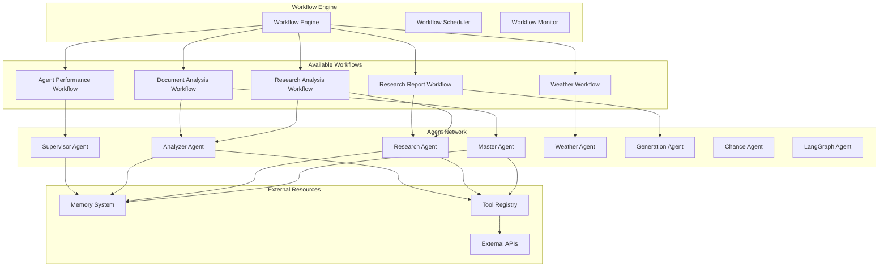

# Workflows & Orchestration Guidelines

This document outlines the workflow system, orchestration patterns, and best practices for multi-agent coordination in the CopilotKit + Mastra AI application.

## Workflow Architecture



## Workflow System Overview

The application uses Mastra's workflow system to orchestrate complex multi-step processes involving multiple agents, tools, and external services.

### Core Workflow Configuration

```typescript
// src/mastra/index.ts
export const mastra = new Mastra({
  workflows: {
    weatherWorkflow,
    researchAnalysisWorkflow,
    documentAnalysisWorkflow,
    researchReportWorkflow,
    agentPerformanceWorkflow,
  },
  // ... other configuration
});
```

## Available Workflows

### 1. Weather Workflow

**Purpose**: Process weather-related queries and provide comprehensive weather information.

```typescript
// src/mastra/workflows/weather-workflow.ts
export const weatherWorkflow = new Workflow({
  name: "weatherWorkflow",
  triggerSchema: z.object({
    location: z.string().describe("Location for weather query"),
    includeHourly: z.boolean().default(false),
    includeForecast: z.boolean().default(true),
    days: z.number().default(5),
  }),
})
  .step("validate_location", async ({ location }) => {
    // Validate and normalize location input
    const normalizedLocation = await validateLocation(location);
    return { location: normalizedLocation };
  })
  .step("fetch_current_weather", async ({ location }) => {
    // Get current weather conditions
    const currentWeather = await weatherAgent.getCurrentWeather(location);
    return { currentWeather };
  })
  .step("fetch_forecast", async ({ location, days, includeForecast }) => {
    if (!includeForecast) return { forecast: null };
    
    const forecast = await weatherAgent.getForecast(location, days);
    return { forecast };
  })
  .step("generate_summary", async ({ currentWeather, forecast, location }) => {
    // Generate human-readable weather summary
    const summary = await weatherAgent.generateWeatherSummary({
      location,
      current: currentWeather,
      forecast,
    });
    return { summary };
  });
```

**Usage:**
```typescript
const result = await mastra.workflow('weatherWorkflow').execute({
  location: "San Francisco, CA",
  includeForecast: true,
  days: 7,
});
```

### 2. Research Analysis Workflow

**Purpose**: Conduct comprehensive research and analysis on a given topic.

```typescript
// src/mastra/workflows/research-analysis-workflow.ts
export const researchAnalysisWorkflow = new Workflow({
  name: "researchAnalysisWorkflow",
  triggerSchema: z.object({
    topic: z.string().describe("Research topic"),
    depth: z.enum(['shallow', 'medium', 'deep']).default('medium'),
    sources: z.array(z.string()).optional().describe("Preferred sources"),
    timeframe: z.string().optional().describe("Time constraint for research"),
  }),
})
  .step("research_planning", async ({ topic, depth, sources }) => {
    // Plan research strategy
    const plan = await supervisorAgent.createResearchPlan({
      topic,
      depth,
      preferredSources: sources,
    });
    return { researchPlan: plan };
  })
  .step("information_gathering", async ({ topic, researchPlan }) => {
    // Gather information from multiple sources
    const searchResults = await researchAgent.gatherInformation({
      topic,
      searchQueries: researchPlan.queries,
      sources: researchPlan.sources,
    });
    return { rawData: searchResults };
  })
  .step("data_analysis", async ({ rawData, topic }) => {
    // Analyze gathered information
    const analysis = await analyzerAgent.analyzeResearchData({
      data: rawData,
      topic,
      analysisType: 'comprehensive',
    });
    return { analysis };
  })
  .step("insight_generation", async ({ analysis, topic }) => {
    // Generate insights and conclusions
    const insights = await analyzerAgent.generateInsights({
      analysis,
      topic,
      includeRecommendations: true,
    });
    return { insights };
  })
  .step("quality_review", async ({ insights, analysis, topic }) => {
    // Review quality and completeness
    const review = await supervisorAgent.reviewResearch({
      topic,
      analysis,
      insights,
    });
    return { qualityReview: review };
  });
```

**Usage:**
```typescript
const result = await mastra.workflow('researchAnalysisWorkflow').execute({
  topic: "Impact of AI on software development",
  depth: "deep",
  sources: ["academic", "industry", "news"],
});
```

### 3. Document Analysis Workflow

**Purpose**: Analyze and extract insights from documents.

```typescript
// src/mastra/workflows/document-analysis-workflow.ts
export const documentAnalysisWorkflow = new Workflow({
  name: "documentAnalysisWorkflow",
  triggerSchema: z.object({
    documents: z.array(z.object({
      id: z.string(),
      content: z.string(),
      metadata: z.record(z.any()).optional(),
    })),
    analysisType: z.enum(['summary', 'detailed', 'comparative']).default('detailed'),
    extractEntities: z.boolean().default(true),
    generateEmbeddings: z.boolean().default(true),
  }),
})
  .step("document_preprocessing", async ({ documents }) => {
    // Clean and preprocess documents
    const processedDocs = await Promise.all(
      documents.map(doc => masterAgent.preprocessDocument(doc))
    );
    return { processedDocuments: processedDocs };
  })
  .step("content_chunking", async ({ processedDocuments, generateEmbeddings }) => {
    // Chunk documents for analysis
    const chunks = await masterAgent.chunkDocuments({
      documents: processedDocuments,
      strategy: 'semantic',
      generateEmbeddings,
    });
    return { documentChunks: chunks };
  })
  .step("entity_extraction", async ({ processedDocuments, extractEntities }) => {
    if (!extractEntities) return { entities: [] };
    
    const entities = await analyzerAgent.extractEntities({
      documents: processedDocuments,
      entityTypes: ['person', 'organization', 'location', 'concept'],
    });
    return { entities };
  })
  .step("content_analysis", async ({ processedDocuments, analysisType }) => {
    // Perform detailed content analysis
    const analysis = await analyzerAgent.analyzeDocuments({
      documents: processedDocuments,
      analysisType,
      includeThemes: true,
      includeSentiment: true,
    });
    return { contentAnalysis: analysis };
  })
  .step("insight_synthesis", async ({ contentAnalysis, entities, analysisType }) => {
    // Synthesize insights from analysis
    const insights = await analyzerAgent.synthesizeInsights({
      analysis: contentAnalysis,
      entities,
      synthesisType: analysisType,
    });
    return { insights };
  });
```

### 4. Research Report Workflow

**Purpose**: Generate comprehensive research reports from analysis results.

```typescript
// src/mastra/workflows/research-report-workflow.ts
export const researchReportWorkflow = new Workflow({
  name: "researchReportWorkflow",
  triggerSchema: z.object({
    researchData: z.object({
      topic: z.string(),
      analysis: z.any(),
      insights: z.any(),
      sources: z.array(z.any()),
    }),
    reportType: z.enum(['executive', 'detailed', 'technical']).default('detailed'),
    includeVisualizations: z.boolean().default(true),
    targetAudience: z.string().optional(),
  }),
})
  .step("report_structure_planning", async ({ researchData, reportType, targetAudience }) => {
    // Plan report structure and sections
    const structure = await generationAgent.planReportStructure({
      topic: researchData.topic,
      reportType,
      targetAudience,
      availableData: researchData,
    });
    return { reportStructure: structure };
  })
  .step("content_generation", async ({ researchData, reportStructure }) => {
    // Generate report content for each section
    const sections = await Promise.all(
      reportStructure.sections.map(section =>
        generationAgent.generateReportSection({
          section,
          data: researchData,
          style: reportStructure.style,
        })
      )
    );
    return { reportSections: sections };
  })
  .step("visualization_creation", async ({ researchData, includeVisualizations }) => {
    if (!includeVisualizations) return { visualizations: [] };
    
    const visualizations = await analyzerAgent.createVisualizations({
      data: researchData.analysis,
      chartTypes: ['bar', 'line', 'pie', 'scatter'],
    });
    return { visualizations };
  })
  .step("report_assembly", async ({ reportSections, visualizations, reportStructure }) => {
    // Assemble final report
    const report = await generationAgent.assembleReport({
      sections: reportSections,
      visualizations,
      structure: reportStructure,
      format: 'markdown',
    });
    return { finalReport: report };
  })
  .step("quality_review", async ({ finalReport, researchData }) => {
    // Review report quality and accuracy
    const review = await supervisorAgent.reviewReport({
      report: finalReport,
      originalData: researchData,
      checkAccuracy: true,
      checkCompleteness: true,
    });
    return { qualityReview: review };
  });
```

### 5. Agent Performance Workflow

**Purpose**: Monitor and analyze agent performance metrics.

```typescript
// src/mastra/workflows/agent-performance-workflow.ts
export const agentPerformanceWorkflow = new Workflow({
  name: "agentPerformanceWorkflow",
  triggerSchema: z.object({
    timeframe: z.string().default('24h').describe("Analysis timeframe"),
    agents: z.array(z.string()).optional().describe("Specific agents to analyze"),
    includeRecommendations: z.boolean().default(true),
  }),
})
  .step("metrics_collection", async ({ timeframe, agents }) => {
    // Collect performance metrics
    const metrics = await supervisorAgent.collectPerformanceMetrics({
      timeframe,
      agents,
      includeToolUsage: true,
      includeErrorRates: true,
    });
    return { performanceMetrics: metrics };
  })
  .step("performance_analysis", async ({ performanceMetrics }) => {
    // Analyze performance patterns
    const analysis = await analyzerAgent.analyzePerformance({
      metrics: performanceMetrics,
      identifyBottlenecks: true,
      compareBaseline: true,
    });
    return { performanceAnalysis: analysis };
  })
  .step("anomaly_detection", async ({ performanceMetrics }) => {
    // Detect performance anomalies
    const anomalies = await analyzerAgent.detectAnomalies({
      metrics: performanceMetrics,
      sensitivity: 'medium',
      includeContext: true,
    });
    return { anomalies };
  })
  .step("recommendation_generation", async ({ performanceAnalysis, anomalies, includeRecommendations }) => {
    if (!includeRecommendations) return { recommendations: [] };
    
    const recommendations = await supervisorAgent.generateRecommendations({
      analysis: performanceAnalysis,
      anomalies,
      prioritize: true,
    });
    return { recommendations };
  });
```

## Workflow Execution Patterns

### 1. Sequential Execution

Basic sequential workflow execution:

```typescript
// Execute workflow steps in sequence
const result = await mastra.workflow('researchAnalysisWorkflow').execute({
  topic: "Machine Learning Trends 2024",
  depth: "medium",
});

console.log('Research completed:', result);
```

### 2. Conditional Branching

Workflows can include conditional logic:

```typescript
export const conditionalWorkflow = new Workflow({
  name: "conditionalWorkflow",
  triggerSchema: z.object({
    dataType: z.enum(['text', 'image', 'video']),
    content: z.string(),
  }),
})
  .step("content_analysis", async ({ dataType, content }) => {
    if (dataType === 'text') {
      return await analyzeText(content);
    } else if (dataType === 'image') {
      return await analyzeImage(content);
    } else {
      return await analyzeVideo(content);
    }
  })
  .step("generate_insights", async ({ analysisResult, dataType }) => {
    // Generate insights based on analysis type
    return await generateInsights(analysisResult, dataType);
  });
```

### 3. Parallel Execution

Execute multiple steps in parallel:

```typescript
export const parallelWorkflow = new Workflow({
  name: "parallelWorkflow",
  triggerSchema: z.object({
    query: z.string(),
  }),
})
  .step("parallel_search", async ({ query }) => {
    // Execute multiple searches in parallel
    const [braveResults, tavilyResults, arxivResults] = await Promise.all([
      braveSearch(query),
      tavilySearch(query),
      arxivSearch(query),
    ]);
    
    return {
      braveResults,
      tavilyResults,
      arxivResults,
    };
  })
  .step("merge_results", async ({ braveResults, tavilyResults, arxivResults }) => {
    // Merge and deduplicate results
    return mergeSearchResults([braveResults, tavilyResults, arxivResults]);
  });
```

### 4. Error Handling and Retry Logic

Implement robust error handling:

```typescript
export const resilientWorkflow = new Workflow({
  name: "resilientWorkflow",
  triggerSchema: z.object({
    task: z.string(),
  }),
})
  .step("risky_operation", async ({ task }) => {
    try {
      return await performRiskyOperation(task);
    } catch (error) {
      // Log error and attempt recovery
      logger.error('Risky operation failed', { task, error: error.message });
      
      // Attempt alternative approach
      return await performAlternativeOperation(task);
    }
  })
  .step("validate_result", async ({ result }) => {
    if (!isValidResult(result)) {
      throw new Error('Invalid result detected');
    }
    return { validatedResult: result };
  });
```

## Workflow State Management

### 1. Persistent State

Workflows can maintain persistent state across executions:

```typescript
export const statefulWorkflow = new Workflow({
  name: "statefulWorkflow",
  triggerSchema: z.object({
    sessionId: z.string(),
    action: z.string(),
  }),
})
  .step("load_state", async ({ sessionId }) => {
    // Load previous state from memory
    const state = await mastraMemory.getWorkflowState(sessionId);
    return { previousState: state };
  })
  .step("process_action", async ({ action, previousState }) => {
    // Process action with context from previous state
    const newState = await processWithState(action, previousState);
    return { newState };
  })
  .step("save_state", async ({ sessionId, newState }) => {
    // Save updated state
    await mastraMemory.saveWorkflowState(sessionId, newState);
    return { saved: true };
  });
```

### 2. Workflow Context

Share context between workflow steps:

```typescript
export const contextAwareWorkflow = new Workflow({
  name: "contextAwareWorkflow",
  triggerSchema: z.object({
    userId: z.string(),
    request: z.string(),
  }),
})
  .step("initialize_context", async ({ userId }) => {
    // Initialize workflow context
    const userProfile = await getUserProfile(userId);
    const preferences = await getUserPreferences(userId);
    
    return {
      context: {
        user: userProfile,
        preferences,
        startTime: new Date().toISOString(),
      },
    };
  })
  .step("process_request", async ({ request, context }) => {
    // Use context to personalize processing
    const result = await processPersonalizedRequest(request, context);
    return { result, context };
  })
  .step("log_interaction", async ({ context, result }) => {
    // Log interaction with full context
    await logUserInteraction({
      userId: context.user.id,
      request: context.originalRequest,
      result,
      timestamp: context.startTime,
    });
    return { logged: true };
  });
```

## Workflow Monitoring & Observability

### 1. Workflow Metrics

Track workflow performance and success rates:

```typescript
// Workflow execution metrics
const workflowMetrics = {
  executions: new Counter({
    name: 'workflow_executions_total',
    help: 'Total workflow executions',
    labelNames: ['workflow', 'status'],
  }),
  
  duration: new Histogram({
    name: 'workflow_duration_seconds',
    help: 'Workflow execution duration',
    labelNames: ['workflow'],
  }),
  
  stepDuration: new Histogram({
    name: 'workflow_step_duration_seconds',
    help: 'Individual step duration',
    labelNames: ['workflow', 'step'],
  }),
};

// Instrument workflow execution
export const instrumentedWorkflow = new Workflow({
  name: "instrumentedWorkflow",
  triggerSchema: z.object({
    input: z.string(),
  }),
})
  .step("monitored_step", async ({ input }) => {
    const stepTimer = workflowMetrics.stepDuration.startTimer({
      workflow: 'instrumentedWorkflow',
      step: 'monitored_step',
    });
    
    try {
      const result = await processInput(input);
      stepTimer({ status: 'success' });
      return { result };
    } catch (error) {
      stepTimer({ status: 'error' });
      throw error;
    }
  });
```

### 2. Workflow Logging

Comprehensive logging for workflow execution:

```typescript
export const loggedWorkflow = new Workflow({
  name: "loggedWorkflow",
  triggerSchema: z.object({
    task: z.string(),
  }),
})
  .step("logged_step", async ({ task }) => {
    const executionId = generateExecutionId();
    
    logger.info('Workflow step started', {
      workflow: 'loggedWorkflow',
      step: 'logged_step',
      executionId,
      input: { task },
    });
    
    try {
      const result = await processTask(task);
      
      logger.info('Workflow step completed', {
        workflow: 'loggedWorkflow',
        step: 'logged_step',
        executionId,
        success: true,
        duration: Date.now() - startTime,
      });
      
      return { result };
    } catch (error) {
      logger.error('Workflow step failed', {
        workflow: 'loggedWorkflow',
        step: 'logged_step',
        executionId,
        error: error.message,
        stack: error.stack,
      });
      
      throw error;
    }
  });
```

## Workflow Testing

### 1. Unit Testing Workflows

Test individual workflow steps:

```typescript
// __tests__/workflows/research-analysis-workflow.test.ts
import { researchAnalysisWorkflow } from '../research-analysis-workflow';

describe('Research Analysis Workflow', () => {
  beforeEach(() => {
    // Setup test environment
    jest.clearAllMocks();
  });

  test('should execute research planning step', async () => {
    const input = {
      topic: 'AI trends',
      depth: 'medium' as const,
    };

    const result = await researchAnalysisWorkflow
      .getStep('research_planning')
      .execute(input);

    expect(result).toHaveProperty('researchPlan');
    expect(result.researchPlan).toHaveProperty('queries');
    expect(result.researchPlan).toHaveProperty('sources');
  });

  test('should handle workflow execution errors', async () => {
    // Mock agent to throw error
    jest.spyOn(supervisorAgent, 'createResearchPlan')
      .mockRejectedValue(new Error('Planning failed'));

    await expect(
      researchAnalysisWorkflow.execute({
        topic: 'invalid topic',
        depth: 'medium',
      })
    ).rejects.toThrow('Planning failed');
  });
});
```

### 2. Integration Testing

Test complete workflow execution:

```typescript
// __tests__/workflows/integration.test.ts
describe('Workflow Integration Tests', () => {
  test('should execute weather workflow end-to-end', async () => {
    const result = await mastra.workflow('weatherWorkflow').execute({
      location: 'San Francisco, CA',
      includeForecast: true,
      days: 3,
    });

    expect(result).toHaveProperty('summary');
    expect(result).toHaveProperty('currentWeather');
    expect(result).toHaveProperty('forecast');
    expect(result.forecast).toHaveLength(3);
  });

  test('should handle workflow timeouts', async () => {
    // Set short timeout for testing
    const timeoutPromise = new Promise((_, reject) => {
      setTimeout(() => reject(new Error('Workflow timeout')), 1000);
    });

    const workflowPromise = mastra.workflow('researchAnalysisWorkflow').execute({
      topic: 'Complex research topic',
      depth: 'deep',
    });

    await expect(
      Promise.race([workflowPromise, timeoutPromise])
    ).rejects.toThrow('Workflow timeout');
  });
});
```

## Best Practices

### 1. Workflow Design
- Keep workflows focused on a single business process
- Design steps to be idempotent when possible
- Implement proper error handling and recovery
- Use meaningful step names and descriptions
- Validate inputs at the workflow level

### 2. Performance Optimization
- Minimize data passed between steps
- Use parallel execution where appropriate
- Implement caching for expensive operations
- Set appropriate timeouts for external calls
- Monitor and optimize step execution times

### 3. Error Handling
- Implement graceful degradation strategies
- Provide meaningful error messages
- Log errors with sufficient context
- Implement retry logic for transient failures
- Design fallback mechanisms for critical paths

### 4. Testing Strategy
- Test individual steps in isolation
- Test complete workflow execution
- Test error scenarios and edge cases
- Use mocks for external dependencies
- Implement performance and load testing

### 5. Monitoring & Observability
- Instrument workflows with metrics
- Implement comprehensive logging
- Track workflow success rates
- Monitor step execution times
- Set up alerting for workflow failures

This comprehensive workflow guide ensures that complex multi-agent processes are well-orchestrated, properly monitored, and maintainable throughout the application lifecycle.