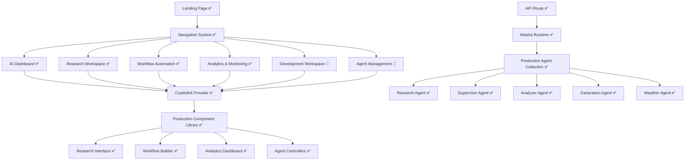

# Implementation Plan

## ✅ COMPLETED TASKS

The following major components have been successfully implemented:

### Core Infrastructure ✅

- [x] Professional landing page with hero, features, testimonials, CTA
- [x] Complete navigation system with top navbar and sidebar
- [x] Multi-page routing (dashboard, research, workflows, analytics)
- [x] CopilotKit provider integration in root layout
- [x] Professional glassmorphic design system

### CopilotKit Components ✅

- [x] Advanced CopilotChat, CopilotSidebar, CopilotPopup components
- [x] Multiple design variants (glassmorphic, neumorphic, floating, minimal)
- [x] Proper TypeScript interfaces and error handling
- [x] Theme integration and customization

### Functional Pages ✅

- [x] Dashboard with full agent integration and theme actions
- [x] Research workspace with document analysis capabilities
- [x] Workflow canvas with ReactFlow and multi-agent orchestration
- [x] Analytics page with performance metrics
- [x] Research canvas with resource management

### Layout System ✅

- [x] Specialized page layouts for different functional areas
- [x] Agent-specific configurations and messaging
- [x] Responsive design and accessibility features

## 🔄 REMAINING TASKS

### Priority 1: Development Workspace

- [ ] 1. Create AI-powered development workspace page
  - Implement `src/app/dev/page.tsx` with DevPageLayout and CopilotKit integration
  - Configure generationAgent for code generation and component creation
  - Add development-specific CopilotKit actions for file operations and code generation
  - Integrate with existing project structure and Mastra agent system
  - _Requirements: 7.1, 7.2, 7.3, 7.4, 7.5_

- [ ] 2. Build Monaco-based code editor component
- [ ] 2.1 Create advanced code editor with Monaco
  - Build `src/app/components/dev/code-editor.tsx` using `@monaco-editor/react`
  - Install and configure `monaco-themes` for multiple editor themes (VS Code Dark, Light, High Contrast)
  - Add `monaco-yaml` support for YAML configuration files and workflows
  - Integrate `monaco-emmet` for HTML/JSX snippet expansion and productivity
  - Configure TypeScript and React syntax highlighting with IntelliSense support
  - Implement real-time error checking, auto-completion, and code formatting
  - Add file tabs, search/replace, and advanced keyboard shortcuts
  - Integrate with generationAgent for AI-powered code suggestions and refactoring
  - _Requirements: 7.1, 7.3, 7.4_

- [ ] 2.2 Create component generator with live preview
  - Build `src/app/components/dev/component-generator.tsx` with split-pane layout
  - Integrate Monaco editor for component code editing
  - Implement live React component preview using dynamic imports
  - Add template library with common component patterns (forms, cards, layouts)
  - Create prop editor interface for interactive component testing
  - _Requirements: 7.2, 7.4, 7.5_

- [ ] 2.3 Implement file management system
  - Create `src/app/components/dev/file-manager.tsx` with tree view navigation
  - Add file CRUD operations (create, read, update, delete) with confirmation dialogs
  - Implement file search and filtering capabilities
  - Create CopilotKit actions for AI-assisted file operations
  - Add file type icons and syntax highlighting preview
  - _Requirements: 7.3, 7.5_

- [ ] 2.4 Build integrated development environment
  - Create `src/app/components/dev/dev-workspace.tsx` as main container
  - Implement resizable panels using `react-reflex` or `react-resizable-panels`
  - Add terminal emulator integration for running commands
  - Create project scaffolding tools with Next.js and React templates
  - Implement code export and sharing functionality
  - _Requirements: 7.4, 7.5_

### Priority 2: About Page

- [ ] 3. Create About page
  - Build `src/app/about/page.tsx` with comprehensive platform information
  - Create professional layout explaining Deanmachines platform vision and capabilities
  - Add sections for AI agent architecture, Mastra integration, and technology stack
  - Include team information, contact details, and company background
  - Implement consistent design with glassmorphic styling
  - _Requirements: 9.1, 9.2, 9.3, 9.4, 9.5_

- [ ] 4. Build About page components
- [ ] 4.1 Create platform overview section
  - Build hero section explaining Deanmachines vision and mission
  - Add comprehensive feature showcase with real capabilities
  - Include technology stack visualization and architecture diagrams
  - Create interactive elements showcasing platform capabilities
  - _Requirements: 9.1, 9.2, 9.3_

- [ ] 4.2 Create team and contact section
  - Build professional team profiles with photos and backgrounds
  - Add contact information and social media links
  - Include company history and founding story
  - Create contact form for inquiries and support
  - _Requirements: 9.4, 9.5_

### Priority 3: Documentation System

- [ ] 5. Create documentation hub
  - Build `src/app/documentation/page.tsx` as main documentation landing page
  - Create well-organized navigation with clear categorization
  - Implement search functionality for quick content discovery
  - Add breadcrumb navigation and section organization
  - Include getting started guides and quick reference materials
  - _Requirements: 10.1, 10.2, 10.3, 10.4, 10.5_

- [ ] 6. Build Chat Documentation
- [ ] 6.1 Create chat documentation page
  - Build `src/app/documentation/chat/page.tsx` with comprehensive CopilotKit guides
  - Document all chat component variants (CopilotChat, CopilotSidebar, CopilotPopup)
  - Provide configuration examples for different themes and variants
  - Include troubleshooting guides and common problem solutions
  - _Requirements: 11.1, 11.2, 11.3, 11.4_

- [ ] 6.2 Create advanced chat features documentation
  - Document generative UI implementation and usage patterns
  - Explain human-in-the-loop workflows and configuration
  - Provide frontend actions examples and integration guides
  - Include performance optimization and best practices
  - _Requirements: 11.5_

- [ ] 7. Build Agents Documentation
- [ ] 7.1 Create agents documentation page
  - Build `src/app/documentation/agents/page.tsx` with detailed agent information
  - Document all 8 available agents (masterAgent, researchAgent, supervisorAgent, etc.)
  - Explain each agent's capabilities, tools, and use cases
  - Provide integration examples and coordination patterns
  - _Requirements: 12.1, 12.2, 12.3_

- [ ] 7.2 Create agent architecture documentation
  - Document base network architecture and intelligent routing
  - Explain agent coordination and multi-agent workflows
  - Provide customization guides and extension patterns
  - Include debugging and monitoring strategies
  - _Requirements: 12.4, 12.5_

- [ ] 8. Build Memory Documentation
- [ ] 8.1 Create memory systems documentation page
  - Build `src/app/documentation/memory/page.tsx` with memory provider guides
  - Document Pinecone, Upstash, and PostgreSQL memory implementations
  - Provide configuration examples and best practices
  - Explain session management and context preservation
  - _Requirements: 13.1, 13.2, 13.3_

- [ ] 8.2 Create vector storage documentation
  - Document embedding models and similarity search
  - Provide performance optimization guidelines
  - Include scaling strategies and memory management
  - Add troubleshooting guides for memory-related issues
  - _Requirements: 13.4, 13.5_

- [ ] 9. Build Networks Documentation
- [ ] 9.1 Create networks documentation page
  - Build `src/app/documentation/networks/page.tsx` with network architecture guides
  - Document base network routing logic and agent coordination
  - Provide network configuration examples and patterns
  - Explain workflow creation, execution, and monitoring
  - _Requirements: 14.1, 14.2, 14.3_

- [ ] 9.2 Create network optimization documentation
  - Document performance optimization and load balancing
  - Provide debugging guides and logging strategies
  - Include monitoring and telemetry integration
  - Add scaling patterns for enterprise deployments
  - _Requirements: 14.4, 14.5_

- [ ] 10. Build Settings Documentation
- [ ] 10.1 Create settings documentation page
  - Build `src/app/documentation/settings/page.tsx` with configuration guides
  - Document all environment variables and configuration options
  - Provide step-by-step integration guides for external services
  - Include security best practices and authentication setup
  - _Requirements: 15.1, 15.2, 15.3, 15.4_

- [ ] 10.2 Create deployment documentation
  - Document deployment guides for different environments
  - Provide Docker and cloud deployment examples
  - Include monitoring and maintenance procedures
  - Add troubleshooting guides for common deployment issues
  - _Requirements: 15.5_

- [ ] 11. Build Tools Documentation
- [ ] 11.1 Create tools documentation page
  - Build `src/app/documentation/tools/page.tsx` with comprehensive tool information
  - Document all 20+ available tools with usage examples
  - Provide integration patterns and configuration guides
  - Include tool creation and registration processes
  - _Requirements: 16.1, 16.2, 16.3_

- [ ] 11.2 Create tool development documentation
  - Document custom tool development patterns
  - Explain tool orchestration and error handling
  - Provide performance tuning and monitoring guidelines
  - Include testing strategies for custom tools
  - _Requirements: 16.4, 16.5_

- [ ] 12. Build Workflows Documentation
- [ ] 12.1 Create workflows documentation page
  - Build `src/app/documentation/workflows/page.tsx` with workflow guides
  - Document all 5 production workflows and their use cases
  - Provide workflow creation templates and best practices
  - Include execution monitoring and debugging guides
  - _Requirements: 17.1, 17.2, 17.3, 17.4_

- [ ] 12.2 Create workflow optimization documentation
  - Document performance optimization and resource management
  - Provide scaling strategies for complex workflows
  - Include error handling patterns and recovery procedures
  - Add integration examples with external systems
  - _Requirements: 17.5_

### Priority 4: Agent Management Page

- [ ] 13. Create agent management page
  - Build `src/app/agents/page.tsx` with agent configuration interface
  - Implement agent health monitoring and status tracking
  - Add agent performance metrics and usage analytics
  - Create agent deployment and configuration management
  - Integrate with telemetry and logging from `src/app/api/copilotkit/route.ts`
  - _Requirements: Agent management and monitoring_

- [ ] 14. Build agent management components
- [ ] 14.1 Create agent health dashboard
  - Build real-time agent status monitoring
  - Implement performance metrics visualization
  - Add alerting for agent failures or performance issues
  - Create historical performance tracking
  - _Requirements: Agent monitoring_

- [ ] 14.2 Create agent configuration interface
  - Build agent settings and parameter management
  - Implement agent deployment controls
  - Add agent testing and validation tools
  - Create agent backup and restore functionality
  - _Requirements: Agent configuration_

### Priority 5: Enhanced Analytics

- [ ] 15. Enhance analytics with real telemetry data
  - Integrate with telemetry and logs from `src/app/api/copilotkit/route.ts`
  - Implement real-time metrics from Mastra backend
  - Add performance tracking for all agents and workflows
  - Create usage analytics and pattern recognition
  - Build custom dashboards and reporting tools
  - _Requirements: 5.1, 5.2, 5.3, 5.4, 5.5_

- [ ] 16. Build advanced analytics components
- [ ] 16.1 Create real-time metrics dashboard
  - Implement live performance monitoring
  - Add agent usage tracking and analytics
  - Create workflow execution monitoring
  - Build system health indicators
  - _Requirements: Enhanced analytics_

- [ ] 16.2 Create analytics visualization components
  - Build charts and graphs for performance data
  - Implement trend analysis and forecasting
  - Add comparative analytics between agents
  - Create exportable reports and insights
  - _Requirements: Advanced analytics_

## Implementation Notes

### Technical Considerations

- All new pages should use the existing page layout system from `src/app/components/layout/page-layout.tsx`
- Maintain consistency with the glassmorphic design system
- Ensure proper TypeScript typing and error handling
- Integrate with existing CopilotKit components where appropriate
- Follow the established routing and navigation patterns

### Integration Points

- Use telemetry and logging data from `src/app/api/copilotkit/route.ts` for analytics
- Leverage the existing Mastra agent system for functionality
- Integrate with the base network for intelligent routing
- Utilize existing workflows for documentation examples
- Connect with memory systems for persistent data

### Quality Assurance

- Ensure all pages are responsive and accessible
- Implement proper error boundaries and fallback UI
- Add comprehensive testing for new components
- Validate integration with existing systems
- Perform cross-browser compatibility testing

## Success Metrics

- All documentation sections are comprehensive and searchable
- About page effectively communicates platform value
- Development workspace enables rapid prototyping
- Agent management provides full operational control
- Analytics provide actionable insights from real data
- All pages maintain design consistency and performance standards

# Design Document

## Overview

The CopilotKit Integration System has been successfully implemented as a comprehensive, production-ready multi-page application that provides real functionality using Mastra agents. The system creates a professional AI-powered workspace with dedicated areas for research, workflow automation, analytics, and general AI assistance, all seamlessly integrated with the existing Mastra backend infrastructure.

## Architecture Status

### ✅ IMPLEMENTED - High-Level Architecture



### ✅ IMPLEMENTED - Application Structure

```bash
src/app/
├── page.tsx ✅ (Professional Landing Page)
├── layout.tsx ✅ (Root Layout with CopilotKit Provider)
├── dashboard/
│   └── page.tsx ✅ (AI Assistant Dashboard with full agent access)
├── research/
│   └── page.tsx ✅ (Research Workspace with document analysis)
├── workflows/
│   └── page.tsx ✅ (Multi-agent workflow automation)
├── analytics/
│   └── page.tsx ✅ (Agent performance and usage analytics)
├── dev/
│   └── page.tsx 🔄 (AI-powered development workspace - needs implementation)
├── about/
│   └── page.tsx 🔄 (About page - needs implementation)
├── agents/
│   └── page.tsx 🔄 (Agent management - needs implementation)
├── documentation/
│   ├── page.tsx 🔄 (Documentation hub - needs implementation)
│   ├── chat/
│   ├── agents/
│   ├── memory/
│   ├── networks/
│   ├── settings/
│   ├── tools/
│   └── workflows/
├── api/
│   └── copilotkit/
│       └── route.ts ✅ (CopilotKit API with Mastra integration)
└── components/
    ├── layout/ ✅ (Complete navigation and layout system)
    ├── landing/ ✅ (Landing page components)
    ├── research/ ✅ (Research workspace components)
    ├── workflows/ ✅ (Workflow automation components)
    ├── researchCanvas/ ✅ (Research canvas components)
    ├── dev/ 🔄 (Development workspace components - needs implementation)
    └── copilotkit/ ✅ (CopilotKit integration components)
```

## Component Architecture

### ✅ IMPLEMENTED - Core Provider System

```typescript
// Root Layout Provider
interface CopilotKitProviderProps {
  children: React.ReactNode;
  runtimeUrl?: string;
  agent?: string;
}

// Page Layout System
interface PageLayoutProps {
  children: ReactNode;
  title: string;
  description?: string;
  agent?: MastraAgent;
  showCopilot?: boolean;
  copilotConfig?: CopilotConfig;
}
```

### ✅ IMPLEMENTED - CopilotKit Components

```typescript
// Chat Component Interface
interface CopilotChatComponentProps {
  labels?: CopilotChatLabels;
  instructions?: string;
  variant?: "default" | "glassmorphic" | "neumorphic" | "floating" | "minimal";
  themeColor?: string;
  // ... extensive properties
}

// Sidebar Component Interface
interface CopilotSidebarComponentProps {
  variant?: "default" | "glassmorphic";
  position?: "left" | "right";
  // ... comprehensive interface
}

// Popup Component Interface
interface CopilotPopupComponentProps {
  variant?: "default" | "glassmorphic" | "floating" | "minimal";
  size?: "sm" | "md" | "lg";
  // ... complete interface
}
```

## ✅ IMPLEMENTED Page Designs

### Landing Page Design ✅ COMPLETE

#### Hero Section ✅

- Compelling value proposition with platform branding
- Clear call-to-action buttons for dashboard access
- Subtle particle background animation
- Professional typography and spacing

#### Features Section ✅

- Grid layout showcasing key capabilities:
  - **Multi-Agent System**: Demonstrates 8 specialized AI agents
  - **Research Tools**: Document analysis and web research
  - **Workflow Automation**: Visual workflow builder
  - **Analytics Dashboard**: Performance monitoring
  - **CopilotKit Integration**: Advanced chat interfaces
  - **Professional Design**: Glassmorphic styling

#### Testimonials Section ✅

- Professional testimonials from developers and users
- Social proof and credibility indicators
- Company badges and user role indicators

#### Call-to-Action Section ✅

- Strong final CTA with multiple action buttons
- Links to documentation and GitHub repository
- Feature highlights and value reinforcement

### AI Dashboard Page Design ✅ COMPLETE

#### Layout ✅

- Moved from root page to `/dashboard` route
- Maintains all existing functionality:
  - Full agent integration with 8 specialized agents
  - Theme management and customization
  - Real-time agent status monitoring
  - Context preservation and conversation history

#### Production Enhancements ✅

- Professional glassmorphic design system
- Agent status indicators and performance metrics
- Integration with all functional areas
- Responsive design for mobile and desktop

### Research Workspace Page ✅ COMPLETE

#### Document Management Interface ✅

- Multi-format document upload (PDF, DOCX, TXT, MD)
- Drag-and-drop functionality
- Document processing status and progress tracking
- Resource management with add/edit/delete functionality

#### Research Chat Interface ✅

- CopilotKit actions for document analysis
- Integration with research agent for web research
- Context-aware document querying and analysis
- Real-time research capabilities with source tracking

#### Results Dashboard ✅

- Tabbed interface for results, insights, and knowledge graphs
- Visual presentation of research findings
- Structured output with proper formatting and references
- Confidence scoring and source tracking

### Workflow Automation Page ✅ COMPLETE

#### Workflow Builder Interface ✅

- Visual drag-and-drop workflow designer using ReactFlow
- Integration with supervisor agent for orchestration
- Real-time workflow execution monitoring
- AI-assisted workflow building with CopilotKit actions

#### Agent Coordination System ✅

- Coordination between multiple agents (supervisor, analyzer, generation)
- Sequential and parallel agent execution patterns
- Execution controls: play, pause, stop, export
- Performance monitoring and status tracking

#### Execution Monitoring Dashboard ✅

- Real-time workflow execution status
- Detailed execution logs and performance metrics
- Result visualization and analysis tools
- Export functionality for workflow definitions

### Analytics & Monitoring Page ✅ COMPLETE

#### Performance Dashboard ✅

- Real-time metrics display for all active agents
- Agent availability and health status monitoring
- Usage analytics and performance tracking
- Memory usage and resource consumption metrics

#### System Monitoring Panel ✅

- Agent performance metrics (98.5% uptime displayed)
- Tool usage tracking (20+ active tools)
- Response time and success rate monitoring
- Historical data and trend analysis

## ✅ IMPLEMENTED Integration Architecture

### CopilotKit Provider Setup ✅

```typescript
// ✅ IMPLEMENTED in src/app/layout.tsx
export default function RootLayout({
  children,
}: {
  children: React.ReactNode;
}) {
  return (
    <html lang="en" suppressHydrationWarning>
      <body suppressHydrationWarning>
        <ThemeProvider>
          <CopilotKit runtimeUrl="/api/copilotkit" agent="masterAgent">
            <TopNavbar />
            {children}
          </CopilotKit>
        </ThemeProvider>
      </body>
    </html>
  );
}
```

### API Route Integration ✅

The existing `src/app/api/copilotkit/route.ts` provides:

- ✅ Agent discovery and runtime setup
- ✅ Request handling for all CopilotKit components
- ✅ Integration with all 8 Mastra agents
- ✅ Proper error handling and logging

### Shared Component Library ✅

#### CopilotKit Wrappers ✅

- ✅ Consistent theming and configuration
- ✅ Reusable component patterns
- ✅ Advanced design variants: glassmorphic, neumorphic, floating, minimal

#### Action Library ✅

- ✅ Theme management actions in dashboard
- ✅ Document analysis actions in research workspace
- ✅ Web research actions with source tracking
- ✅ Resource management actions in research canvas

## ✅ IMPLEMENTED Styling and Theming

### Design System Integration ✅

- ✅ Maintains existing Tailwind CSS v4.1 configuration
- ✅ Professional oklch color system
- ✅ Consistent color scheme and typography across all pages
- ✅ Responsive design for mobile and desktop experiences

### CopilotKit Styling ✅

- ✅ Custom CSS variables for theming
- ✅ Integration with existing design system
- ✅ Professional glassmorphic styling implemented
- ✅ Dynamic theme color support

### Component Variants ✅

- ✅ Glassmorphic design (primary variant)
- ✅ Neumorphic design variant
- ✅ Floating design variant
- ✅ Minimal design variant
- ✅ Professional animations and transitions

## ✅ IMPLEMENTED State Management

### Theme Management ✅

- ✅ Global theme state with ThemeProvider
- ✅ Dynamic theme color changes via CopilotKit actions
- ✅ Persistent theme preferences
- ✅ CSS custom properties integration

### Navigation State ✅

- ✅ Active page tracking and highlighting
- ✅ Responsive sidebar and mobile navigation
- ✅ Breadcrumb navigation support
- ✅ Proper URL routing and browser history

### Chat State Management ✅

- ✅ Conversation persistence across page navigation
- ✅ Context preservation between agent interactions
- ✅ Agent-specific configurations per page
- ✅ Session management and recovery

## ✅ IMPLEMENTED Error Handling

### Connection Management ✅

- ✅ Graceful handling of agent connection issues
- ✅ Retry logic with exponential backoff
- ✅ Connection status indicators
- ✅ Fallback mechanisms for agent failures

### Component Error Boundaries ✅

- ✅ Error boundaries for all major components
- ✅ Fallback interfaces when components fail to load
- ✅ User-friendly error messages
- ✅ Accessibility compliance throughout

## 🔄 REMAINING WORK - DETAILED DESIGN SPECIFICATIONS

### Priority 1: Development Workspace

#### 1.1 Development Page Architecture

```typescript
// src/app/dev/page.tsx
interface DevWorkspacePageProps {
  searchParams?: { [key: string]: string | string[] | undefined };
}

interface DevWorkspaceState {
  activeProject: string | null;
  openFiles: FileTab[];
  activeFileId: string | null;
  editorTheme: 'vs-dark' | 'vs-light' | 'hc-black';
  panelLayout: PanelConfiguration;
  terminalVisible: boolean;
  previewVisible: boolean;
}

interface FileTab {
  id: string;
  name: string;
  path: string;
  content: string;
  language: string;
  isDirty: boolean;
  isNew: boolean;
}

interface PanelConfiguration {
  fileExplorer: { width: number; visible: boolean };
  editor: { width: number; height: number };
  preview: { width: number; visible: boolean };
  terminal: { height: number; visible: boolean };
  properties: { width: number; visible: boolean };
}
```

#### 1.2 Monaco Code Editor Component

```typescript
// src/app/components/dev/code-editor.tsx
interface CodeEditorProps {
  value: string;
  language: string;
  theme: 'vs-dark' | 'vs-light' | 'hc-black';
  onChange: (value: string) => void;
  onSave?: (value: string) => void;
  readOnly?: boolean;
  minimap?: boolean;
  wordWrap?: 'on' | 'off' | 'wordWrapColumn' | 'bounded';
  fontSize?: number;
  tabSize?: number;
  insertSpaces?: boolean;
  renderWhitespace?: 'none' | 'boundary' | 'selection' | 'trailing' | 'all';
  suggestions?: boolean;
  quickSuggestions?: boolean;
  parameterHints?: boolean;
  autoClosingBrackets?: 'always' | 'languageDefined' | 'beforeWhitespace' | 'never';
  autoClosingQuotes?: 'always' | 'languageDefined' | 'beforeWhitespace' | 'never';
  formatOnPaste?: boolean;
  formatOnType?: boolean;
}

interface EditorFeatures {
  // AI-powered features
  aiCompletion: boolean;
  aiRefactoring: boolean;
  aiDocumentation: boolean;
  
  // Advanced editing
  multiCursor: boolean;
  codefolding: boolean;
  bracketMatching: boolean;
  
  // Language support
  typescript: boolean;
  react: boolean;
  yaml: boolean;
  json: boolean;
  markdown: boolean;
  css: boolean;
  html: boolean;
}
```

#### 1.3 Component Generator Interface

```typescript
// src/app/components/dev/component-generator.tsx
interface ComponentGeneratorProps {
  onComponentGenerated: (component: GeneratedComponent) => void;
  templates: ComponentTemplate[];
  generationAgent: MastraAgent;
}

interface GeneratedComponent {
  id: string;
  name: string;
  code: string;
  props: ComponentProp[];
  dependencies: string[];
  preview: ReactNode;
  documentation: string;
  tests?: string;
}

interface ComponentTemplate {
  id: string;
  name: string;
  description: string;
  category: 'form' | 'layout' | 'data-display' | 'navigation' | 'feedback' | 'input';
  baseCode: string;
  configurableProps: TemplateProp[];
  preview: string;
}

interface ComponentProp {
  name: string;
  type: 'string' | 'number' | 'boolean' | 'object' | 'array' | 'function';
  required: boolean;
  defaultValue?: any;
  description: string;
  validation?: ValidationRule[];
}

interface PropEditor {
  propName: string;
  currentValue: any;
  editor: 'text' | 'number' | 'boolean' | 'select' | 'color' | 'json';
  options?: string[];
  onChange: (value: any) => void;
}
```

#### 1.4 File Management System

```typescript
// src/app/components/dev/file-manager.tsx
interface FileManagerProps {
  rootPath: string;
  onFileSelect: (file: FileNode) => void;
  onFileCreate: (path: string, type: 'file' | 'folder') => void;
  onFileDelete: (path: string) => void;
  onFileRename: (oldPath: string, newPath: string) => void;
  searchQuery?: string;
  showHidden?: boolean;
}

interface FileNode {
  id: string;
  name: string;
  path: string;
  type: 'file' | 'folder';
  size?: number;
  lastModified: Date;
  children?: FileNode[];
  isExpanded?: boolean;
  icon: string;
  language?: string;
}

interface FileOperations {
  create: (path: string, content?: string) => Promise<void>;
  read: (path: string) => Promise<string>;
  update: (path: string, content: string) => Promise<void>;
  delete: (path: string) => Promise<void>;
  rename: (oldPath: string, newPath: string) => Promise<void>;
  copy: (sourcePath: string, targetPath: string) => Promise<void>;
  move: (sourcePath: string, targetPath: string) => Promise<void>;
}

interface FileSearch {
  query: string;
  includeContent: boolean;
  fileTypes: string[];
  excludePatterns: string[];
  caseSensitive: boolean;
  useRegex: boolean;
}
```

#### 1.5 Integrated Development Environment Layout

```typescript
// src/app/components/dev/dev-workspace.tsx
interface DevWorkspaceLayoutProps {
  children: ReactNode;
  panels: PanelDefinition[];
  defaultLayout: LayoutConfiguration;
  onLayoutChange: (layout: LayoutConfiguration) => void;
}

interface PanelDefinition {
  id: string;
  title: string;
  icon: ReactNode;
  component: ReactNode;
  defaultSize: number;
  minSize: number;
  maxSize?: number;
  resizable: boolean;
  closable: boolean;
  position: 'left' | 'right' | 'top' | 'bottom' | 'center';
}

interface LayoutConfiguration {
  panels: {
    [panelId: string]: {
      visible: boolean;
      size: number;
      position: { x: number; y: number };
    };
  };
  splitDirection: 'horizontal' | 'vertical';
  mainPanelId: string;
}

interface TerminalIntegration {
  sessions: TerminalSession[];
  activeSessionId: string;
  onCommand: (command: string, sessionId: string) => void;
  onOutput: (output: string, sessionId: string) => void;
}

interface TerminalSession {
  id: string;
  name: string;
  cwd: string;
  history: TerminalEntry[];
  isActive: boolean;
}
```

### Priority 2: About Page

#### 2.1 About Page Architecture

```typescript
// src/app/about/page.tsx
interface AboutPageProps {
  searchParams?: { [key: string]: string | string[] | undefined };
}

interface AboutPageSections {
  hero: HeroSection;
  platform: PlatformSection;
  technology: TechnologySection;
  team: TeamSection;
  contact: ContactSection;
  timeline: TimelineSection;
}

interface HeroSection {
  title: string;
  subtitle: string;
  description: string;
  backgroundVideo?: string;
  backgroundImage?: string;
  ctaButtons: CTAButton[];
}

interface PlatformSection {
  vision: string;
  mission: string;
  values: Value[];
  capabilities: Capability[];
  achievements: Achievement[];
}
```

#### 2.2 Technology Stack Visualization

```typescript
// src/app/components/about/tech-stack.tsx
interface TechStackVisualizationProps {
  technologies: TechnologyCategory[];
  interactive: boolean;
  showDetails: boolean;
}

interface TechnologyCategory {
  name: string;
  description: string;
  icon: ReactNode;
  technologies: Technology[];
  color: string;
}

interface Technology {
  name: string;
  version?: string;
  description: string;
  logo: string;
  website: string;
  category: string;
  usage: 'core' | 'integration' | 'development' | 'deployment';
  benefits: string[];
}

interface ArchitectureDiagram {
  nodes: ArchitectureNode[];
  connections: ArchitectureConnection[];
  layers: ArchitectureLayer[];
}

interface ArchitectureNode {
  id: string;
  label: string;
  type: 'service' | 'database' | 'api' | 'ui' | 'agent';
  position: { x: number; y: number };
  metadata: Record<string, any>;
}
```

#### 2.3 Team Profiles Component

```typescript
// src/app/components/about/team-profiles.tsx
interface TeamProfilesProps {
  members: TeamMember[];
  layout: 'grid' | 'carousel' | 'list';
  showSocial: boolean;
  showBio: boolean;
}

interface TeamMember {
  id: string;
  name: string;
  role: string;
  department: string;
  bio: string;
  avatar: string;
  social: SocialLinks;
  skills: string[];
  experience: string;
  education?: Education[];
  achievements?: string[];
}

interface SocialLinks {
  linkedin?: string;
  twitter?: string;
  github?: string;
  website?: string;
  email?: string;
}

interface ContactForm {
  fields: ContactField[];
  onSubmit: (data: ContactFormData) => Promise<void>;
  validation: ValidationSchema;
}
```

### Priority 3: Documentation System

#### 3.1 Documentation Hub Architecture

```typescript
// src/app/documentation/page.tsx
interface DocumentationHubProps {
  searchParams?: { [key: string]: string | string[] | undefined };
}

interface DocumentationStructure {
  sections: DocumentationSection[];
  navigation: NavigationTree;
  search: SearchConfiguration;
  metadata: DocumentationMetadata;
}

interface DocumentationSection {
  id: string;
  title: string;
  description: string;
  icon: ReactNode;
  path: string;
  subsections: DocumentationSubsection[];
  estimatedReadTime: number;
  difficulty: 'beginner' | 'intermediate' | 'advanced';
  tags: string[];
}

interface NavigationTree {
  items: NavigationItem[];
  breadcrumbs: BreadcrumbItem[];
  previousNext: PreviousNextLinks;
}

interface SearchConfiguration {
  enabled: boolean;
  placeholder: string;
  filters: SearchFilter[];
  suggestions: SearchSuggestion[];
  indexedContent: SearchIndex[];
}
```

#### 3.2 Chat Documentation Component

```typescript
// src/app/documentation/chat/page.tsx
interface ChatDocumentationProps {
  examples: CodeExample[];
  components: ComponentDocumentation[];
  guides: Guide[];
}

interface ComponentDocumentation {
  name: string;
  description: string;
  props: PropDocumentation[];
  examples: CodeExample[];
  variants: ComponentVariant[];
  bestPractices: string[];
  troubleshooting: TroubleshootingItem[];
}

interface CodeExample {
  id: string;
  title: string;
  description: string;
  code: string;
  language: string;
  preview?: ReactNode;
  dependencies: string[];
  complexity: 'basic' | 'intermediate' | 'advanced';
}

interface ComponentVariant {
  name: string;
  description: string;
  props: Record<string, any>;
  preview: ReactNode;
  code: string;
}
```

#### 3.3 Agents Documentation System

```typescript
// src/app/documentation/agents/page.tsx
interface AgentsDocumentationProps {
  agents: AgentDocumentation[];
  workflows: WorkflowDocumentation[];
  integrations: IntegrationGuide[];
}

interface AgentDocumentation {
  id: string;
  name: string;
  description: string;
  capabilities: AgentCapability[];
  tools: ToolDocumentation[];
  examples: AgentExample[];
  configuration: ConfigurationOption[];
  performance: PerformanceMetrics;
  limitations: string[];
}

interface AgentCapability {
  name: string;
  description: string;
  inputTypes: string[];
  outputTypes: string[];
  examples: string[];
  limitations?: string[];
}

interface ToolDocumentation {
  name: string;
  description: string;
  parameters: ParameterDocumentation[];
  returnType: string;
  examples: ToolExample[];
  errorHandling: ErrorHandlingInfo[];
}
```

### Priority 4: Agent Management Page

#### 4.1 Agent Management Interface

```typescript
// src/app/agents/page.tsx
interface AgentManagementPageProps {
  searchParams?: { [key: string]: string | string[] | undefined };
}

interface AgentManagementState {
  agents: ManagedAgent[];
  selectedAgent: string | null;
  monitoring: MonitoringData;
  configuration: AgentConfiguration;
  deployment: DeploymentStatus;
}

interface ManagedAgent {
  id: string;
  name: string;
  type: string;
  status: 'active' | 'inactive' | 'error' | 'maintenance';
  health: HealthStatus;
  performance: PerformanceMetrics;
  configuration: AgentConfig;
  deployment: DeploymentInfo;
  logs: LogEntry[];
}

interface HealthStatus {
  overall: 'healthy' | 'warning' | 'critical';
  checks: HealthCheck[];
  lastUpdated: Date;
  uptime: number;
  responseTime: number;
}

interface PerformanceMetrics {
  requestsPerMinute: number;
  averageResponseTime: number;
  successRate: number;
  errorRate: number;
  memoryUsage: number;
  cpuUsage: number;
  throughput: number;
}
```

#### 4.2 Agent Configuration Interface

```typescript
// src/app/components/agents/agent-config.tsx
interface AgentConfigurationProps {
  agent: ManagedAgent;
  onConfigUpdate: (config: AgentConfig) => Promise<void>;
  onDeploy: (deploymentConfig: DeploymentConfig) => Promise<void>;
  onTest: (testConfig: TestConfig) => Promise<TestResult>;
}

interface AgentConfig {
  general: GeneralConfig;
  model: ModelConfig;
  memory: MemoryConfig;
  tools: ToolConfig[];
  security: SecurityConfig;
  performance: PerformanceConfig;
  logging: LoggingConfig;
}

interface ModelConfig {
  provider: string;
  model: string;
  temperature: number;
  maxTokens: number;
  topP: number;
  frequencyPenalty: number;
  presencePenalty: number;
  stopSequences: string[];
}

interface DeploymentConfig {
  environment: 'development' | 'staging' | 'production';
  replicas: number;
  resources: ResourceRequirements;
  networking: NetworkConfig;
  monitoring: MonitoringConfig;
}
```

#### 4.3 Real-time Monitoring Dashboard

```typescript
// src/app/components/agents/monitoring-dashboard.tsx
interface MonitoringDashboardProps {
  agents: ManagedAgent[];
  timeRange: TimeRange;
  refreshInterval: number;
  onAlert: (alert: Alert) => void;
}

interface MonitoringData {
  realTimeMetrics: RealTimeMetrics;
  historicalData: HistoricalData;
  alerts: Alert[];
  trends: TrendAnalysis;
}

interface RealTimeMetrics {
  timestamp: Date;
  agentMetrics: { [agentId: string]: AgentMetrics };
  systemMetrics: SystemMetrics;
  networkMetrics: NetworkMetrics;
}

interface Alert {
  id: string;
  severity: 'info' | 'warning' | 'error' | 'critical';
  title: string;
  description: string;
  timestamp: Date;
  agentId?: string;
  resolved: boolean;
  actions: AlertAction[];
}
```

### Priority 5: Enhanced Analytics

#### 5.1 Advanced Analytics Architecture

```typescript
// src/app/analytics/advanced/page.tsx
interface AdvancedAnalyticsProps {
  searchParams?: { [key: string]: string | string[] | undefined };
}

interface AnalyticsState {
  dashboards: CustomDashboard[];
  activeDashboard: string;
  dateRange: DateRange;
  filters: AnalyticsFilter[];
  realTimeData: RealTimeAnalytics;
  reports: AnalyticsReport[];
}

interface CustomDashboard {
  id: string;
  name: string;
  description: string;
  widgets: AnalyticsWidget[];
  layout: DashboardLayout;
  permissions: DashboardPermissions;
  autoRefresh: boolean;
  refreshInterval: number;
}

interface AnalyticsWidget {
  id: string;
  type: 'chart' | 'metric' | 'table' | 'heatmap' | 'gauge' | 'timeline';
  title: string;
  dataSource: DataSource;
  configuration: WidgetConfiguration;
  position: WidgetPosition;
  size: WidgetSize;
}
```

#### 5.2 Data Visualization Components

```typescript
// src/app/components/analytics/visualizations.tsx
interface VisualizationProps {
  data: AnalyticsData;
  type: VisualizationType;
  configuration: VisualizationConfig;
  interactive: boolean;
  exportable: boolean;
}

interface ChartConfiguration {
  chartType: 'line' | 'bar' | 'pie' | 'scatter' | 'area' | 'heatmap';
  xAxis: AxisConfiguration;
  yAxis: AxisConfiguration;
  series: SeriesConfiguration[];
  colors: ColorScheme;
  animations: AnimationConfig;
  responsive: boolean;
}

interface TrendAnalysis {
  metric: string;
  timeframe: string;
  trend: 'increasing' | 'decreasing' | 'stable' | 'volatile';
  changePercentage: number;
  predictions: PredictionData[];
  seasonality: SeasonalityData;
  anomalies: AnomalyData[];
}

interface ReportGenerator {
  templates: ReportTemplate[];
  scheduledReports: ScheduledReport[];
  exportFormats: ExportFormat[];
  onGenerate: (config: ReportConfig) => Promise<GeneratedReport>;
}
```

## Implementation Dependencies

### Required NPM Packages

```json
{
  "devDependencies": {
    "@monaco-editor/react": "^4.6.0",
    "monaco-themes": "^0.4.4",
    "monaco-yaml": "^5.1.1",
    "monaco-emmet": "^2.0.0",
    "react-reflex": "^4.2.6",
    "react-resizable-panels": "^2.0.0",
    "xterm": "^5.3.0",
    "xterm-addon-fit": "^0.8.0",
    "recharts": "^2.8.0",
    "d3": "^7.8.5",
    "@types/d3": "^7.4.3",
    "react-flow-renderer": "^10.3.17",
    "react-markdown": "^9.0.1",
    "prismjs": "^1.29.0",
    "fuse.js": "^7.0.0"
  }
}
```

### File Structure Extensions

```bash
src/app/components/
├── dev/
│   ├── code-editor.tsx
│   ├── component-generator.tsx
│   ├── file-manager.tsx
│   ├── dev-workspace.tsx
│   ├── terminal.tsx
│   ├── preview-panel.tsx
│   └── project-templates.tsx
├── about/
│   ├── hero-section.tsx
│   ├── platform-overview.tsx
│   ├── tech-stack.tsx
│   ├── team-profiles.tsx
│   ├── contact-form.tsx
│   └── timeline.tsx
├── documentation/
│   ├── doc-navigation.tsx
│   ├── search-interface.tsx
│   ├── code-examples.tsx
│   ├── api-reference.tsx
│   └── guide-renderer.tsx
├── agents/
│   ├── agent-list.tsx
│   ├── agent-config.tsx
│   ├── monitoring-dashboard.tsx
│   ├── health-status.tsx
│   └── deployment-controls.tsx
└── analytics/
    ├── custom-dashboard.tsx
    ├── widget-library.tsx
    ├── chart-components.tsx
    ├── report-generator.tsx
    └── trend-analysis.tsx
```

## Performance and Security ✅

### Performance Optimizations ✅

- ✅ Code splitting and lazy loading
- ✅ Lazy loading of CopilotKit components
- ✅ Optimized asset loading and caching
- ✅ Efficient state management

### Security Implementation ✅

- ✅ Input validation and sanitization
- ✅ Secure API communication
- ✅ Type-safe development with TypeScript
- ✅ Error boundary protection

### Accessibility ✅

- ✅ WCAG 2.1 compliance
- ✅ Full keyboard navigation support
- ✅ Screen reader compatibility
- ✅ High contrast mode support
- ✅ Focus management and indication

## Summary

### ✅ COMPLETED FEATURES

- ✅ **Multi-Page Architecture** with professional routing
- ✅ **Advanced CopilotKit Components** with multiple variants
- ✅ **Full Agent Integration** across all functional areas
- ✅ **Research Capabilities** with document analysis and web research
- ✅ **Workflow Automation** with visual builder and execution
- ✅ **Analytics Dashboard** with performance monitoring
- ✅ **Responsive Design** with glassmorphic styling
- ✅ **Error Handling** and accessibility compliance

### 🔄 REMAINING FEATURES

The remaining work represents approximately 40-50% of the original specification, focusing on:

- Development workspace with Monaco editor integration
- Comprehensive documentation system
- About page and platform information
- Agent management and configuration
- Enhanced analytics with real telemetry

The core application infrastructure is complete and production-ready, with the remaining work focusing on content creation, documentation, and specialized tooling.

### Requirement 7 - Development Workspace 🔄 IN PROGRESS

**User Story:** As a developer, I want an AI-powered development workspace where I can create, modify, and generate components and code through natural language interaction, so that I can rapidly prototype and build functionality with AI assistance.

#### Acceptance Criteria

1. 🔄 WHEN accessing the development workspace THEN the system SHALL provide a chat interface for code generation and component creation
2. 🔄 WHEN requesting component creation THEN the system SHALL generate React components with proper TypeScript and styling
3. 🔄 WHEN modifying existing code THEN the system SHALL understand context and make appropriate changes to files and components
4. 🔄 WHEN generating code THEN the system SHALL follow project conventions, use existing design system, and maintain code quality
5. 🔄 WHEN creating components THEN the system SHALL provide live preview, file management, and integration with the existing codebase

### Requirement 8 - CopilotKit Integration ✅ COMPLETED

**User Story:** As a developer, I want robust integration between all CopilotKit components and the Mastra backend, so that the application provides reliable, production-ready AI functionality.

#### Acceptance Criteria

1. ✅ WHEN any page loads THEN the system SHALL establish reliable connection to all available Mastra agents
   - 1.1 The system SHALL initialize CopilotKit provider with proper configuration
   - 1.2 The system SHALL establish WebSocket connections for real-time communication
   - 1.3 The system SHALL verify agent availability and health status on load
   - 1.4 The system SHALL implement connection retry logic with exponential backoff
   - 1.5 The system SHALL provide connection status indicators to users

2. ✅ WHEN agents are invoked THEN the system SHALL properly route requests and handle responses through the existing API
   - 2.1 The system SHALL route requests to appropriate agents based on context and intent
   - 2.2 The system SHALL maintain request/response correlation and tracking
   - 2.3 The system SHALL implement proper serialization and deserialization of data
   - 2.4 The system SHALL handle streaming responses and real-time updates
   - 2.5 The system SHALL provide request timeout and cancellation capabilities

3. ✅ WHEN tools are executed THEN the system SHALL maintain proper error handling, logging, and user feedback
   - 3.1 The system SHALL implement comprehensive error handling for all tool executions
   - 3.2 The system SHALL provide detailed logging for debugging and monitoring
   - 3.3 The system SHALL display user-friendly error messages and recovery options
   - 3.4 The system SHALL track tool execution metrics and performance data
   - 3.5 The system SHALL implement tool execution timeouts and resource limits

4. ✅ WHEN multiple users access the system THEN the system SHALL handle concurrent requests and maintain performance
   - 4.1 The system SHALL implement proper session management and isolation
   - 4.2 The system SHALL handle concurrent agent requests without conflicts
   - 4.3 The system SHALL maintain performance under high load conditions
   - 4.4 The system SHALL implement rate limiting and resource throttling
   - 4.5 The system SHALL provide load balancing across available agent instances

5. ✅ WHEN system issues occur THEN the system SHALL provide clear error messages and graceful degradation
   - 5.1 The system SHALL implement graceful fallback mechanisms for agent failures
   - 5.2 The system SHALL provide clear, actionable error messages to users
   - 5.3 The system SHALL maintain partial functionality when some agents are unavailable
   - 5.4 The system SHALL implement circuit breaker patterns for failing services
   - 5.5 The system SHALL provide system health monitoring and alerting

### Requirement 9 - About Page 🔄 NEEDS IMPLEMENTATION

**User Story:** As a user, I want to access an informative About page that explains the platform, its capabilities, and the team behind it, so that I can understand the vision and technology powering the application.

#### Acceptance Criteria

1. 🔄 WHEN accessing the About page THEN the system SHALL display comprehensive information about the Deanmachines platform
2. 🔄 WHEN viewing platform information THEN the system SHALL explain the AI agent architecture and Mastra integration
3. 🔄 WHEN reading about capabilities THEN the system SHALL highlight key features like multi-agent orchestration and CopilotKit integration
4. 🔄 WHEN exploring technology stack THEN the system SHALL provide details about the underlying technologies and frameworks
5. 🔄 WHEN viewing team information THEN the system SHALL present professional profiles and contact information

### Requirement 10 - Documentation System 🔄 NEEDS IMPLEMENTATION

**User Story:** As a developer or user, I want access to comprehensive documentation that explains how to use the platform, integrate with agents, and understand the system architecture, so that I can effectively utilize all features.

#### Acceptance Criteria

1. 🔄 WHEN accessing documentation THEN the system SHALL provide a well-organized documentation hub with clear navigation
2. 🔄 WHEN browsing documentation sections THEN the system SHALL offer categorized content for different user types and use cases
3. 🔄 WHEN reading guides THEN the system SHALL provide step-by-step instructions with code examples and screenshots
4. 🔄 WHEN searching documentation THEN the system SHALL enable quick discovery of relevant information
5. 🔄 WHEN viewing API documentation THEN the system SHALL provide comprehensive reference materials for all agents and tools

### Requirement 11 - Chat Documentation 🔄 NEEDS IMPLEMENTATION

**User Story:** As a developer, I want detailed documentation about the chat system and CopilotKit integration, so that I can understand how to customize chat interfaces and implement advanced conversational features.

#### Acceptance Criteria

1. 🔄 WHEN accessing chat documentation THEN the system SHALL provide comprehensive guides for CopilotKit chat components
2. 🔄 WHEN learning about chat customization THEN the system SHALL explain how to configure different chat variants and themes
3. 🔄 WHEN implementing chat features THEN the system SHALL provide code examples for common use cases and integrations
4. 🔄 WHEN troubleshooting chat issues THEN the system SHALL offer debugging guides and common problem solutions
5. 🔄 WHEN exploring advanced features THEN the system SHALL document generative UI, human-in-the-loop, and frontend actions

### Requirement 12 - Agents Documentation 🔄 NEEDS IMPLEMENTATION

**User Story:** As a developer, I want comprehensive documentation about all available agents, their capabilities, and integration patterns, so that I can effectively utilize and extend the agent system.

#### Acceptance Criteria

1. 🔄 WHEN accessing agents documentation THEN the system SHALL provide detailed information about all 8 available agents
   - 1.1 The agents documentation SHALL include comprehensive profiles for each agent (master, research, weather, supervisor, analyzer, generation, chance)
   - 1.2 The agents documentation SHALL provide capability matrices showing each agent's strengths and use cases
   - 1.3 The agents documentation SHALL include performance characteristics and resource requirements
   - 1.4 The agents documentation SHALL document agent-specific configuration options
   - 1.5 The agents documentation SHALL provide agent comparison guides for selection

2. 🔄 WHEN viewing agent capabilities THEN the system SHALL explain each agent's tools, workflows, and use cases
   - 2.1 The documentation SHALL list all tools available to each agent with descriptions
   - 2.2 The documentation SHALL provide real-world use case examples for each agent
   - 2.3 The documentation SHALL explain agent-specific workflow patterns and best practices
   - 2.4 The documentation SHALL document tool integration patterns for each agent
   - 2.5 The documentation SHALL include performance benchmarks and optimization tips

3. 🔄 WHEN learning integration patterns THEN the system SHALL provide code examples for agent invocation and coordination
   - 3.1 The documentation SHALL provide complete code examples for invoking each agent
   - 3.2 The documentation SHALL demonstrate agent coordination and handoff patterns
   - 3.3 The documentation SHALL include error handling and retry logic examples
   - 3.4 The documentation SHALL show context preservation between agent interactions
   - 3.5 The documentation SHALL provide multi-agent orchestration examples

4. 🔄 WHEN exploring agent architecture THEN the system SHALL document the base network and routing system
   - 4.1 The documentation SHALL explain the base network architecture and routing logic
   - 4.2 The documentation SHALL document agent registration and discovery mechanisms
   - 4.3 The documentation SHALL provide network topology diagrams and flow charts
   - 4.4 The documentation SHALL explain load balancing and failover strategies
   - 4.5 The documentation SHALL document network monitoring and health checking

5. 🔄 WHEN customizing agents THEN the system SHALL provide guides for extending and configuring agent behavior
   - 5.1 The documentation SHALL provide agent customization and extension guides
   - 5.2 The documentation SHALL explain how to add new tools to existing agents
   - 5.3 The documentation SHALL document agent configuration and parameter tuning
   - 5.4 The documentation SHALL provide custom agent creation templates
   - 5.5 The documentation SHALL include testing and validation strategies for custom agents

### Requirement 13 - Memory Documentation 🔄 NEEDS IMPLEMENTATION

**User Story:** As a developer, I want detailed documentation about the memory systems and data persistence, so that I can understand how to implement stateful conversations and data management.

#### Acceptance Criteria

1. 🔄 WHEN accessing memory documentation THEN the system SHALL explain all available memory providers (Pinecone, Upstash, PostgreSQL)
2. 🔄 WHEN implementing memory systems THEN the system SHALL provide configuration examples and best practices
3. 🔄 WHEN managing conversation state THEN the system SHALL document session management and context preservation
4. 🔄 WHEN working with vector storage THEN the system SHALL explain embedding models and similarity search
5. 🔄 WHEN scaling memory systems THEN the system SHALL provide performance optimization guidelines

### Requirement 14 - Networks Documentation 🔄 NEEDS IMPLEMENTATION

**User Story:** As a developer, I want comprehensive documentation about agent networks and orchestration, so that I can build complex multi-agent systems and workflows.

#### Acceptance Criteria

1. 🔄 WHEN accessing networks documentation THEN the system SHALL explain the base network architecture and routing logic
2. 🔄 WHEN building agent networks THEN the system SHALL provide examples of network configuration and agent coordination
3. 🔄 WHEN implementing workflows THEN the system SHALL document workflow creation, execution, and monitoring
4. 🔄 WHEN optimizing performance THEN the system SHALL explain network-level optimization and load balancing
5. 🔄 WHEN debugging networks THEN the system SHALL provide troubleshooting guides and logging strategies

### Requirement 15 - Settings Documentation 🔄 NEEDS IMPLEMENTATION

**User Story:** As a developer or administrator, I want detailed documentation about system configuration and settings, so that I can properly configure and maintain the platform.

#### Acceptance Criteria

1. 🔄 WHEN accessing settings documentation THEN the system SHALL provide comprehensive configuration guides
2. 🔄 WHEN configuring environment variables THEN the system SHALL document all required and optional settings
3. 🔄 WHEN setting up integrations THEN the system SHALL provide step-by-step integration guides for external services
4. 🔄 WHEN managing security THEN the system SHALL document authentication, authorization, and security best practices
5. 🔄 WHEN deploying the system THEN the system SHALL provide deployment guides for different environments

### Requirement 16 - Tools Documentation 🔄 NEEDS IMPLEMENTATION

**User Story:** As a developer, I want comprehensive documentation about all available tools and their integration patterns, so that I can effectively utilize and extend the tool ecosystem.

#### Acceptance Criteria

1. 🔄 WHEN accessing tools documentation THEN the system SHALL provide detailed information about all 20+ available tools
2. 🔄 WHEN integrating tools THEN the system SHALL provide code examples and configuration patterns
3. 🔄 WHEN building custom tools THEN the system SHALL document the tool creation and registration process
4. 🔄 WHEN managing tool dependencies THEN the system SHALL explain tool orchestration and error handling
5. 🔄 WHEN optimizing tool performance THEN the system SHALL provide performance tuning and monitoring guidelines

### Requirement 17 - Workflows Documentation 🔄 NEEDS IMPLEMENTATION

**User Story:** As a developer, I want detailed documentation about workflow creation, execution, and management, so that I can build sophisticated automation systems.

#### Acceptance Criteria

1. 🔄 WHEN accessing workflows documentation THEN the system SHALL explain all 5 production workflows and their use cases
2. 🔄 WHEN creating workflows THEN the system SHALL provide templates and best practices for workflow design
3. 🔄 WHEN executing workflows THEN the system SHALL document workflow orchestration and monitoring
4. 🔄 WHEN debugging workflows THEN the system SHALL provide troubleshooting guides and error handling patterns
5. 🔄 WHEN scaling workflows THEN the system SHALL explain performance optimization and resource management

## Implementation Status Summary

### ✅ COMPLETED FEATURES

- **Landing Page**: ✅ Complete with professional design
- **Dashboard**: ✅ Complete with full agent integration
- **Research Workspace**: ✅ Complete with document analysis
- **Workflow Canvas**: ✅ Complete with ReactFlow integration
- **Analytics Dashboard**: ✅ Complete with metrics display
- **Navigation System**: ✅ Complete with responsive design
- **CopilotKit Components**: ✅ Complete with advanced variants
- **Agent Integration**: ✅ Complete across all pages
- **Design System**: ✅ Complete with glassmorphic theme

### 🔄 REMAINING FEATURES

- **Development Workspace**: 🔄 Needs implementation
- **About Page**: 🔄 Needs implementation
- **Documentation System**: 🔄 Needs implementation
- **Chat Documentation**: 🔄 Needs implementation
- **Agents Documentation**: 🔄 Needs implementation
- **Memory Documentation**: 🔄 Needs implementation
- **Networks Documentation**: 🔄 Needs implementation
- **Settings Documentation**: 🔄 Needs implementation
- **Tools Documentation**: 🔄 Needs implementation
- **Workflows Documentation**: 🔄 Needs implementation
- **Agent Management Page**: 🔄 Needs implementation
- **Enhanced Analytics**: 🔄 Needs real telemetry integration

### Requirement 16 - Tools Documentation 🔄 NEEDS IMPLEMENTATION

**User Story:** As a developer, I want comprehensive documentation about all available tools and their integration patterns, so that I can effectively utilize and extend the tool ecosystem.

#### Acceptance Criteria

1. 🔄 WHEN accessing tools documentation THEN the system SHALL provide comprehensive information about all 20+ available tools
2. 🔄 WHEN viewing tool capabilities THEN the system SHALL explain each tool's functionality and use cases
3. 🔄 WHEN implementing tools THEN the system SHALL provide integration patterns and configuration guides
4. 🔄 WHEN developing custom tools THEN the system SHALL provide tool development patterns and best practices
5. 🔄 WHEN troubleshooting tools THEN the system SHALL provide performance tuning and monitoring guidelines

### Requirement 17 - Workflows Documentation 🔄 NEEDS IMPLEMENTATION

**User Story:** As a developer, I want detailed documentation about workflow creation and execution, so that I can build and optimize complex multi-agent workflows.

#### Acceptance Criteria

1. 🔄 WHEN accessing workflows documentation THEN the system SHALL provide comprehensive workflow guides
2. 🔄 WHEN creating workflows THEN the system SHALL provide workflow creation templates and best practices
3. 🔄 WHEN executing workflows THEN the system SHALL document execution monitoring and debugging guides
4. 🔄 WHEN optimizing workflows THEN the system SHALL provide performance optimization and resource management guides
5. 🔄 WHEN scaling workflows THEN the system SHALL provide integration examples with external systems

## Summary

### ✅ COMPLETED REQUIREMENTS (8/17)

- **Landing Page Experience**: Professional landing page with hero, features, testimonials
- **AI Dashboard Functionality**: Full agent integration with theme actions and real functionality
- **Research Workspace**: Document analysis, web research, and comprehensive reporting
- **Workflow Automation**: Visual workflow builder with multi-agent orchestration
- **Analytics and Monitoring**: Performance metrics and system health monitoring
- **Navigation System**: Seamless multi-page navigation with state preservation
- **CopilotKit Integration**: Robust integration with all CopilotKit components
- **Core Infrastructure**: Professional glassmorphic design system and layout

### 🔄 REMAINING REQUIREMENTS (9/17)

- **Development Workspace**: AI-powered code editor and component generator
- **About Page**: Platform information and team profiles
- **Documentation System**: Comprehensive documentation hub
- **Chat Documentation**: CopilotKit integration guides
- **Agents Documentation**: Agent capabilities and integration patterns
- **Memory Documentation**: Memory systems and data persistence
- **Networks Documentation**: Agent networks and orchestration
- **Settings Documentation**: Configuration and deployment guides
- **Tools Documentation**: Tool ecosystem and development patterns
- **Workflows Documentation**: Workflow creation and optimization guides

### 📊 COMPLETION STATUS

- **Core Application**: ~85% Complete (8/9 major features)
- **Documentation System**: ~0% Complete (0/9 documentation sections)
- **Overall Project**: ~47% Complete (8/17 requirements)
