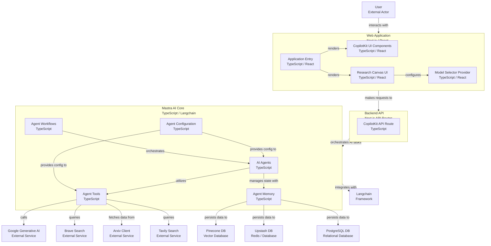

# 🤖 CopilotKit <> Mastra AI Starter Template

[](https://app.codacy.com/gh/ssdeanx/coagents-mastra/dashboard?utm_source=gh&utm_medium=referral&utm_content=&utm_campaign=Badge_grade)
[](https://wakatime.com/badge/user/7a2fb9a0-188b-4568-887f-7645f9249e62/project/9aecd309-f490-4566-8261-0652b1de5ae8)


This repository provides a robust starter template for developing advanced AI applications by integrating [Mastra](https://mastra.ai), an open-source TypeScript agent framework, with [CopilotKit](https://copilotkit.ai), a powerful toolkit for building AI-powered user experiences. It features a modern Next.js application with a sleek UI, designed for seamless AI agent interaction and generative capabilities.

## ✨ Features

*   **Intelligent AI Agents**: Leverage Mastra to build and manage sophisticated AI agents capable of complex reasoning, tool utilization, and memory management.
*   **Seamless Frontend Integration**: Utilize CopilotKit's React hooks and components for intuitive AI interaction, including generative UI, chat interfaces, and dynamic content generation.
*   **Modern Web Stack**: Built with Next.js, React, and TypeScript for a high-performance, scalable, and type-safe development experience.
*   **Elegant User Interface**: Styled with Tailwind CSS and Shadcn UI components, ensuring a responsive, accessible, and visually appealing application.
*   **Flexible Memory Management**: Configured with Upstash (Redis/Vector DB) for efficient and scalable agent memory, with support for Pinecone and PostgreSQL.
*   **Comprehensive Tooling**: Agents are equipped with a wide array of tools for web search (Brave, Tavily), data analysis, academic research (Arxiv), and more.
*   **Structured Project Architecture**: A clear and modular project structure facilitates easy development, maintenance, and extension.

## 🚀 Technologies

This project is built upon a modern and robust technology stack:

*   **Framework**: [Next.js](https://nextjs.org/) (React Framework)
*   **Language**: [TypeScript](https://www.typescriptlang.org/)
*   **AI Agent Framework**: [Mastra](https://mastra.ai/)
*   **AI Frontend Toolkit**: [CopilotKit](https://copilotkit.ai/)
*   **Styling**: [Tailwind CSS](https://tailwindcss.com/)
*   **UI Components**: [Shadcn UI](https://ui.shadcn.com/) (built on Radix UI)
*   **Database/Memory**: [Upstash](https://upstash.com/) (Redis & Vector Database), [Pinecone](https://www.pinecone.io/) (Vector Database), [PostgreSQL](https://www.postgresql.org/) (Relational Database)
*   **LLM Provider**: [Google Gemini](https://ai.google.dev/gemini)
*   **AI Libraries**: [LangChain.js](https://js.langchain.com/docs/)
*   **Code Quality**: [ESLint](https://eslint.org/), [Prettier](https://prettier.io/)
*   **Deployment**: [Vercel](https://vercel.com/) (Recommended for Next.js applications)

## ⚙️ Getting Started

Follow these steps to set up and run the project locally.

### Prerequisites

Ensure you have the following installed:

*   [Node.js](https://nodejs.org/) (version 18 or higher)
*   One of the following package managers:
    *   [pnpm](https://pnpm.io/) (recommended)
    *   [npm](https://www.npmjs.com/)
    *   [yarn](https://yarnpkg.com/)
    *   [bun](https://bun.sh/)

> **Note:** This repository intentionally ignores lock files (`package-lock.json`, `yarn.lock`, `pnpm-lock.yaml`, `bun.lockb`) to prevent conflicts between different package managers. Each developer should generate their own lock file using their preferred package manager. After initial setup, you may remove the corresponding lock file entry from `.gitignore` if desired.

### Environment Variables

Create a `.env` file in the root of the project and add your Google Generative AI API key:

```bash
# You can use any model supported by Mastra and Google Generative AI
GOOGLE_GENERATIVE_AI_API_KEY=your-key-here
```

### Installation

Install project dependencies using your preferred package manager:

```bash
# Using pnpm (recommended)
pnpm install

# Using npm
npm install

# Using yarn
yarn install

# Using bun
bun install
```

### Running the Development Server

Start both the UI and agent servers concurrently:

```bash
# Using pnpm
pnpm dev

# Using npm
npm run dev

# Using yarn
yarn dev

# Using bun
bun run dev
```

The application will be accessible at `http://localhost:3000`.

## 🛠️ Available Scripts

The following scripts can be executed using your preferred package manager (e.g., `pnpm <script-name>`):

*   `dev`: Starts both UI and agent servers in development mode.
*   `dev:debug`: Starts development servers with debug logging enabled.
*   `dev:ui`: Starts only the UI server.
*   `dev:agent`: Starts only the Mastra agent server.
*   `build`: Builds the application for production.
*   `start`: Starts the production server.
*   `lint`: Runs ESLint for code linting.

## 🗺️ Project Structure Diagram



## 📚 Documentation

*   [Mastra Documentation](https://mastra.ai/en/docs) - Learn more about Mastra and its features.
*   [CopilotKit Documentation](https://docs.copilotkit.ai) - Explore CopilotKit's capabilities.
*   [Next.js Documentation](https://nextjs.org/docs) - Learn about Next.js features and API.

## 🤝 Contributing

We welcome contributions! Please see our [Contributing Guidelines](CONTRIBUTING.md) (if applicable, otherwise remove this line) for more details on how to get started, report issues, and submit pull requests.

## 📄 License

This project is licensed under the MIT License - see the [LICENSE](LICENSE) file for details.
