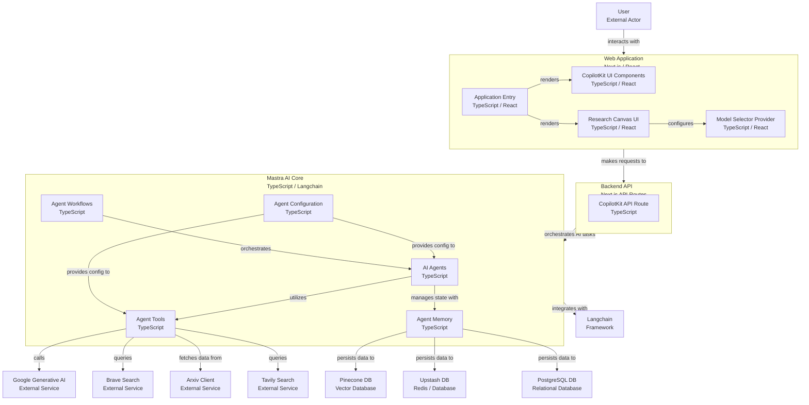

# CopilotKit <> Mastra Starter

[](https://app.codacy.com/gh/ssdeanx/coagents-mastra/dashboard?utm_source=gh&utm_medium=referral&utm_content=&utm_campaign=Badge_grade)

This is a starter template for building AI agents using [Mastra](https://mastra.ai) and [CopilotKit](https://copilotkit.ai). It provides a modern Next.js application with integrated AI capabilities and a beautiful UI.

## Prerequisites

- Node.js 18+
- Any of the following package managers:
  - pnpm (recommended)
  - npm
  - yarn
  - bun

> **Note:** This repository ignores lock files (package-lock.json, yarn.lock, pnpm-lock.yaml, bun.lockb) to avoid conflicts between different package managers. Each developer should generate their own lock file using their preferred package manager. After that, make sure to delete it from the .gitignore.

## Getting Started

1. Add your OpenAI API key

  ```bash
  # you can use whatever model Mastra supports
  echo "GOOGLE_GENERATIVE_AI_API_KEY=your-key-here" >> .env
  ```

2. Install dependencies using your preferred package manager:

  ```bash
  # Using pnpm (recommended)
  pnpm install

  # Using npm
  npm install

  # Using yarn
  yarn install

  # Using bun
  bun install
  ```

2. Start the development server:

  ```bash
  # Using pnpm
  pnpm dev

  # Using npm
  npm run dev

  # Using yarn
  yarn dev

  # Using bun
  bun run dev
  ```

This will start both the UI and agent servers concurrently.

## Available Scripts

The following scripts can also be run using your preferred package manager:

- `dev` - Starts both UI and agent servers in development mode
- `dev:debug` - Starts development servers with debug logging enabled
- `dev:ui` - Starts only the UI server
- `dev:agent` - Starts only the Mastra agent server
- `build` - Builds the application for production
- `start` - Starts the production server
- `lint` - Runs ESLint for code linting

## Project Structure Diagram



## Documentation

- [Mastra Documentation](https://mastra.ai/en/docs) - Learn more about Mastra and its features
- [CopilotKit Documentation](https://docs.copilotkit.ai) - Explore CopilotKit's capabilities
- [Next.js Documentation](https://nextjs.org/docs) - Learn about Next.js features and API

## Contributing

Feel free to submit issues and enhancement requests!

## License

This project is licensed under the MIT License - see the LICENSE file for details.
