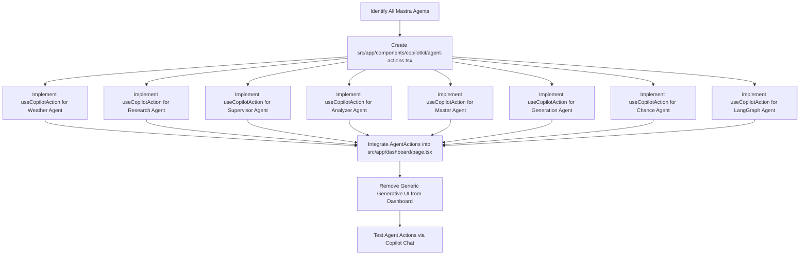

# **Implementation Plan: CopilotKit Agent Action Wrappers**

## 1. Task Dependency Graph

## 2. Detailed Task Checklist

### 🏗️ **Phase 1: Create Agent Action Wrappers**

- [ ] **FILE:** Create a new file `src/app/components/copilotkit/agent-actions.tsx`.
- [ ] **EDIT:** In `src/app/components/copilotkit/agent-actions.tsx`, define a React functional component `AgentActions` that accepts `onNotification` and `themeColor` props.
- [ ] **EDIT:** Inside `AgentActions`, implement `useCopilotAction` for the **Weather Agent**.
  - [ ] `name`: `callWeatherAgent`
  - [ ] `description`: "Get current weather information for a specified location."
  - [ ] `parameters`: `location: string` (e.g., "London"), `forecast: boolean` (optional).
  - [ ] `handler`: Make a `POST` request to `/api/copilotkit` with `agent: 'weatherAgent'` and a message constructed from `location` and `forecast`. Use `onNotification` for feedback.
  - [ ] `render`: Display a `Card` with `Weather` icon, status (executing/complete), and arguments.
- [ ] **EDIT:** Inside `AgentActions`, implement `useCopilotAction` for the **Research Agent**.
  - [ ] `name`: `callResearchAgent`
  - [ ] `description`: "Conduct comprehensive research on a given topic."
  - [ ] `parameters`: `topic: string`, `depth: 'surface' | 'detailed' | 'comprehensive'` (optional).
  - [ ] `handler`: Make a `POST` request to `/api/copilotkit` with `agent: 'researchAgent'` and a message constructed from `topic` and `depth`. Use `onNotification`.
  - [ ] `render`: Display a `Card` with `Search` icon, status, and arguments.
- [ ] **EDIT:** Inside `AgentActions`, implement `useCopilotAction` for the **Supervisor Agent**.
  - [ ] `name`: `callSupervisorAgent`
  - [ ] `description`: "Orchestrate and manage a complex task involving multiple agents."
  - [ ] `parameters`: `task: string`, `agents: string[]` (optional, e.g., "researchAgent, analyzerAgent").
  - [ ] `handler`: Make a `POST` request to `/api/copilotkit` with `agent: 'supervisorAgent'` and a message constructed from `task` and `agents`. Use `onNotification`.
  - [ ] `render`: Display a `Card` with `Users` icon, status, and arguments.
- [ ] **EDIT:** Inside `AgentActions`, implement `useCopilotAction` for the **Analyzer Agent**.
  - [ ] `name`: `callAnalyzerAgent`
  - [ ] `description`: "Analyze data or code and provide insights and optimization suggestions."
  - [ ] `parameters`: `data: string`, `analysisType: 'statistical' | 'trend' | 'diagnostic'` (optional).
  - [ ] `handler`: Make a `POST` request to `/api/copilotkit` with `agent: 'analyzerAgent'` and a message constructed from `data` and `analysisType`. Use `onNotification`.
  - [ ] `render`: Display a `Card` with `BarChart3` icon, status, and arguments.
- [ ] **EDIT:** Inside `AgentActions`, implement `useCopilotAction` for the **Master Agent**.
  - [ ] `name`: `callMasterAgent`
  - [ ] `description`: "Solve general problems or coordinate other agents for complex tasks."
  - [ ] `parameters`: `problem: string`.
  - [ ] `handler`: Make a `POST` request to `/api/copilotkit` with `agent: 'masterAgent'` and a message constructed from `problem`. Use `onNotification`.
  - [ ] `render`: Display a `Card` with `Brain` icon, status, and arguments.
- [ ] **EDIT:** Inside `AgentActions`, implement `useCopilotAction` for the **Generation Agent**.
  - [ ] `name`: `callGenerationAgent`
  - [ ] `description`: "Generate text, code, or creative content based on a prompt."
  - [ ] `parameters`: `prompt: string`, `contentType: 'text' | 'code' | 'report'` (optional).
  - [ ] `handler`: Make a `POST` request to `/api/copilotkit` with `agent: 'generationAgent'` and a message constructed from `prompt` and `contentType`. Use `onNotification`.
  - [ ] `render`: Display a `Card` with `Code2` icon, status, and arguments.
- [ ] **EDIT:** Inside `AgentActions`, implement `useCopilotAction` for the **Chance Agent**.
  - [ ] `name`: `callChanceAgent`
  - [ ] `description`: "Perform probability calculations or assist in decision-making under uncertainty."
  - [ ] `parameters`: `decisionProblem: string`, `options: string[]`.
  - [ ] `handler`: Make a `POST` request to `/api/copilotkit` with `agent: 'chanceAgent'` and a message constructed from `decisionProblem` and `options`. Use `onNotification`.
  - [ ] `render`: Display a `Card` with `Target` icon, status, and arguments.
- [ ] **EDIT:** Inside `AgentActions`, implement `useCopilotAction` for the **LangGraph Agent**.
  - [ ] `name`: `callLangGraphAgent`
  - [ ] `description`: "Execute complex multi-step workflows or advanced reasoning tasks."
  - [ ] `parameters`: `workflowDescription: string`, `maxSteps: number` (optional).
  - [ ] `handler`: Make a `POST` request to `/api/copilotkit` with `agent: 'langGraphAgent'` and a message constructed from `workflowDescription` and `maxSteps`. Use `onNotification`.
  - [ ] `render`: Display a `Card` with `Network` icon, status, and arguments.

### ☁️ **Phase 2: Integrate Agent Actions into Dashboard**

- [ ] **EDIT:** In `src/app/components/copilotkit/index.ts`, export `AgentActions`.
- [ ] **EDIT:** In `src/app/dashboard/page.tsx`, import `AgentActions` from `src/app/components/copilotkit/agent-actions.tsx`.
- [ ] **EDIT:** In `src/app/dashboard/page.tsx`, within the `YourMainContent` component, render `<AgentActions onNotification={toast} themeColor={themeColor} />` to register the new actions.
- [ ] **EDIT:** In `src/app/dashboard/page.tsx`, remove the existing generic `useCopilotAction` that renders `details` tags from `YourMainContent` to avoid duplicate or conflicting UI for actions.

### ✔️ **Phase 3: Finalization & Testing**

- [ ] **TEST:** Run the application locally (`npm run dev` or `pnpm dev`).
- [ ] **TEST:** Navigate to the Dashboard page (`/dashboard`).
- [ ] **TEST:** Open the Copilot chat.
- [ ] **TEST:** Test each new agent action by typing commands like:
  - "Call weather agent for New York with forecast"
  - "Call research agent to research quantum computing in detail"
  - "Call supervisor agent to manage project deployment with researchAgent and generationAgent"
  - "Call analyzer agent to analyze this code: function add(a, b) { return a + b; }"
  - "Call master agent to solve the traveling salesman problem"
  - "Call generation agent to generate a blog post about AI in healthcare"
  - "Call chance agent to decide between option A and option B for investment"
  - "Call langGraph agent to execute a data processing workflow with 5 steps"
- [ ] **TEST:** Verify that the custom UI for each action appears correctly in the chat window, showing the arguments and status.
- [ ] **TEST:** Check the browser console for any errors related to the new actions or API calls.
- [ ] **REVIEW:** Ensure all new code adheres to existing coding standards and design principles (e.g., glassmorphism, proper imports).
